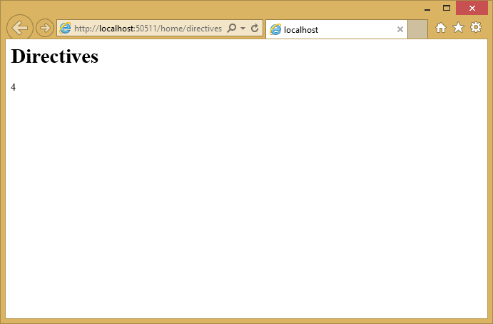
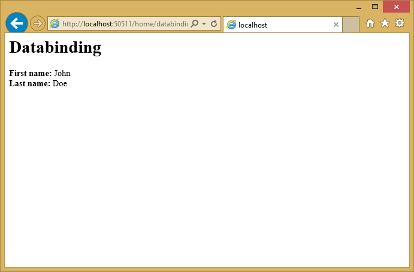
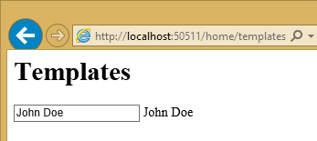
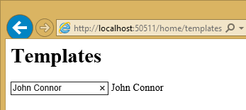
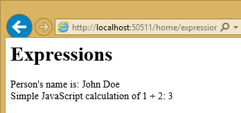
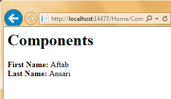
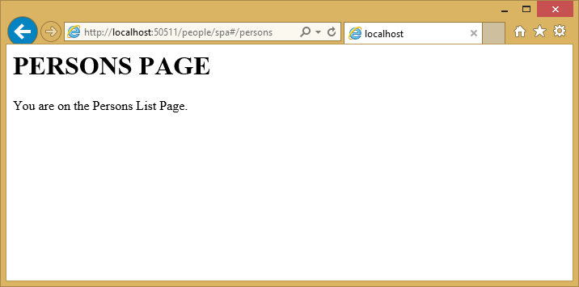
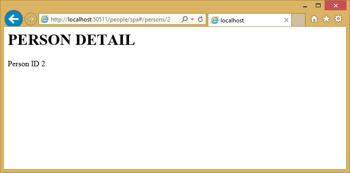
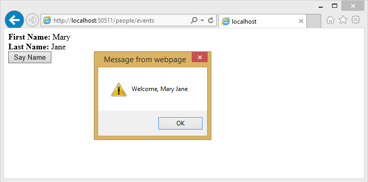

Warning: This page documents version 1.0.0-rc1 and has not yet been updated for version 1.0.0

  # Using Angular for Single Page Applications (SPAs)

By [Venkata Koppaka](http://blog.falafel.com/author/venkata-koppaka/) and [Scott Addie](https://scottaddie.com)

In this article, you will learn how to build a SPA-style ASP.NET application using AngularJS.

[View or download sample code](https://github.com/aspnet/Docs/tree/master/aspnet/client-side/angular/sample)

  ## What is AngularJS?

[AngularJS](http://angularjs.org/) is a modern JavaScript framework from Google commonly used to work with Single Page Applications (SPAs). AngularJS is open sourced under MIT license, and the development progress of AngularJS can be followed on [its GitHub repository](https://github.com/angular/angular.js). The library is called Angular because HTML uses angular-shaped brackets.

AngularJS is not a DOM manipulation library like jQuery, but it uses a subset of jQuery called jQLite. AngularJS is primarily based on declarative HTML attributes that you can add to your HTML tags. You can try AngularJS in your browser using the [Code School website](http://campus.codeschool.com/courses/shaping-up-with-angular-js/intro).

This article focuses on Angular 1.X with some notes on where Angular is heading with 2.0.

  ## Getting Started

To start using AngularJS in your ASP.NET application, you must either install it as part of your project, or reference it from a content delivery network (CDN).

  ### Installation

There are several ways to add AngularJS to your application. If you’re starting a new ASP.NET Core web application in Visual Studio, you can add AngularJS using the built-in [Bower](bower.md#bower-index.md) support. Simply open `bower.json`, and add an entry to the `dependencies` property:

<a name=angular-bower-json></a>

<!--[!code-json[Main](sample/AngularSample/src/AngularSample/bower.json )]-->

<!-- literal_block {"ids": ["angular-bower-json"], "names": ["angular-bower-json"], "highlight_args": {"hl_lines": [9], "linenostart": 1}, "backrefs": [], "dupnames": [], "linenos": true, "classes": [], "xml:space": "preserve", "language": "json", "source": "/Users/shirhatti/src/Docs/aspnet/client-side/angular/sample/AngularSample/src/AngularSample/bower.json"} -->

````json

   {
     "name": "ASP.NET",
     "private": true,
     "dependencies": {
       "bootstrap": "3.3.5",
       "jquery": "2.1.4",
       "jquery-validation": "1.14.0",
       "jquery-validation-unobtrusive": "3.2.4",
       "angular": "1.5.7",
       "angular-route": "1.5.7"
     }
   }

   ````

Upon saving the `bower.json` file, Angular will be installed in your project's `wwwroot/lib` folder. Additionally, it will be listed within the `Dependencies/Bower` folder. See the screenshot below.


Next, add a `<script>` reference to the bottom of the `<body>` section of your HTML page or *_Layout.cshtml* file, as shown here:

<!--[!code-html[Main](sample/AngularSample/src/AngularSample/Views/Shared/_Layout.cshtml )]-->

<!-- literal_block {"ids": [], "names": [], "highlight_args": {"hl_lines": [4], "linenostart": 1}, "backrefs": [], "dupnames": [], "linenos": true, "classes": [], "xml:space": "preserve", "language": "html", "source": "/Users/shirhatti/src/Docs/aspnet/client-side/angular/sample/AngularSample/src/AngularSample/Views/Shared/_Layout.cshtml"} -->

````html

           <environment names="Development">
               <script src="~/lib/jquery/dist/jquery.js"></script>
               <script src="~/lib/bootstrap/dist/js/bootstrap.js"></script>
               <script src="~/lib/angular/angular.js"></script>
           </environment>

   ````

It's recommended that production applications utilize CDNs for common libraries like Angular. You can reference Angular from one of several CDNs, such as this one:

<!--[!code-html[Main](sample/AngularSample/src/AngularSample/Views/Shared/_Layout.cshtml )]-->

<!-- literal_block {"ids": [], "names": [], "highlight_args": {"hl_lines": [10], "linenostart": 1}, "backrefs": [], "dupnames": [], "linenos": true, "classes": [], "xml:space": "preserve", "language": "html", "source": "/Users/shirhatti/src/Docs/aspnet/client-side/angular/sample/AngularSample/src/AngularSample/Views/Shared/_Layout.cshtml"} -->

````html

           <environment names="Staging,Production">
               <script src="//ajax.aspnetcdn.com/ajax/jquery/jquery-2.1.4.min.js"
                       asp-fallback-src="~/lib/jquery/dist/jquery.min.js"
                       asp-fallback-test="window.jQuery">
               </script>
               <script src="//ajax.aspnetcdn.com/ajax/bootstrap/3.3.5/bootstrap.min.js"
                       asp-fallback-src="~/lib/bootstrap/dist/js/bootstrap.min.js"
                       asp-fallback-test="window.jQuery && window.jQuery.fn && window.jQuery.fn.modal">
               </script>
               <script src="https://ajax.googleapis.com/ajax/libs/angularjs/1.4.8/angular.min.js"
                       asp-fallback-src="~/lib/angular/angular.min.js"
                       asp-fallback-test="window.angular">
               </script>
               <script src="~/js/site.min.js" asp-append-version="true"></script>
           </environment>

   ````

Once you have a reference to the angular.js script file, you're ready to begin using Angular in your web pages.

  ## Key Components

AngularJS includes a number of major components, such as *directives*, *templates*, *repeaters*, *modules*, *controllers*, *components*, *component router* and more. Let's examine how these components work together to add behavior to your web pages.

  ### Directives

AngularJS uses [directives](https://docs.angularjs.org/guide/directive) to extend HTML with custom attributes and elements. AngularJS directives are defined via `data-ng-*` or `ng-*` prefixes (`ng` is short for angular). There are two types of AngularJS directives:

   1. **Primitive Directives**: These are predefined by the Angular team and are part of the AngularJS framework.

   2. **Custom Directives**: These are custom directives that you can define.

One of the primitive directives used in all AngularJS applications is the `ng-app` directive, which bootstraps the AngularJS application. This directive can be applied to the `<body>` tag or to a child element of the body. Let's see an example in action. Assuming you're in an ASP.NET project, you can either add an HTML file to the `wwwroot` folder, or add a new controller action and an associated view. In this case, I've added a new `Directives` action method to `HomeController.cs`. The associated view is shown here:

<!--[!code-html[Main](sample/AngularSample/src/AngularSample/Views/Home/Directives.cshtml )]-->

<!-- literal_block {"ids": [], "names": [], "highlight_args": {"hl_lines": [5, 7], "linenostart": 1}, "backrefs": [], "dupnames": [], "linenos": true, "classes": [], "xml:space": "preserve", "language": "html", "source": "/Users/shirhatti/src/Docs/aspnet/client-side/angular/sample/AngularSample/src/AngularSample/Views/Home/Directives.cshtml"} -->

````html

   @{
       Layout = "";
   }
   <html>
   <body ng-app>
       <h1>Directives</h1>
       {{2+2}}
       <script src="~/lib/angular/angular.js"></script>
   </body>
   </html>
   ````

To keep these samples independent of one another, I'm not using the shared layout file. You can see that we decorated the body tag with the `ng-app` directive to indicate this page is an AngularJS application. The `{{2+2}}` is an Angular data binding expression that you will learn more about in a moment. Here is the result if you run this application:



Other primitive directives in AngularJS include:

`ng-controller`
   Determines which JavaScript controller is bound to which view.

`ng-model`
   Determines the model to which the values of an HTML element's properties are bound.

`ng-init`
   Used to initialize the application data in the form of an expression for the current scope.

`ng-if`
   Removes or recreates the given HTML element in the DOM based on the truthiness of the expression provided.

`ng-repeat`
   Repeats a given block of HTML over a set of data.

`ng-show`
   Shows or hides the given HTML element based on the expression provided.

For a full list of all primitive directives supported in AngularJS, please refer to the [directive documentation section on the AngularJS documentation website](https://docs.angularjs.org/api/ng/directive).

  ### Data Binding

AngularJS provides [data binding](https://docs.angularjs.org/guide/databinding) support out-of-the-box using either the `ng-bind` directive or a data binding expression syntax such as `{{expression}}`. AngularJS supports two-way data binding where data from a model is kept in synchronization with a view template at all times. Any changes to the view are automatically reflected in the model. Likewise, any changes in the model are reflected in the view.

Create either an HTML file or a controller action with an accompanying view named `Databinding`. Include the following in the view:

<!--[!code-html[Main](sample/AngularSample/src/AngularSample/Views/Home/Databinding.cshtml )]-->

<!-- literal_block {"ids": [], "names": [], "highlight_args": {"hl_lines": [8, 9, 10], "linenostart": 1}, "backrefs": [], "dupnames": [], "linenos": true, "classes": [], "xml:space": "preserve", "language": "html", "source": "/Users/shirhatti/src/Docs/aspnet/client-side/angular/sample/AngularSample/src/AngularSample/Views/Home/Databinding.cshtml"} -->

````html

   @{
       Layout = "";
   }
   <html>
   <body ng-app>
       <h1>Databinding</h1>

       <div ng-init="firstName='John'; lastName='Doe';">
           <strong>First name:</strong> {{firstName}} <br />
           <strong>Last name:</strong> <span ng-bind="lastName" />
       </div>

       <script src="~/lib/angular/angular.js"></script>
   </body>
   </html>
   ````

Notice that you can display model values using either directives or data binding (`ng-bind`). The resulting page should look like this:



  ### Templates

[Templates](https://docs.angularjs.org/guide/templates) in AngularJS are just plain HTML pages decorated with AngularJS directives and artifacts. A template in AngularJS is a mixture of directives, expressions, filters, and controls that combine with HTML to form the view.

Add another view to demonstrate templates, and add the following to it:

<!--[!code-html[Main](sample/AngularSample/src/AngularSample/Views/Home/Templates.cshtml )]-->

<!-- literal_block {"ids": [], "names": [], "highlight_args": {"hl_lines": [8, 9, 10], "linenostart": 1}, "backrefs": [], "dupnames": [], "linenos": true, "classes": [], "xml:space": "preserve", "language": "html", "source": "/Users/shirhatti/src/Docs/aspnet/client-side/angular/sample/AngularSample/src/AngularSample/Views/Home/Templates.cshtml"} -->

````html

   @{
       Layout = "";
   }
   <html>
   <body ng-app>
       <h1>Templates</h1>

       <div ng-init="personName='John Doe'">
           <input ng-model="personName" /> {{personName}}
       </div>

       <script src="~/lib/angular/angular.js"></script>
   </body>
   </html>
   ````

The template has AngularJS directives like `ng-app`, `ng-init`, `ng-model` and data binding expression syntax to bind the `personName` property. Running in the browser, the view looks like the screenshot below:



If you change the name by typing in the input field, you will see the text next to the input field dynamically update, showing Angular two-way data binding in action.



  ### Expressions

[Expressions](https://docs.angularjs.org/guide/expression) in AngularJS are JavaScript-like code snippets that are written inside the `{{ expression }}` syntax. The data from these expressions is bound to HTML the same way as `ng-bind` directives. The main difference between AngularJS expressions and regular JavaScript expressions is that AngularJS expressions are evaluated against the `$scope` object in AngularJS.

The AngularJS expressions in the sample below bind `personName` and a simple JavaScript calculated expression:

<!--[!code-html[Main](sample/AngularSample/src/AngularSample/Views/Home/Expressions.cshtml )]-->

<!-- literal_block {"ids": [], "names": [], "highlight_args": {"hl_lines": [8, 9, 10], "linenostart": 1}, "backrefs": [], "dupnames": [], "linenos": true, "classes": [], "xml:space": "preserve", "language": "html", "source": "/Users/shirhatti/src/Docs/aspnet/client-side/angular/sample/AngularSample/src/AngularSample/Views/Home/Expressions.cshtml"} -->

````html

   @{
       Layout = "";
   }
   <html>
   <body ng-app>
       <h1>Expressions</h1>

       <div ng-init="personName='John Doe'">
           Person's name is: {{personName}} <br />
           Simple JavaScript calculation of 1 + 2: {{1+2}}
       </div>

       <script src="~/lib/angular/angular.js"></script>
   </body>
   </html>
   ````

The example running in the browser displays the `personName` data and the results of the calculation:



  ### Repeaters

Repeating in AngularJS is done via a primitive directive called `ng-repeat`. The `ng-repeat` directive repeats a given HTML element in a view over the length of a repeating data array. Repeaters in AngularJS can repeat over an array of strings or objects. Here is a sample usage of repeating over an array of strings:

<!--[!code-html[Main](sample/AngularSample/src/AngularSample/Views/Home/Repeaters.cshtml )]-->

<!-- literal_block {"ids": [], "names": [], "highlight_args": {"hl_lines": [8, 10, 11], "linenostart": 1}, "backrefs": [], "dupnames": [], "linenos": true, "classes": [], "xml:space": "preserve", "language": "html", "source": "/Users/shirhatti/src/Docs/aspnet/client-side/angular/sample/AngularSample/src/AngularSample/Views/Home/Repeaters.cshtml"} -->

````html

   @{
       Layout = "";
   }
   <html>
   <body ng-app>
       <h1>Repeaters</h1>

       <div ng-init="names=['John Doe', 'Mary Jane', 'Bob Parker']">
           <ul>
               <li ng-repeat="name in names">
                   {{name}}
               </li>
           </ul>
       </div>

       <script src="~/lib/angular/angular.js"></script>
   </body>
   </html>
   ````

The [repeat directive](https://docs.angularjs.org/api/ng/directive/ngRepeat) outputs a series of list items in an unordered list, as you can see in the developer tools shown in this screenshot:


Here is an example that repeats over an array of objects. The `ng-init` directive establishes a `names` array, where each element is an object containing first and last names. The `ng-repeat` assignment, `name in names`, outputs a list item for every array element.

<!--[!code-html[Main](sample/AngularSample/src/AngularSample/Views/Home/Repeaters2.cshtml )]-->

<!-- literal_block {"ids": [], "names": [], "highlight_args": {"hl_lines": [8, 9, 10, 11, 13, 14], "linenostart": 1}, "backrefs": [], "dupnames": [], "linenos": true, "classes": [], "xml:space": "preserve", "language": "html", "source": "/Users/shirhatti/src/Docs/aspnet/client-side/angular/sample/AngularSample/src/AngularSample/Views/Home/Repeaters2.cshtml"} -->

````html

   @{
       Layout = "";
   }
   <html>
   <body ng-app>
       <h1>Repeaters2</h1>

       <div ng-init="names=[
   		{firstName:'John', lastName:'Doe'},
   		{firstName:'Mary', lastName:'Jane'},
   		{firstName:'Bob', lastName:'Parker'}]">
           <ul>
               <li ng-repeat="name in names">
                   {{name.firstName + ' ' + name.lastName}}
               </li>
           </ul>
       </div>

       <script src="~/lib/angular/angular.js"></script>
   </body>
   </html>
   ````

The output in this case is the same as in the previous example.

Angular provides some additional directives that can help provide behavior based on where the loop is in its execution.

`$index`
   Use `$index` in the `ng-repeat` loop to determine which index position your loop currently is on.

`$even` and `$odd`
   Use `$even` in the `ng-repeat` loop to determine whether the current index in your loop is an even indexed row. Similarly, use `$odd` to determine if the current index is an odd indexed row.

`$first` and `$last`
   Use `$first` in the `ng-repeat` loop to determine whether the current index in your loop is the first row. Similarly, use `$last` to determine if the current index is the last row.

Below is a sample that shows `$index`, `$even`, `$odd`, `$first`, and `$last` in action:

<!--[!code-html[Main](sample/AngularSample/src/AngularSample/Views/Home/Repeaters3.cshtml )]-->

<!-- literal_block {"ids": [], "names": [], "highlight_args": {"hl_lines": [14, 15, 16, 17, 18], "linenostart": 1}, "backrefs": [], "dupnames": [], "linenos": true, "classes": [], "xml:space": "preserve", "language": "html", "source": "/Users/shirhatti/src/Docs/aspnet/client-side/angular/sample/AngularSample/src/AngularSample/Views/Home/Repeaters3.cshtml"} -->

````html

   @{
       Layout = "";
   }
   <html>
   <body ng-app>
       <h1>Repeaters2</h1>

       <div ng-init="names=[
   		{firstName:'John', lastName:'Doe'},
   		{firstName:'Mary', lastName:'Jane'},
   		{firstName:'Bob', lastName:'Parker'}]">
           <ul>
               <li ng-repeat="name in names">
                   {{name.firstName + ' ' + name.lastName}} at index {{$index}}
                   <span ng-show="{{$first}}">, the first position</span>
                   <span ng-show="{{$last}}">, the last position</span>
                   <span ng-show="{{$odd}}">,which is odd-numbered.</span>
                   <span ng-show="{{$even}}">,which is even-numbered.</span>
               </li>
           </ul>
       </div>

       <script src="~/lib/angular/angular.js"></script>
   </body>
   </html>
   ````

Here is the resulting output:


  ### $scope

`$scope` is a JavaScript object that acts as glue between the view (template) and the controller (explained below). A view template in AngularJS only knows about the values attached to the `$scope` object in the controller.

Note: In the MVVM world, the `$scope` object in AngularJS is often defined as the ViewModel. The AngularJS team refers to the `$scope` object as the Data-Model. [Learn more about Scopes in AngularJS](https://docs.angularjs.org/guide/scope).

Below is a simple example showing how to set properties on `$scope` within a separate JavaScript file, `scope.js`:

<!--[!code-html[Main](sample/AngularSample/src/AngularSample/wwwroot/app/scope.js )]-->

<!-- literal_block {"ids": [], "names": [], "highlight_args": {"hl_lines": [2, 3], "linenostart": 1}, "backrefs": [], "dupnames": [], "linenos": true, "classes": [], "xml:space": "preserve", "language": "html", "source": "/Users/shirhatti/src/Docs/aspnet/client-side/angular/sample/AngularSample/src/AngularSample/wwwroot/app/scope.js"} -->

````html

   var personApp = angular.module('personApp', []);
   personApp.controller('personController', ['$scope', function ($scope) {
       $scope.name = 'Mary Jane';
   }]);
   ````

Observe the `$scope` parameter passed to the controller on line 2. This object is what the view knows about. On line 3, we are setting a property called "name" to "Mary Jane".

What happens when a particular property is not found by the view? The view defined below refers to "name" and "age" properties:

<!--[!code-html[Main](sample/AngularSample/src/AngularSample/Views/Home/Scope.cshtml )]-->

<!-- literal_block {"ids": [], "names": [], "highlight_args": {"hl_lines": [9, 10, 14], "linenostart": 1}, "backrefs": [], "dupnames": [], "linenos": true, "classes": [], "xml:space": "preserve", "language": "html", "source": "/Users/shirhatti/src/Docs/aspnet/client-side/angular/sample/AngularSample/src/AngularSample/Views/Home/Scope.cshtml"} -->

````html

   @{
       Layout = "";
   }
   <html>
   <body ng-app="personApp">
       <h1>Scope</h1>

       <div ng-controller="personController">
           <strong>Name:</strong> {{name}} <br />
           <strong>Missing Property (age):</strong> {{age}}
       </div>

       <script src="~/lib/angular/angular.js"></script>
       <script src="~/app/scope.js"></script>
   </body>
   </html>
   ````

Notice on line 9 that we are asking Angular to show the "name" property using expression syntax. Line 10 then refers to "age", a property that does not exist. The running example shows the name set to "Mary Jane" and nothing for age. Missing properties are ignored.


  ### Modules

A [module](https://docs.angularjs.org/guide/module) in AngularJS is a collection of controllers, services, directives, etc. The `angular.module()` function call is used to create, register, and retrieve modules in AngularJS. All modules, including those shipped by the AngularJS team and third party libraries, should be registered using the `angular.module()` function.

Below is a snippet of code that shows how to create a new module in AngularJS. The first parameter is the name of the module. The second parameter defines dependencies on other modules. Later in this article, we will be showing how to pass these dependencies to an `angular.module()` method call.

<!-- literal_block {"ids": [], "names": [], "highlight_args": {}, "backrefs": [], "dupnames": [], "linenos": false, "classes": [], "xml:space": "preserve", "language": "javascript"} -->

````javascript

   var personApp = angular.module('personApp', []);
   ````

Use the `ng-app` directive to represent an AngularJS module on the page. To use a module, assign the name of the module, `personApp` in this example, to the `ng-app` directive in our template.

<!-- literal_block {"ids": [], "names": [], "highlight_args": {}, "backrefs": [], "dupnames": [], "linenos": false, "classes": [], "xml:space": "preserve", "language": "html"} -->

````html

   <body ng-app="personApp">
   ````

  ### Controllers

[Controllers](https://docs.angularjs.org/guide/controller) in AngularJS are the first point of entry for your code. The `<module name>.controller()` function call is used to create and register controllers in AngularJS. The `ng-controller` directive is used to represent an AngularJS controller on the HTML page. The role of the controller in Angular is to set state and behavior of the data model (`$scope`). Controllers should not be used to manipulate the DOM directly.

Below is a snippet of code that registers a new controller. The `personApp` variable in the snippet references an Angular module, which is defined on line 2.

<!--[!code-javascript[Main](sample/AngularSample/src/AngularSample/wwwroot/app/controllers.js )]-->

<!-- literal_block {"ids": [], "names": [], "highlight_args": {"hl_lines": [2, 5], "linenostart": 1}, "backrefs": [], "dupnames": [], "linenos": true, "classes": [], "xml:space": "preserve", "language": "javascript", "source": "/Users/shirhatti/src/Docs/aspnet/client-side/angular/sample/AngularSample/src/AngularSample/wwwroot/app/controllers.js"} -->

````javascript

   // module
   var personApp = angular.module('personApp', []);

   // controller
   personApp.controller('personController', function ($scope) {
       $scope.firstName = "Mary";
       $scope.lastName = "Jane"
   });

   ````

The view using the `ng-controller` directive assigns the controller name:

<!--[!code-html[Main](sample/AngularSample/src/AngularSample/Views/Home/Controllers.cshtml )]-->

<!-- literal_block {"ids": [], "names": [], "highlight_args": {"hl_lines": [8, 14], "linenostart": 1}, "backrefs": [], "dupnames": [], "linenos": true, "classes": [], "xml:space": "preserve", "language": "html", "source": "/Users/shirhatti/src/Docs/aspnet/client-side/angular/sample/AngularSample/src/AngularSample/Views/Home/Controllers.cshtml"} -->

````html

   @{
       Layout = "";
   }
   <html>
   <body ng-app="personApp">
       <h1>Controllers</h1>

       <div ng-controller="personController">
           <strong>First Name:</strong> {{firstName}} <br />
           <strong>Last Name:</strong> {{lastName}}
       </div>

       <script src="~/lib/angular/angular.js"></script>
       <script src="~/app/controllers.js"></script>
   </body>
   </html>
   ````

The page shows "Mary" and "Jane" that correspond to the `firstName` and `lastName` properties attached to the `$scope` object:


  ### Components

[Components](https://docs.angularjs.org/guide/component) in Angular 1.5.x allow for the encapsulation and capability of creating individual HTML elements. In Angular 1.4.x you could achieve the same feature using the .directive() method.

By using the .component() method, development is simplified gaining the functionality of the directive and the controller. Other benefits include; scope isolation, best practices are inherent, and migration to Angular 2 becomes an easier task. The `<module name>.component()` function call is used to create and register components in AngularJS.

Below is a snippet of code that registers a new component. The `personApp` variable in the snippet references an Angular module, which is defined on line 2.

<!--[!code-javascript[Main](sample/AngularSample/src/AngularSample/wwwroot/app/components.js )]-->

<!-- literal_block {"ids": [], "names": [], "highlight_args": {"hl_lines": [2, 5, 13], "linenostart": 1}, "backrefs": [], "dupnames": [], "linenos": true, "classes": [], "xml:space": "preserve", "language": "javascript", "source": "/Users/shirhatti/src/Docs/aspnet/client-side/angular/sample/AngularSample/src/AngularSample/wwwroot/app/components.js"} -->

````javascript

   // module
   var personApp = angular.module('personApp', []);

   // controller
   var PersonController = function(){
   	
   	var vm = this;
   	vm.firstName = "Aftab";
   	vm.lastName = "Ansari";
   }

   // component
   personApp.component('personComponent', {
       templateUrl:'/app/partials/personcomponent.html',
   	controller:PersonController,
   	controllerAs:'vm'
   	
   });

   ````

The view where we are displaying the custom HTML element.

<!--[!code-html[Main](sample/AngularSample/src/AngularSample/Views/Home/Components.cshtml )]-->

<!-- literal_block {"ids": [], "names": [], "highlight_args": {"hl_lines": [8], "linenostart": 1}, "backrefs": [], "dupnames": [], "linenos": true, "classes": [], "xml:space": "preserve", "language": "html", "source": "/Users/shirhatti/src/Docs/aspnet/client-side/angular/sample/AngularSample/src/AngularSample/Views/Home/Components.cshtml"} -->

````html

   @{
       Layout = "";
   }
   <html>
   <body ng-app="personApp">
       <h1>Components</h1>

   	<person-component></person-component>
      
       <script src="~/lib/angular/angular.js"></script>
       <script src="~/app/components.js"></script>
   </body>
   </html>
   ````

The associated template used by component:

<!--[!code-html[Main](sample/AngularSample/src/AngularSample/wwwroot/app/partials/personcomponent.html )]-->

<!-- literal_block {"ids": [], "names": [], "highlight_args": {"hl_lines": [2, 3], "linenostart": 1}, "backrefs": [], "dupnames": [], "linenos": true, "classes": [], "xml:space": "preserve", "language": "html", "source": "/Users/shirhatti/src/Docs/aspnet/client-side/angular/sample/AngularSample/src/AngularSample/wwwroot/app/partials/personcomponent.html"} -->

````html

   <div>
       <strong>First Name:</strong> {{vm.firstName}} <br />
       <strong>Last Name:</strong> {{vm.lastName}}
   </div>
   ````

The page shows "Aftab" and "Ansari" that correspond to the `firstName` and `lastName` properties attached to the `vm` object:



  ### Services

[Services](https://docs.angularjs.org/guide/services) in AngularJS are commonly used for shared code that is abstracted away into a file which can be used throughout the lifetime of an Angular application. Services are lazily instantiated, meaning that there will not be an instance of a service unless a component that depends on the service gets used. Factories are an example of a service used in AngularJS applications. Factories are created using the `myApp.factory()` function call, where `myApp` is the module.

Below is an example that shows how to use factories in AngularJS:

<!--[!code-javascript[Main](sample/AngularSample/src/AngularSample/wwwroot/app/simpleFactory.js )]-->

<!-- literal_block {"ids": [], "names": [], "highlight_args": {"hl_lines": [1], "linenostart": 1}, "backrefs": [], "dupnames": [], "linenos": true, "classes": [], "xml:space": "preserve", "language": "javascript", "source": "/Users/shirhatti/src/Docs/aspnet/client-side/angular/sample/AngularSample/src/AngularSample/wwwroot/app/simpleFactory.js"} -->

````javascript

   personApp.factory('personFactory', function () {
       function getName() {
           return "Mary Jane";
       }

       var service = {
           getName: getName
       };

       return service;
   });
   ````

To call this factory from the controller, pass `personFactory` as a parameter to the `controller` function:

<!-- literal_block {"ids": [], "names": [], "highlight_args": {}, "backrefs": [], "dupnames": [], "linenos": false, "classes": [], "xml:space": "preserve", "language": "javascript"} -->

````javascript

   personApp.controller('personController', function($scope,personFactory) {
     $scope.name = personFactory.getName();
   });
   ````

  ### Using services to talk to a REST endpoint

Below is an end-to-end example using services in AngularJS to interact with an ASP.NET Core Web API endpoint. The example gets data from the Web API and displays the data in a view template. Let's start with the view first:

<!--[!code-html[Main](sample/AngularSample/src/AngularSample/Views/People/Index.cshtml )]-->

<!-- literal_block {"ids": [], "names": [], "highlight_args": {"hl_lines": [5, 8, 10, 17, 18, 19], "linenostart": 1}, "backrefs": [], "dupnames": [], "linenos": true, "classes": [], "xml:space": "preserve", "language": "html", "source": "/Users/shirhatti/src/Docs/aspnet/client-side/angular/sample/AngularSample/src/AngularSample/Views/People/Index.cshtml"} -->

````html

   @{
       Layout = "";
   }
   <html>
   <body ng-app="PersonsApp">
       <h1>People</h1>

       <div ng-controller="personController">
           <ul>
               <li ng-repeat="person in people">
                   <h2>{{person.FirstName}} {{person.LastName}}</h2>
               </li>
           </ul>
       </div>

       <script src="~/lib/angular/angular.js"></script>
       <script src="~/app/personApp.js"></script>
       <script src="~/app/personFactory.js"></script>
       <script src="~/app/personController.js"></script>
   </body>
   </html>
   ````

In this view, we have an Angular module called `PersonsApp` and a controller called `personController`. We are using `ng-repeat` to iterate over the list of persons. We are referencing three custom JavaScript files on lines 17-19.

The `personApp.js` file is used to register the `PersonsApp` module; and, the syntax is similar to previous examples. We are using the `angular.module` function to create a new instance of the module that we will be working with.

<!--[!code-javascript[Main](sample/AngularSample/src/AngularSample/wwwroot/app/personApp.js )]-->

<!-- literal_block {"ids": [], "names": [], "highlight_args": {"hl_lines": [3], "linenostart": 1}, "backrefs": [], "dupnames": [], "linenos": true, "classes": [], "xml:space": "preserve", "language": "javascript", "source": "/Users/shirhatti/src/Docs/aspnet/client-side/angular/sample/AngularSample/src/AngularSample/wwwroot/app/personApp.js"} -->

````javascript

   (function () {
       'use strict';
       var app = angular.module('PersonsApp', []);
   })();
   ````

Let's take a look at `personFactory.js`, below. We are calling the module’s `factory` method to create a factory. Line 12 shows the built-in Angular `$http` service retrieving people information from a web service.

<!--[!code-javascript[Main](sample/AngularSample/src/AngularSample/wwwroot/app/personFactory.js )]-->

<!-- literal_block {"ids": [], "names": [], "highlight_args": {"hl_lines": [6, 7, 12], "linenostart": 1}, "backrefs": [], "dupnames": [], "linenos": true, "classes": [], "xml:space": "preserve", "language": "javascript", "source": "/Users/shirhatti/src/Docs/aspnet/client-side/angular/sample/AngularSample/src/AngularSample/wwwroot/app/personFactory.js"} -->

````javascript

   (function () {
       'use strict';

       var serviceId = 'personFactory';

       angular.module('PersonsApp').factory(serviceId,
           ['$http', personFactory]);

       function personFactory($http) {

           function getPeople() {
               return $http.get('/api/people');
           }

           var service = {
               getPeople: getPeople
           };

           return service;
       }
   })();

   ````

In `personController.js`, we are calling the module’s `controller` method to create the controller. The `$scope` object's `people` property is assigned the data returned from the personFactory (line 13).

<!--[!code-javascript[Main](sample/AngularSample/src/AngularSample/wwwroot/app/personController.js )]-->

<!-- literal_block {"ids": [], "names": [], "highlight_args": {"hl_lines": [6, 7, 13], "linenostart": 1}, "backrefs": [], "dupnames": [], "linenos": true, "classes": [], "xml:space": "preserve", "language": "javascript", "source": "/Users/shirhatti/src/Docs/aspnet/client-side/angular/sample/AngularSample/src/AngularSample/wwwroot/app/personController.js"} -->

````javascript

   (function () {
       'use strict';

       var controllerId = 'personController';

       angular.module('PersonsApp').controller(controllerId,
           ['$scope', 'personFactory', personController]);

       function personController($scope, personFactory) {
           $scope.people = [];

           personFactory.getPeople().success(function (data) {
               $scope.people = data;
           }).error(function (error) {
               // log errors
           });
       }
   })();
   ````

Let's take a quick look at the Web API and the model behind it. The `Person` model is a POCO (Plain Old CLR Object) with `Id`, `FirstName`, and `LastName` properties:

<!--[!code-csharp[Main](sample/AngularSample/src/AngularSample/Models/Person.cs )]-->

<!-- literal_block {"ids": [], "names": [], "highlight_args": {"linenostart": 1}, "backrefs": [], "dupnames": [], "linenos": true, "classes": [], "xml:space": "preserve", "language": "csharp", "source": "/Users/shirhatti/src/Docs/aspnet/client-side/angular/sample/AngularSample/src/AngularSample/Models/Person.cs"} -->

````csharp

   namespace AngularSample.Models
   {
       public class Person
       {
           public int Id { get; set; }
           public string FirstName { get; set; }
           public string LastName { get; set; }
       }
   }

   ````

The `Person` controller returns a JSON-formatted list of `Person` objects:

<!--[!code-csharp[Main](sample/AngularSample/src/AngularSample/Controllers/Api/PersonController.cs )]-->

<!-- literal_block {"ids": [], "names": [], "highlight_args": {"hl_lines": [9, 10, 19], "linenostart": 1}, "backrefs": [], "dupnames": [], "linenos": true, "classes": [], "xml:space": "preserve", "language": "csharp", "source": "/Users/shirhatti/src/Docs/aspnet/client-side/angular/sample/AngularSample/src/AngularSample/Controllers/Api/PersonController.cs"} -->

````csharp

   using AngularSample.Models;
   using Microsoft.AspNet.Mvc;
   using System.Collections.Generic;

   namespace AngularSample.Controllers.Api
   {
       public class PersonController : Controller
       {
           [Route("/api/people")]
           public JsonResult GetPeople()
           {
               var people = new List<Person>()
               {
                   new Person { Id = 1, FirstName = "John", LastName = "Doe" },
                   new Person { Id = 1, FirstName = "Mary", LastName = "Jane" },
                   new Person { Id = 1, FirstName = "Bob", LastName = "Parker" }
               };

               return Json(people);
           }
       }
   }

   ````

Let's see the application in action:


You can [view the application's structure on GitHub](https://github.com/aspnet/Docs/tree/master/aspnet/client-side/angular/sample).

Note: For more on structuring AngularJS applications, see [John Papa's Angular Style Guide](https://github.com/johnpapa/angular-styleguide)

Note: To create AngularJS module, controller, factory, directive and view files easily, be sure to check out Sayed Hashimi's [SideWaffle template pack for Visual Studio](http://sidewaffle.com/). Sayed Hashimi is a Senior Program Manager on the Visual Studio Web Team at Microsoft and SideWaffle templates are considered the gold standard. At the time of this writing, SideWaffle is available for Visual Studio 2012, 2013, and 2015.

  ### Routing and Multiple Views

AngularJS has a built-in route provider to handle SPA (Single Page Application) based navigation. To work with routing in AngularJS, you must add the `angular-route` library using Bower. You can see in the [bower.json](xref:client-side/angular#angular-bower-json) file referenced at the start of this article that we are already referencing it in our project.

After you install the package, add the script reference (`angular-route.js`) to your view.

Now let's take the Person App we have been building and add navigation to it. First, we will make a copy of the app by creating a new `PeopleController` action called `Spa` and a corresponding `Spa.cshtml` view by copying the Index.cshtml view in the `People` folder. Add a script reference to `angular-route` (see line 11). Also add a `div` marked with the `ng-view` directive (see line 6) as a placeholder to place views in. We are going to be using several additional `.js` files which are referenced on lines 13-16.

<!--[!code-html[Main](sample/AngularSample/src/AngularSample/Views/People/Spa.cshtml )]-->

<!-- literal_block {"ids": [], "names": [], "highlight_args": {"hl_lines": [6, 11, 12, 13, 14, 15, 16], "linenostart": 1}, "backrefs": [], "dupnames": [], "linenos": true, "classes": [], "xml:space": "preserve", "language": "html", "source": "/Users/shirhatti/src/Docs/aspnet/client-side/angular/sample/AngularSample/src/AngularSample/Views/People/Spa.cshtml"} -->

````html

   @{
       Layout = "";
   }
   <html>
   <body ng-app="personApp">
       <div ng-view>

       </div>

       <script src="~/lib/angular/angular.js"></script>
       <script src="~/lib/angular-route/angular-route.js"></script>

       <script src="~/app/personModule.js"></script>
       <script src="~/app/personRoutes.js"></script>
       <script src="~/app/personListController.js"></script>
       <script src="~/app/personDetailController.js"></script>
   </body>
   </html>
   ````

Let's take a look at `personModule.js` file to see how we are instantiating the module with routing. We are passing `ngRoute` as a library into the module. This module handles routing in our application.

<!--[!code-javascript[Main](sample/AngularSample/src/AngularSample/wwwroot/app/personModule.js )]-->

<!-- literal_block {"ids": [], "names": [], "highlight_args": {"linenostart": 1}, "backrefs": [], "dupnames": [], "linenos": true, "classes": [], "xml:space": "preserve", "language": "javascript", "source": "/Users/shirhatti/src/Docs/aspnet/client-side/angular/sample/AngularSample/src/AngularSample/wwwroot/app/personModule.js"} -->

````javascript

   var personApp = angular.module('personApp', ['ngRoute']);
   ````

The `personRoutes.js` file, below, defines routes based on the route provider. Lines 4-7 define navigation by effectively saying, when a URL with `/persons` is requested, use a template called `partials/personlist` by working through `personListController`. Lines 8-11 indicate a detail page with a route parameter of `personId`. If the URL doesn't match one of the patterns, Angular defaults to the `/persons` view.

<!--[!code-javascript[Main](sample/AngularSample/src/AngularSample/wwwroot/app/personRoutes.js )]-->

<!-- literal_block {"ids": [], "names": [], "highlight_args": {"hl_lines": [4, 5, 6, 7, 8, 9, 10, 11, 13], "linenostart": 1}, "backrefs": [], "dupnames": [], "linenos": true, "classes": [], "xml:space": "preserve", "language": "javascript", "source": "/Users/shirhatti/src/Docs/aspnet/client-side/angular/sample/AngularSample/src/AngularSample/wwwroot/app/personRoutes.js"} -->

````javascript

   personApp.config(['$routeProvider',
       function ($routeProvider) {
           $routeProvider.
               when('/persons', {
                   templateUrl: '/app/partials/personlist.html',
                   controller: 'personListController'
               }).
               when('/persons/:personId', {
                   templateUrl: '/app/partials/persondetail.html',
                   controller: 'personDetailController'
               }).
               otherwise({
                   redirectTo: '/persons'
               })
       }
   ]);
   ````

The `personlist.html` file is a partial view containing only the HTML needed to display person list.

<!--[!code-html[Main](sample/AngularSample/src/AngularSample/wwwroot/app/partials/personlist.html )]-->

<!-- literal_block {"ids": [], "names": [], "highlight_args": {"hl_lines": [3], "linenostart": 1}, "backrefs": [], "dupnames": [], "linenos": true, "classes": [], "xml:space": "preserve", "language": "html", "source": "/Users/shirhatti/src/Docs/aspnet/client-side/angular/sample/AngularSample/src/AngularSample/wwwroot/app/partials/personlist.html"} -->

````html

   <div>
       <h1>PERSONS PAGE</h1>
       <span ng-bind="message"/>
   </div>
   ````

The controller is defined by using the module's `controller` function in `personListController.js`.

<!--[!code-javascript[Main](sample/AngularSample/src/AngularSample/wwwroot/app/personListController.js )]-->

<!-- literal_block {"ids": [], "names": [], "highlight_args": {"hl_lines": [1], "linenostart": 1}, "backrefs": [], "dupnames": [], "linenos": true, "classes": [], "xml:space": "preserve", "language": "javascript", "source": "/Users/shirhatti/src/Docs/aspnet/client-side/angular/sample/AngularSample/src/AngularSample/wwwroot/app/personListController.js"} -->

````javascript

   personApp.controller('personListController', function ($scope) {
       $scope.message = "You are on the Persons List Page.";
   })
   ````

If we run this application and navigate to the `people/spa#/persons` URL, we will see:



If we navigate to a detail page, for example `people/spa#/persons/2`, we will see the detail partial view:



You can view the full source and any files not shown in this article on [GitHub](https://github.com/aspnet/Docs/tree/master/aspnet/client-side/angular/sample).

  ### Event Handlers

There are a number of directives in AngularJS that add event-handling capabilities to the input elements in your HTML DOM. Below is a list of the events that are built into AngularJS.

   * `ng-click`

   * `ng-dbl-click`

   * `ng-mousedown`

   * `ng-mouseup`

   * `ng-mouseenter`

   * `ng-mouseleave`

   * `ng-mousemove`

   * `ng-keydown`

   * `ng-keyup`

   * `ng-keypress`

   * `ng-change`

Note: You can add your own event handlers using the [custom directives feature in AngularJS](https://docs.angularjs.org/guide/directive).

Let's look at how the `ng-click` event is wired up. Create a new JavaScript file named `eventHandlerController.js`, and add the following to it:

<!--[!code-javascript[Main](sample/AngularSample/src/AngularSample/wwwroot/app/eventHandlerController.js )]-->

<!-- literal_block {"ids": [], "names": [], "highlight_args": {"hl_lines": [5, 6, 7], "linenostart": 1}, "backrefs": [], "dupnames": [], "linenos": true, "classes": [], "xml:space": "preserve", "language": "javascript", "source": "/Users/shirhatti/src/Docs/aspnet/client-side/angular/sample/AngularSample/src/AngularSample/wwwroot/app/eventHandlerController.js"} -->

````javascript

   personApp.controller('eventHandlerController', function ($scope) {
       $scope.firstName = 'Mary';
       $scope.lastName = 'Jane';

       $scope.sayName = function () {
           alert('Welcome, ' + $scope.firstName + ' ' + $scope.lastName);
       }
   });
   ````

Notice the new `sayName` function in `eventHandlerController` on line 5 above. All the method is doing for now is showing a JavaScript alert to the user with a welcome message.

The view below binds a controller function to an AngularJS event. Line 9 has a button on which the `ng-click` Angular directive has been applied. It calls our `sayName` function, which is attached to the `$scope` object passed to this view.

<!--[!code-html[Main](sample/AngularSample/src/AngularSample/Views/People/Events.cshtml )]-->

<!-- literal_block {"ids": [], "names": [], "highlight_args": {"hl_lines": [9], "linenostart": 1}, "backrefs": [], "dupnames": [], "linenos": true, "classes": [], "xml:space": "preserve", "language": "html", "source": "/Users/shirhatti/src/Docs/aspnet/client-side/angular/sample/AngularSample/src/AngularSample/Views/People/Events.cshtml"} -->

````html

   @{
       Layout = "";
   }
   <html>
   <body ng-app="personApp">
       <div ng-controller="eventHandlerController">
           <strong>First Name:</strong> {{firstName}} <br />
           <strong>Last Name:</strong> {{lastName}} <br />
           <input ng-click="sayName()" type="button" value="Say Name" />
       </div>
       <script src="~/lib/angular/angular.js"></script>
       <script src="~/lib/angular-route/angular-route.js"></script>

       <script src="~/app/personModule.js"></script>
       <script src="~/app/eventHandlerController.js"></script>
   </body>
   </html>
   ````

The running example demonstrates that the controller's `sayName` function is called automatically when the button is clicked.



For more detail on AngularJS built-in event handler directives, be sure to head to the [documentation website](https://docs.angularjs.org/api/ng/directive/ngClick) of AngularJS.

  ## Related Resources

* [Angular Docs](https://docs.angularjs.org)

* [Angular 2 Info](http://angular.io)
