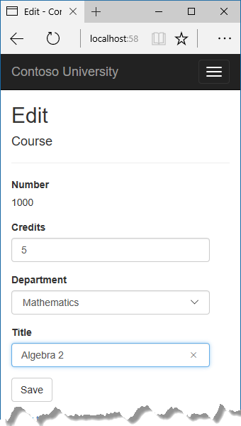
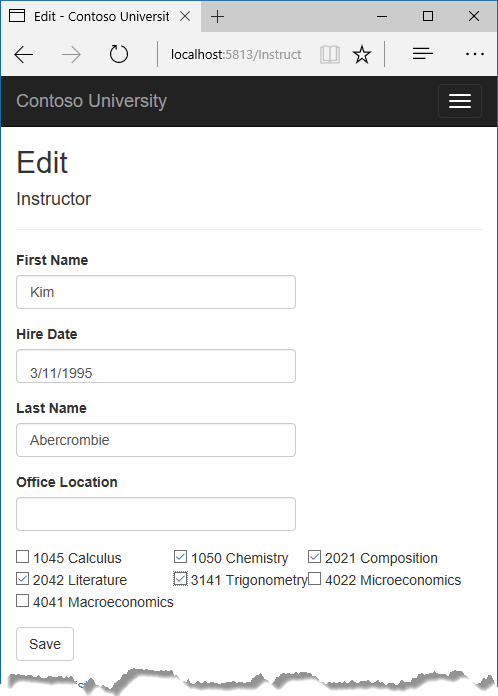
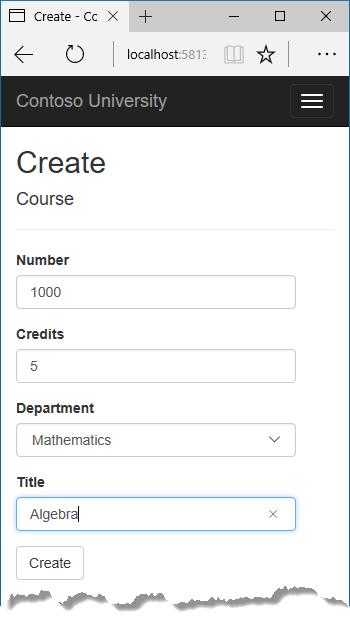
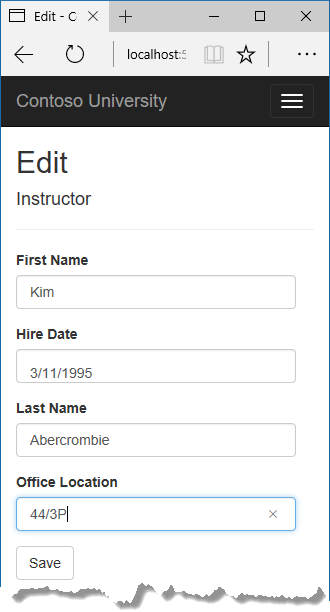
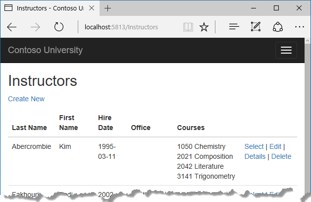

  # Updating related data

The Contoso University sample web application demonstrates how to create ASP.NET Core 1.0 MVC web applications using Entity Framework Core 1.0 and Visual Studio 2015. For information about the tutorial series, see [the first tutorial in the series](intro.md).

In the previous tutorial you displayed related data; in this tutorial you'll update related data by updating foreign key fields and navigation properties.

The following illustrations show some of the pages that you'll work with.







  ## Customize the Create and Edit Pages for Courses

When a new course entity is created, it must have a relationship to an existing department. To facilitate this, the scaffolded code includes controller methods and Create and Edit views that include a drop-down list for selecting the department. The drop-down list sets the `Course.DepartmentID` foreign key property, and that's all the Entity Framework needs in order to load the `Department` navigation property with the appropriate Department entity. You'll use the scaffolded code, but change it slightly to add error handling and sort the drop-down list.

In *CoursesController.cs*, delete the four Create and Edit methods and replace them with the following code:

<!-- literal_block {"ids": [], "names": [], "highlight_args": {"linenostart": 1}, "backrefs": [], "dupnames": [], "linenos": false, "classes": [], "xml:space": "preserve", "language": "c#", "source": "/Users/shirhatti/src/Docs/aspnet/data/ef-mvc/intro/samples/cu/Controllers/CoursesController.cs"} -->

````c#

   public IActionResult Create()
   {
       PopulateDepartmentsDropDownList();
       return View();
   }

   ````

<!-- literal_block {"ids": [], "names": [], "highlight_args": {"linenostart": 1}, "backrefs": [], "dupnames": [], "linenos": false, "classes": [], "xml:space": "preserve", "language": "c#", "source": "/Users/shirhatti/src/Docs/aspnet/data/ef-mvc/intro/samples/cu/Controllers/CoursesController.cs"} -->

````c#

   [HttpPost]
   [ValidateAntiForgeryToken]
   public async Task<IActionResult> Create([Bind("CourseID,Credits,DepartmentID,Title")] Course course)
   {
       if (ModelState.IsValid)
       {
           _context.Add(course);
           await _context.SaveChangesAsync();
           return RedirectToAction("Index");
       }
       PopulateDepartmentsDropDownList(course.DepartmentID);
       return View(course);
   }

   ````

<!-- literal_block {"ids": [], "names": [], "highlight_args": {"linenostart": 1}, "backrefs": [], "dupnames": [], "linenos": false, "classes": [], "xml:space": "preserve", "language": "c#", "source": "/Users/shirhatti/src/Docs/aspnet/data/ef-mvc/intro/samples/cu/Controllers/CoursesController.cs"} -->

````c#

   public async Task<IActionResult> Edit(int? id)
   {
       if (id == null)
       {
           return NotFound();
       }

       var course = await _context.Courses
           .AsNoTracking()
           .SingleOrDefaultAsync(m => m.CourseID == id);
       if (course == null)
       {
           return NotFound();
       }
       PopulateDepartmentsDropDownList(course.DepartmentID);
       return View(course);
   }

   ````

<!-- literal_block {"ids": [], "names": [], "highlight_args": {"linenostart": 1}, "backrefs": [], "dupnames": [], "linenos": false, "classes": [], "xml:space": "preserve", "language": "c#", "source": "/Users/shirhatti/src/Docs/aspnet/data/ef-mvc/intro/samples/cu/Controllers/CoursesController.cs"} -->

````c#

   [HttpPost, ActionName("Edit")]
   [ValidateAntiForgeryToken]
   public async Task<IActionResult> EditPost(int? id)
   {
       if (id == null)
       {
           return NotFound();
       }

       var courseToUpdate = await _context.Courses
           .SingleOrDefaultAsync(c => c.CourseID == id);

       if (await TryUpdateModelAsync<Course>(courseToUpdate,
           "",
           c => c.Credits, c => c.DepartmentID, c => c.Title))
       {
           try
           {
               await _context.SaveChangesAsync();
           }
           catch (DbUpdateException /* ex */)
           {
               //Log the error (uncomment ex variable name and write a log.)
               ModelState.AddModelError("", "Unable to save changes. " +
                   "Try again, and if the problem persists, " +
                   "see your system administrator.");
           }
           return RedirectToAction("Index");
       }
       PopulateDepartmentsDropDownList(courseToUpdate.DepartmentID);
       return View(courseToUpdate);
   }

   ````

After the `Edit` HttpPost method, create a new method that loads department info for the drop-down list.

<!-- literal_block {"ids": [], "names": [], "highlight_args": {"linenostart": 1}, "backrefs": [], "dupnames": [], "linenos": false, "classes": [], "xml:space": "preserve", "language": "c#", "source": "/Users/shirhatti/src/Docs/aspnet/data/ef-mvc/intro/samples/cu/Controllers/CoursesController.cs"} -->

````c#

   private void PopulateDepartmentsDropDownList(object selectedDepartment = null)
   {
       var departmentsQuery = from d in _context.Departments
                              orderby d.Name
                              select d;
       ViewBag.DepartmentID = new SelectList(departmentsQuery.AsNoTracking(), "DepartmentID", "Name", selectedDepartment);
   }

   ````

The `PopulateDepartmentsDropDownList` method gets a list of all departments sorted by name, creates a `SelectList` collection for a drop-down list, and passes the collection to the view in `ViewBag`. The method accepts the optional `selectedDepartment` parameter that allows the calling code to specify the item that will be selected when the drop-down list is rendered. The view will pass the name "DepartmentID" to the `<select>` tag helper, and the helper then knows to look in the `ViewBag` object for a `SelectList` named "DepartmentID".

The HttpGet `Create` method calls the `PopulateDepartmentsDropDownList` method without setting the selected item, because for a new course the department is not established yet:

<!-- literal_block {"ids": [], "names": [], "highlight_args": {"hl_lines": [3], "linenostart": 1}, "backrefs": [], "dupnames": [], "linenos": false, "classes": [], "xml:space": "preserve", "language": "c#", "source": "/Users/shirhatti/src/Docs/aspnet/data/ef-mvc/intro/samples/cu/Controllers/CoursesController.cs"} -->

````c#

   public IActionResult Create()
   {
       PopulateDepartmentsDropDownList();
       return View();
   }

   ````

The HttpGet `Edit` method sets the selected item, based on the ID of the department that is already assigned to the course being edited:

<!-- literal_block {"ids": [], "names": [], "highlight_args": {"hl_lines": [15], "linenostart": 1}, "backrefs": [], "dupnames": [], "linenos": false, "classes": [], "xml:space": "preserve", "language": "c#", "source": "/Users/shirhatti/src/Docs/aspnet/data/ef-mvc/intro/samples/cu/Controllers/CoursesController.cs"} -->

````c#

   public async Task<IActionResult> Edit(int? id)
   {
       if (id == null)
       {
           return NotFound();
       }

       var course = await _context.Courses
           .AsNoTracking()
           .SingleOrDefaultAsync(m => m.CourseID == id);
       if (course == null)
       {
           return NotFound();
       }
       PopulateDepartmentsDropDownList(course.DepartmentID);
       return View(course);
   }

   ````

The HttpPost methods for both `Create` and `Edit` also include code that sets the selected item when they redisplay the page after an error. This ensures that when the page is redisplayed to show the error message, whatever department was selected stays selected.

  ### Add eager loading to Details and Delete methods

To enable the Course Details and Delete pages to display department data, open `CoursesController.cs` and add eager loading for department data, as shown below. Also add `AsNoTracking` to optimize performance.

<!-- literal_block {"ids": [], "names": [], "highlight_args": {"hl_lines": [9, 10], "linenostart": 1}, "backrefs": [], "dupnames": [], "linenos": false, "classes": [], "xml:space": "preserve", "language": "c#", "source": "/Users/shirhatti/src/Docs/aspnet/data/ef-mvc/intro/samples/cu/Controllers/CoursesController.cs"} -->

````c#

   public async Task<IActionResult> Details(int? id)
   {
       if (id == null)
       {
           return NotFound();
       }

       var course = await _context.Courses
           .Include(c => c.Department)
           .AsNoTracking()
           .SingleOrDefaultAsync(m => m.CourseID == id);
       if (course == null)
       {
           return NotFound();
       }

       return View(course);
   }

   ````

<!-- literal_block {"ids": [], "names": [], "highlight_args": {"hl_lines": [9, 10], "linenostart": 1}, "backrefs": [], "dupnames": [], "linenos": false, "classes": [], "xml:space": "preserve", "language": "c#", "source": "/Users/shirhatti/src/Docs/aspnet/data/ef-mvc/intro/samples/cu/Controllers/CoursesController.cs"} -->

````c#

   public async Task<IActionResult> Delete(int? id)
   {
       if (id == null)
       {
           return NotFound();
       }

       var course = await _context.Courses
           .Include(c => c.Department)
           .AsNoTracking()
           .SingleOrDefaultAsync(m => m.CourseID == id);
       if (course == null)
       {
           return NotFound();
       }

       return View(course);
   }

   ````

  ### Modify the Course views

In *Views/Courses/Create.cshtml*, add a field for the course ID before the **Credits** field:

<!-- literal_block {"ids": [], "names": [], "highlight_args": {"linenostart": 1}, "backrefs": [], "dupnames": [], "linenos": false, "classes": [], "xml:space": "preserve", "language": "html", "source": "/Users/shirhatti/src/Docs/aspnet/data/ef-mvc/intro/samples/cu/Views/Courses/Create.cshtml"} -->

````html

   <div class="form-group">
       <label asp-for="CourseID" class="col-md-2 control-label"></label>
       <div class="col-md-10">
           <input asp-for="CourseID" class="form-control" />
           <span asp-validation-for="CourseID" class="text-danger" />
       </div>
   </div>

   ````

The scaffolder doesn't scaffold a primary key because typically the key value is generated by the database and can't be changed and isn't a meaningful value to be displayed to users. For Course entities you do need a text box in the Create view for the **CourseID** field because the `DatabaseGeneratedOption.None` attribute means the user enters the primary key value.

In *Views/Courses/Create.cshtml*, add a "Select Department" option to the **Department** drop-down list, and change the caption for the field from **DepartmentID** to **Department**.

<!-- literal_block {"ids": [], "names": [], "highlight_args": {"hl_lines": [2, 4, 5, 6], "linenostart": 1}, "backrefs": [], "dupnames": [], "linenos": false, "classes": [], "xml:space": "preserve", "language": "html", "source": "/Users/shirhatti/src/Docs/aspnet/data/ef-mvc/intro/samples/cu/Views/Courses/Create.cshtml"} -->

````html

   <div class="form-group">
       <label asp-for="Department" class="col-md-2 control-label"></label>
       <div class="col-md-10">
           <select asp-for="DepartmentID" class ="form-control" asp-items="ViewBag.DepartmentID">
               <option value="">-- Select Department --</option>
           </select>
           <span asp-validation-for="DepartmentID" class="text-danger" />
       </div>
   </div>

   ````

In *Views/Courses/Edit.cshtml*, make the same change for the Department field that you just did in *Create.cshtml*.

Also in *Views/Courses/Edit.cshtml*, add a course number field before the Credits field. Because it's the primary key, it's displayed, but it can't be changed.

<!-- literal_block {"ids": [], "names": [], "highlight_args": {"linenostart": 1}, "backrefs": [], "dupnames": [], "linenos": false, "classes": [], "xml:space": "preserve", "language": "html", "source": "/Users/shirhatti/src/Docs/aspnet/data/ef-mvc/intro/samples/cu/Views/Courses/Edit.cshtml"} -->

````html

   <div class="form-group">
       <label asp-for="CourseID" class="col-md-2 control-label"></label>
       <div class="col-md-10">
           @Html.DisplayFor(model => model.CourseID)
       </div>
   </div>

   ````

There's already a hidden field (`<input type="hidden">`) for the course number in the Edit view. Adding a `<label>` tag helper doesn't eliminate the need for the hidden field because it doesn't cause the course number to be included in the posted data when the user clicks **Save** on the **Edit** page.

In *Views/Course/Delete.cshtml*, add a course number field at the top and a department name field before the title field.

<!-- literal_block {"ids": [], "names": [], "highlight_args": {"hl_lines": [2, 3, 4, 5, 6, 7, 14, 15, 16, 17, 18, 19], "linenostart": 1}, "backrefs": [], "dupnames": [], "linenos": false, "classes": [], "xml:space": "preserve", "language": "html", "source": "/Users/shirhatti/src/Docs/aspnet/data/ef-mvc/intro/samples/cu/Views/Courses/Details.cshtml"} -->

````html

   <dl class="dl-horizontal">
       <dt>
           @Html.DisplayNameFor(model => model.CourseID)
       </dt>
       <dd>
           @Html.DisplayFor(model => model.CourseID)
       </dd>
       <dt>
           @Html.DisplayNameFor(model => model.Credits)
       </dt>
       <dd>
           @Html.DisplayFor(model => model.Credits)
       </dd>
       <dt>
           @Html.DisplayNameFor(model => model.Department)
       </dt>
       <dd>
           @Html.DisplayFor(model => model.Department.Name)
       </dd>
       <dt>
           @Html.DisplayNameFor(model => model.Title)
       </dt>
       <dd>
           @Html.DisplayFor(model => model.Title)
       </dd>
   </dl>

   ````

In *Views/Course/Details.cshtml*, make the same change that you just did for *Delete.cshtml*.

  ### Test the Course pages

Run the **Create** page (display the Course Index page and click **Create New**) and enter data for a new course:




Click **Create**. The Courses Index page is displayed with the new course added to the list. The department name in the Index page list comes from the navigation property, showing that the relationship was established correctly.

Run the **Edit** page (click **Edit** on a course in the Course Index page ).


Change data on the page and click **Save**. The Courses Index page is displayed with the updated course data.

  ## Add an Edit Page for Instructors

When you edit an instructor record, you want to be able to update the instructor's office assignment. The Instructor entity has a one-to-zero-or-one relationship with the OfficeAssignment entity, which means your code has to handle the following situations:

* If the user clears the office assignment and it originally had a value, delete the OfficeAssignment entity.

* If the user enters an office assignment value and it originally was empty, create a new OfficeAssignment entity.

* If the user changes the value of an office assignment, change the value in an existing OfficeAssignment entity.

  ### Update the Instructors controller

In *InstructorsController.cs*, change the code in the HttpGet `Edit` method so that it loads the Instructor entity's `OfficeAssignment` navigation property and calls `AsNoTracking`:

<!-- literal_block {"ids": [], "names": [], "highlight_args": {"hl_lines": [9, 10], "linenostart": 1}, "backrefs": [], "dupnames": [], "linenos": false, "classes": [], "xml:space": "preserve", "language": "c#", "source": "/Users/shirhatti/src/Docs/aspnet/data/ef-mvc/intro/samples/cu/Controllers/InstructorsController.cs"} -->

````c#

   public async Task<IActionResult> Edit(int? id)
   {
       if (id == null)
       {
           return NotFound();
       }

       var instructor = await _context.Instructors
           .Include(i => i.OfficeAssignment)
           .AsNoTracking()
           .SingleOrDefaultAsync(m => m.ID == id);
       if (instructor == null)
       {
           return NotFound();
       }
       return View(instructor);
   }

   ````

Replace the HttpPost `Edit` method with the following code to handle office assignment updates:

<!-- literal_block {"ids": [], "names": [], "highlight_args": {"linenostart": 1}, "backrefs": [], "dupnames": [], "linenos": false, "classes": [], "xml:space": "preserve", "language": "c#", "source": "/Users/shirhatti/src/Docs/aspnet/data/ef-mvc/intro/samples/cu/Controllers/InstructorsController.cs"} -->

````c#

   [HttpPost, ActionName("Edit")]
   [ValidateAntiForgeryToken]
   public async Task<IActionResult> EditPost(int? id)
   {
       if (id == null)
       {
           return NotFound();
       }

       var instructorToUpdate = await _context.Instructors
           .Include(i => i.OfficeAssignment)
           .SingleOrDefaultAsync(s => s.ID == id);

       if (await TryUpdateModelAsync<Instructor>(
           instructorToUpdate,
           "",
           i => i.FirstMidName, i => i.LastName, i => i.HireDate, i => i.OfficeAssignment))
       {
           if (String.IsNullOrWhiteSpace(instructorToUpdate.OfficeAssignment?.Location))
           {
               instructorToUpdate.OfficeAssignment = null;
           }
           try
           {
               await _context.SaveChangesAsync();
           }
           catch (DbUpdateException /* ex */)
           {
               //Log the error (uncomment ex variable name and write a log.)
               ModelState.AddModelError("", "Unable to save changes. " +
                   "Try again, and if the problem persists, " +
                   "see your system administrator.");
           }
           return RedirectToAction("Index");
       }
       return View(instructorToUpdate);
   }

   ````

The code does the following:

* Changes the method name to `EditPost` because the signature is now the same as the HttpGet `Edit` method (the `ActionName` attribute specifies that the `/Edit/` URL is still used).

* Gets the current Instructor entity from the database using eager loading for the `OfficeAssignment` navigation property. This is the same as what you did in the HttpGet `Edit` method.

* Updates the retrieved Instructor entity with values from the model binder. The `TryUpdateModel` overload enables you to whitelist the properties you want to include. This prevents over-posting, as explained in the [second tutorial](crud.md).

  <!-- literal_block {"ids": [], "names": [], "highlight_args": {"linenostart": 1}, "backrefs": [], "dupnames": [], "linenos": false, "classes": [], "xml:space": "preserve", "language": "c#", "source": "/Users/shirhatti/src/Docs/aspnet/data/ef-mvc/intro/samples/cu/Controllers/InstructorsController.cs"} -->

  ````c#

     if (await TryUpdateModelAsync<Instructor>(
         instructorToUpdate,
         "",
         i => i.FirstMidName, i => i.LastName, i => i.HireDate, i => i.OfficeAssignment))

     ````

* If the office location is blank, sets the Instructor.OfficeAssignment property to null so that the related row in the OfficeAssignment table will be deleted.

  <!-- literal_block {"ids": [], "names": [], "highlight_args": {"linenostart": 1}, "backrefs": [], "dupnames": [], "linenos": false, "classes": [], "xml:space": "preserve", "language": "c#", "source": "/Users/shirhatti/src/Docs/aspnet/data/ef-mvc/intro/samples/cu/Controllers/InstructorsController.cs"} -->

  ````c#

     if (String.IsNullOrWhiteSpace(instructorToUpdate.OfficeAssignment?.Location))
     {
         instructorToUpdate.OfficeAssignment = null;
     }

     ````

* Saves the changes to the database.

  ### Update the Instructor Edit view

In *Views/Instructors/Edit.cshtml*, add a new field for editing the office location, at the end before the **Save** button :

<!-- literal_block {"ids": [], "names": [], "highlight_args": {"linenostart": 1}, "backrefs": [], "dupnames": [], "linenos": false, "classes": [], "xml:space": "preserve", "language": "html", "source": "/Users/shirhatti/src/Docs/aspnet/data/ef-mvc/intro/samples/cu/Views/Instructors/Edit.cshtml"} -->

````html

   <div class="form-group">
       <label asp-for="OfficeAssignment.Location" class="col-md-2 control-label"></label>
       <div class="col-md-10">
           <input asp-for="OfficeAssignment.Location" class="form-control" />
           <span asp-validation-for="OfficeAssignment.Location" class="text-danger" />
       </div>
   </div>

   ````

Run the page (select the **Instructors** tab and then click **Edit** on an instructor). Change the **Office Location** and click **Save**.




  ## Add Course assignments to the Instructor Edit page

Instructors may teach any number of courses. Now you'll enhance the Instructor Edit page by adding the ability to change course assignments using a group of check boxes, as shown in the following screen shot:


The relationship between the Course and Instructor entities is many-to-many. To add and remove relationships, you add and remove entities to and from the InstructorCourses join entity set.

The UI that enables you to change which courses an instructor is assigned to is a group of check boxes. A check box for every course in the database is displayed, and the ones that the instructor is currently assigned to are selected. The user can select or clear check boxes to change course assignments. If the number of courses were much greater, you would probably want to use a different method of presenting the data in the view, but you'd use the same method of manipulating a join entity to create or delete relationships.

  ### Update the Instructors controller

To provide data to the view for the list of check boxes, you'll use a view model class.

Create *AssignedCourseData.cs* in the *SchoolViewModels* folder and replace the existing code with the following code:

<!-- literal_block {"ids": [], "names": [], "highlight_args": {"linenostart": 1}, "backrefs": [], "dupnames": [], "linenos": false, "classes": [], "xml:space": "preserve", "language": "c#", "source": "/Users/shirhatti/src/Docs/aspnet/data/ef-mvc/intro/samples/cu/Models/SchoolViewModels/AssignedCourseData.cs"} -->

````c#

   using System;
   using System.Collections.Generic;
   using System.Linq;
   using System.Threading.Tasks;

   namespace ContosoUniversity.Models.SchoolViewModels
   {
       public class AssignedCourseData
       {
           public int CourseID { get; set; }
           public string Title { get; set; }
           public bool Assigned { get; set; }
       }
   }
   ````

In *InstructorsController.cs*, replace the HttpGet `Edit` method with the following code. The changes are highlighted.

<!-- literal_block {"ids": [], "names": [], "highlight_args": {"hl_lines": [10, 17, 21, 22, 23, 24, 25, 26, 27, 28, 29, 30, 31, 32, 33, 34, 35, 36], "linenostart": 1}, "backrefs": [], "dupnames": [], "linenos": false, "classes": [], "xml:space": "preserve", "language": "c#", "source": "/Users/shirhatti/src/Docs/aspnet/data/ef-mvc/intro/samples/cu/Controllers/InstructorsController.cs"} -->

````c#

   public async Task<IActionResult> Edit(int? id)
   {
       if (id == null)
       {
           return NotFound();
       }

       var instructor = await _context.Instructors
           .Include(i => i.OfficeAssignment)
           .Include(i => i.Courses).ThenInclude(i => i.Course)
           .AsNoTracking()
           .SingleOrDefaultAsync(m => m.ID == id);
       if (instructor == null)
       {
           return NotFound();
       }
       PopulateAssignedCourseData(instructor);
       return View(instructor);
   }

   private void PopulateAssignedCourseData(Instructor instructor)
   {
       var allCourses = _context.Courses;
       var instructorCourses = new HashSet<int>(instructor.Courses.Select(c => c.Course.CourseID));
       var viewModel = new List<AssignedCourseData>();
       foreach (var course in allCourses)
       {
           viewModel.Add(new AssignedCourseData
           {
               CourseID = course.CourseID,
               Title = course.Title,
               Assigned = instructorCourses.Contains(course.CourseID)
           });
       }
       ViewData["Courses"] = viewModel;
   }

   ````

The code adds eager loading for the `Courses` navigation property and calls the new `PopulateAssignedCourseData` method to provide information for the check box array using the `AssignedCourseData` view model class.

The code in the `PopulateAssignedCourseData` method reads through all Course entities in order to load a list of courses using the view model class. For each course, the code checks whether the course exists in the instructor's `Courses` navigation property. To create efficient lookup when checking whether a course is assigned to the instructor, the courses assigned to the instructor are put into a `HashSet` collection. The `Assigned` property  is set to true for courses the instructor is assigned to. The view will use this property to determine which check boxes must be displayed as selected. Finally, the list is passed to the view in `ViewData`.

Next, add the code that's executed when the user clicks **Save**. Replace the `EditPost` method with the following code, and add a new method that updates the `Courses` navigation property of the Instructor entity.

<!-- literal_block {"ids": [], "names": [], "highlight_args": {"hl_lines": [3, 12, 13, 25], "linenostart": 1}, "backrefs": [], "dupnames": [], "linenos": false, "classes": [], "xml:space": "preserve", "language": "c#", "source": "/Users/shirhatti/src/Docs/aspnet/data/ef-mvc/intro/samples/cu/Controllers/InstructorsController.cs"} -->

````c#

   [HttpPost]
   [ValidateAntiForgeryToken]
   public async Task<IActionResult> Edit(int? id, string[] selectedCourses)
   {
       if (id == null)
       {
           return NotFound();
       }

       var instructorToUpdate = await _context.Instructors
           .Include(i => i.OfficeAssignment)
           .Include(i => i.Courses)
               .ThenInclude(i => i.Course)
           .SingleOrDefaultAsync(m => m.ID == id);

       if (await TryUpdateModelAsync<Instructor>(
           instructorToUpdate,
           "",
           i => i.FirstMidName, i => i.LastName, i => i.HireDate, i => i.OfficeAssignment))
       {
           if (String.IsNullOrWhiteSpace(instructorToUpdate.OfficeAssignment?.Location))
           {
               instructorToUpdate.OfficeAssignment = null;
           }
           UpdateInstructorCourses(selectedCourses, instructorToUpdate);
           try
           {
               await _context.SaveChangesAsync();
           }
           catch (DbUpdateException /* ex */)
           {
               //Log the error (uncomment ex variable name and write a log.)
               ModelState.AddModelError("", "Unable to save changes. " +
                   "Try again, and if the problem persists, " +
                   "see your system administrator.");
           }
           return RedirectToAction("Index");
       }
       return View(instructorToUpdate);
   }

   ````

<!-- literal_block {"ids": [], "names": [], "highlight_args": {"hl_lines": [1, 2, 3, 4, 5, 6, 7, 8, 9, 10, 11, 12, 13, 14, 15, 16, 17, 18, 19, 20, 21, 22, 23, 24, 25, 26, 27, 28, 29, 30, 31], "linenostart": 1}, "backrefs": [], "dupnames": [], "linenos": false, "classes": [], "xml:space": "preserve", "language": "c#", "source": "/Users/shirhatti/src/Docs/aspnet/data/ef-mvc/intro/samples/cu/Controllers/InstructorsController.cs"} -->

````c#

   private void UpdateInstructorCourses(string[] selectedCourses, Instructor instructorToUpdate)
   {
       if (selectedCourses == null)
       {
           instructorToUpdate.Courses = new List<CourseAssignment>();
           return;
       }

       var selectedCoursesHS = new HashSet<string>(selectedCourses);
       var instructorCourses = new HashSet<int>
           (instructorToUpdate.Courses.Select(c => c.Course.CourseID));
       foreach (var course in _context.Courses)
       {
           if (selectedCoursesHS.Contains(course.CourseID.ToString()))
           {
               if (!instructorCourses.Contains(course.CourseID))
               {
                   instructorToUpdate.Courses.Add(new CourseAssignment { InstructorID = instructorToUpdate.ID, CourseID = course.CourseID });
               }
           }
           else
           {

               if (instructorCourses.Contains(course.CourseID))
               {
                   CourseAssignment courseToRemove = instructorToUpdate.Courses.SingleOrDefault(i => i.CourseID == course.CourseID);
                   _context.Remove(courseToRemove);
               }
           }
       }
   }

   ````

The method signature is now different from the HttpGet `Edit` method, so the method name changes from `EditPost` back to `Edit`.

Since the view doesn't have a collection of Course entities, the model binder can't automatically update the `Courses` navigation property. Instead of using the model binder to update the `Courses` navigation property, you do that in the new `UpdateInstructorCourses` method. Therefore you need to exclude the `Courses` property from model binding. This doesn't require any change to the code that calls `TryUpdateModel` because you're using the whitelisting overload and `Courses` isn't in the include list.

If no check boxes were selected, the code in `UpdateInstructorCourses` initializes the `Courses` navigation property with an empty collection and returns:

<!-- literal_block {"ids": [], "names": [], "highlight_args": {"hl_lines": [3, 4, 5, 6, 7], "linenostart": 1}, "backrefs": [], "dupnames": [], "linenos": false, "classes": [], "xml:space": "preserve", "language": "c#", "source": "/Users/shirhatti/src/Docs/aspnet/data/ef-mvc/intro/samples/cu/Controllers/InstructorsController.cs"} -->

````c#

   private void UpdateInstructorCourses(string[] selectedCourses, Instructor instructorToUpdate)
   {
       if (selectedCourses == null)
       {
           instructorToUpdate.Courses = new List<CourseAssignment>();
           return;
       }

       var selectedCoursesHS = new HashSet<string>(selectedCourses);
       var instructorCourses = new HashSet<int>
           (instructorToUpdate.Courses.Select(c => c.Course.CourseID));
       foreach (var course in _context.Courses)
       {
           if (selectedCoursesHS.Contains(course.CourseID.ToString()))
           {
               if (!instructorCourses.Contains(course.CourseID))
               {
                   instructorToUpdate.Courses.Add(new CourseAssignment { InstructorID = instructorToUpdate.ID, CourseID = course.CourseID });
               }
           }
           else
           {

               if (instructorCourses.Contains(course.CourseID))
               {
                   CourseAssignment courseToRemove = instructorToUpdate.Courses.SingleOrDefault(i => i.CourseID == course.CourseID);
                   _context.Remove(courseToRemove);
               }
           }
       }
   }

   ````

The code then loops through all courses in the database and checks each course against the ones currently assigned to the instructor versus the ones that were selected in the view. To facilitate efficient lookups, the latter two collections are stored in `HashSet` objects.

If the check box for a course was selected but the course isn't in the `Instructor.Courses` navigation property, the course is added to the collection in the navigation property.

<!-- literal_block {"ids": [], "names": [], "highlight_args": {"hl_lines": [14, 15, 16, 17, 18, 19, 20], "linenostart": 1}, "backrefs": [], "dupnames": [], "linenos": false, "classes": [], "xml:space": "preserve", "language": "c#", "source": "/Users/shirhatti/src/Docs/aspnet/data/ef-mvc/intro/samples/cu/Controllers/InstructorsController.cs"} -->

````c#

   private void UpdateInstructorCourses(string[] selectedCourses, Instructor instructorToUpdate)
   {
       if (selectedCourses == null)
       {
           instructorToUpdate.Courses = new List<CourseAssignment>();
           return;
       }

       var selectedCoursesHS = new HashSet<string>(selectedCourses);
       var instructorCourses = new HashSet<int>
           (instructorToUpdate.Courses.Select(c => c.Course.CourseID));
       foreach (var course in _context.Courses)
       {
           if (selectedCoursesHS.Contains(course.CourseID.ToString()))
           {
               if (!instructorCourses.Contains(course.CourseID))
               {
                   instructorToUpdate.Courses.Add(new CourseAssignment { InstructorID = instructorToUpdate.ID, CourseID = course.CourseID });
               }
           }
           else
           {

               if (instructorCourses.Contains(course.CourseID))
               {
                   CourseAssignment courseToRemove = instructorToUpdate.Courses.SingleOrDefault(i => i.CourseID == course.CourseID);
                   _context.Remove(courseToRemove);
               }
           }
       }
   }

   ````

If the check box for a course wasn't selected, but the course is in the `Instructor.Courses` navigation property, the course is removed from the navigation property.

<!-- literal_block {"ids": [], "names": [], "highlight_args": {"hl_lines": [21, 22, 23, 24, 25, 26, 27, 28, 29], "linenostart": 1}, "backrefs": [], "dupnames": [], "linenos": false, "classes": [], "xml:space": "preserve", "language": "c#", "source": "/Users/shirhatti/src/Docs/aspnet/data/ef-mvc/intro/samples/cu/Controllers/InstructorsController.cs"} -->

````c#

   private void UpdateInstructorCourses(string[] selectedCourses, Instructor instructorToUpdate)
   {
       if (selectedCourses == null)
       {
           instructorToUpdate.Courses = new List<CourseAssignment>();
           return;
       }

       var selectedCoursesHS = new HashSet<string>(selectedCourses);
       var instructorCourses = new HashSet<int>
           (instructorToUpdate.Courses.Select(c => c.Course.CourseID));
       foreach (var course in _context.Courses)
       {
           if (selectedCoursesHS.Contains(course.CourseID.ToString()))
           {
               if (!instructorCourses.Contains(course.CourseID))
               {
                   instructorToUpdate.Courses.Add(new CourseAssignment { InstructorID = instructorToUpdate.ID, CourseID = course.CourseID });
               }
           }
           else
           {

               if (instructorCourses.Contains(course.CourseID))
               {
                   CourseAssignment courseToRemove = instructorToUpdate.Courses.SingleOrDefault(i => i.CourseID == course.CourseID);
                   _context.Remove(courseToRemove);
               }
           }
       }
   }

   ````

  ### Update the Instructor views

In *Views/Instructors/Edit.cshtml*, add a **Courses** field with an array of check boxes by adding the following code immediately after the `div` elements for the **Office** field and before the `div` element for the **Save** button.

Note: Open the file in a text editor such as Notepad to make this change.  If you use Visual Studio, line breaks will be changed in a way that breaks the code.  If that happens, fix the line breaks so that they look like what you see here. The indentation doesn't have to be perfect, but the `@</tr><tr>`, `@:<td>`, `@:</td>`, and `@:</tr>` lines must each be on a single line as shown or you'll get a runtime error. After editing the file in a text editor, you can open it in Visual Studio, highlight the block of new code, and press Tab twice to line up the new code with the existing code.

<!-- literal_block {"ids": [], "names": [], "highlight_args": {"linenostart": 1}, "backrefs": [], "dupnames": [], "linenos": false, "classes": [], "xml:space": "preserve", "language": "none", "source": "/Users/shirhatti/src/Docs/aspnet/data/ef-mvc/intro/samples/cu/Views/Instructors/Edit.cshtml"} -->

````none

   <div class="form-group">
       <div class="col-md-offset-2 col-md-10">
           <table>
               <tr>
                   @{
                       int cnt = 0;
                       List<ContosoUniversity.Models.SchoolViewModels.AssignedCourseData> courses = ViewBag.Courses;

                       foreach (var course in courses)
                       {
                           if (cnt++ % 3 == 0)
                           {
                               @:</tr><tr>
                           }
                           @:<td>
                               <input type="checkbox"
                                      name="selectedCourses"
                                      value="@course.CourseID"
                                      @(Html.Raw(course.Assigned ? "checked=\"checked\"" : "")) />
                                      @course.CourseID @:  @course.Title
                           @:</td>
                       }
                       @:</tr>
                   }
           </table>
       </div>
   </div>

   ````

This code creates an HTML table that has three columns. In each column is a check box followed by a caption that consists of the course number and title. The check boxes all have the same name ("selectedCourses"), which informs the model binder that they are to be treated as a group. The value attribute of each check box is set to the value of `CourseID`. When the page is posted, the model binder passes an array to the controller that consists of the `CourseID` values for only the check boxes which are selected.

When the check boxes are initially rendered, those that are for courses assigned to the instructor have checked attributes, which selects them (displays them checked).

Run the Instructor Index page, and click **Edit** on an instructor to see the **Edit** page.


Change some course assignments and click Save. The changes you make are reflected on the Index page.




Note: The approach taken here to edit instructor course data works well when there is a limited number of courses. For collections that are much larger, a different UI and a different updating method would be required.

  ## Update the Delete page

In *InstructorsController.cs*, delete the `DeleteConfirmed` method and insert the following code in its place.

<!-- literal_block {"ids": [], "names": [], "highlight_args": {"hl_lines": [6, 9, 10, 11, 12], "linenostart": 1}, "backrefs": [], "dupnames": [], "linenos": false, "classes": [], "xml:space": "preserve", "language": "c#", "source": "/Users/shirhatti/src/Docs/aspnet/data/ef-mvc/intro/samples/cu/Controllers/InstructorsController.cs"} -->

````c#

   [HttpPost, ActionName("Delete")]
   [ValidateAntiForgeryToken]
   public async Task<IActionResult> DeleteConfirmed(int id)
   {
       Instructor instructor = await _context.Instructors
           .Include(i => i.Courses)
           .SingleAsync(i => i.ID == id);

       var departments = await _context.Departments
           .Where(d => d.InstructorID == id)
           .ToListAsync();
       departments.ForEach(d => d.InstructorID = null);

       _context.Instructors.Remove(instructor);

       await _context.SaveChangesAsync();
       return RedirectToAction("Index");
   }

   ````

This code makes the following changes:

* Does eager loading for the `Courses` navigation property.  You have to include this or EF won't know about related `CourseAssignment` entities and won't delete them.  To avoid needing to read them here you could configure cascade delete in the database.

* If the instructor to be deleted is assigned as administrator of any departments, removes the instructor assignment from those departments.

  ## Add office location and courses to the Create page

In *InstructorController.cs*, delete the HttpGet and HttpPost `Create` methods, and then add the following code in their place:

<!-- literal_block {"ids": [], "names": [], "highlight_args": {"hl_lines": [5, 14, 15, 16, 17, 18, 19, 20, 21, 22], "linenostart": 1}, "backrefs": [], "dupnames": [], "linenos": false, "classes": [], "xml:space": "preserve", "language": "c#", "source": "/Users/shirhatti/src/Docs/aspnet/data/ef-mvc/intro/samples/cu/Controllers/InstructorsController.cs"} -->

````c#

   public IActionResult Create()
   {
       var instructor = new Instructor();
       instructor.Courses = new List<CourseAssignment>();
       PopulateAssignedCourseData(instructor);
       return View();
   }

   // POST: Instructors/Create
   [HttpPost]
   [ValidateAntiForgeryToken]
   public async Task<IActionResult> Create([Bind("FirstMidName,HireDate,LastName,OfficeAssignment")] Instructor instructor, string[] selectedCourses)
   {
       if (selectedCourses != null)
       {
           instructor.Courses = new List<CourseAssignment>();
           foreach (var course in selectedCourses)
           {
               var courseToAdd = new CourseAssignment { InstructorID = instructor.ID, CourseID = int.Parse(course) };
               instructor.Courses.Add(courseToAdd);
           }
       }
       if (ModelState.IsValid)
       {
           _context.Add(instructor);
           await _context.SaveChangesAsync();
           return RedirectToAction("Index");
       }
       return View(instructor);
   }

   ````

This code is similar to what you saw for the `Edit` methods except that initially no courses are selected. The HttpGet `Create` method calls the `PopulateAssignedCourseData` method not because there might be courses selected but in order to provide an empty collection for the `foreach` loop in the view (otherwise the view code would throw a null reference exception).

The HttpPost `Create` method adds each selected course to the `Courses` navigation property before it checks for validation errors and adds the new instructor to the database. Courses are added even if there are model errors so that when there are model errors (for an example, the user keyed an invalid date), and the page is redisplayed with an error message, any course selections that were made are automatically restored.

Notice that in order to be able to add courses to the `Courses` navigation property you have to initialize the property as an empty collection:

<!-- literal_block {"ids": [], "names": [], "highlight_args": {}, "backrefs": [], "dupnames": [], "linenos": false, "classes": [], "xml:space": "preserve", "language": "c#"} -->

````c#

   instructor.Courses = new List<Course>();
   ````

As an alternative to doing this in controller code, you could do it in the Instructor model by changing the property getter to automatically create the collection if it doesn't exist, as shown in the following example:

<!-- literal_block {"ids": [], "names": [], "highlight_args": {}, "backrefs": [], "dupnames": [], "linenos": false, "classes": [], "xml:space": "preserve", "language": "c#"} -->

````c#

   private ICollection<Course> _courses;
   public ICollection<Course> Courses
   {
       get
       {
           return _courses ?? (_courses = new List<Course>());
       }
       set
       {
           _courses = value;
       }
   }
   ````

If you modify the `Courses` property in this way, you can remove the explicit property initialization code in the controller.

In *Views/Instructor/Create.cshtml*, add an office location text box and check boxes for courses after the hire date field and before the Submit button. As in the case of the Edit page, this will work better if you do it in a text editor such as Notepad.

<!-- literal_block {"ids": [], "names": [], "highlight_args": {"linenostart": 1}, "backrefs": [], "dupnames": [], "linenos": false, "classes": [], "xml:space": "preserve", "language": "none", "source": "/Users/shirhatti/src/Docs/aspnet/data/ef-mvc/intro/samples/cu/Views/Instructors/Create.cshtml"} -->

````none

   <div class="form-group">
       <label asp-for="OfficeAssignment.Location" class="col-md-2 control-label"></label>
       <div class="col-md-10">
           <input asp-for="OfficeAssignment.Location" class="form-control" />
           <span asp-validation-for="OfficeAssignment.Location" class="text-danger" />
       </div>
   </div>

   <div class="form-group">
       <div class="col-md-offset-2 col-md-10">
           <table>
               <tr>
                   @{
                       int cnt = 0;
                       List<ContosoUniversity.Models.SchoolViewModels.AssignedCourseData> courses = ViewBag.Courses;

                       foreach (var course in courses)
                       {
                           if (cnt++ % 3 == 0)
                           {
                               @:</tr><tr>
                           }
                           @:<td>
                               <input type="checkbox"
                                      name="selectedCourses"
                                      value="@course.CourseID"
                                      @(Html.Raw(course.Assigned ? "checked=\"checked\"" : "")) />
                                   @course.CourseID @:  @course.Title
                                   @:</td>
                       }
                       @:</tr>
                   }
           </table>
       </div>
   </div>

   ````

Test by running the **Create** page and adding an instructor.

  ## Handling Transactions

As explained in the [CRUD tutorial](crud.md), the Entity Framework implicitly implements transactions. For scenarios where you need more control -- for example, if you want to include operations done outside of Entity Framework in a transaction -- see [Transactions](https://ef.readthedocs.io/en/latest/saving/transactions.html).

  ## Summary

You have now completed the introduction to working with related data. In the next tutorial you'll see how to handle concurrency conflicts.
