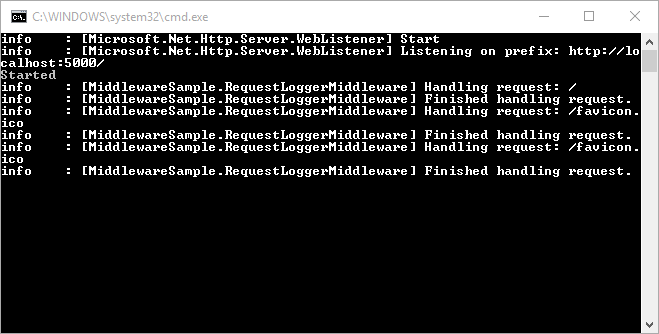

<a name=fundamentals-middleware></a>

  # Middleware

By [Steve Smith](http://ardalis.com) and [Rick Anderson](https://twitter.com/RickAndMSFT)

[View or download sample code](https://github.com/aspnet/Docs/tree/master/aspnet/fundamentals/middleware/sample)

  ## What is middleware

Middleware are software components that are assembled into an application pipeline to handle requests and responses. Each component chooses whether to pass the request on to the next component in the pipeline, and can perform certain actions before and after the next component is invoked in the pipeline. Request delegates are used to build the request pipeline. The request delegates handle each HTTP request.

Request delegates are configured using [Run](https://docs.asp.net/projects/api/en/latest/autoapi/Microsoft/AspNetCore/Builder/RunExtensions/index.html), [Map](https://docs.asp.net/projects/api/en/latest/autoapi/Microsoft/AspNetCore/Builder/MapExtensions/index.html?highlight=Microsoft.AspNetCore.builder.mapextensions#Microsoft.AspNetCore.Builder.MapExtensions.Map), and [Use](https://docs.asp.net/projects/api/en/latest/autoapi/Microsoft/AspNetCore/Builder/UseExtensions/index.html?highlight=Microsoft.AspNetCore.builder.useextensions#Microsoft.AspNetCore.Builder.UseExtensions.Use) extension methods on the [IApplicationBuilder](https://docs.asp.net/projects/api/en/latest/autoapi/Microsoft/AspNetCore/Builder/IApplicationBuilder/index.html) type that is passed into the `Configure` method in the `Startup` class. An individual request delegate can be specified in-line as an anonymous method, or it can be defined in a reusable class. These reusable classes  are *middleware*, or *middleware
components*. Each middleware component in the request pipeline is responsible for invoking the next component in the pipeline, or short-circuiting the chain if appropriate.

[Migrating HTTP Modules to Middleware](../migration/http-modules.md) explains the difference between request pipelines in ASP.NET Core and the previous versions and provides more middleware samples.

  ## Creating a middleware pipeline with IApplicationBuilder

The ASP.NET request pipeline consists of a sequence of request delegates, called one after the next, as this diagram shows (the thread of execution follows the black arrows):


Each delegate has the opportunity to perform operations before and after the next delegate. Any delegate can choose to stop passing the request on to the next delegate, and instead handle the request itself. This is referred to as short-circuiting the request pipeline, and is desirable because it allows unnecessary work to be avoided. For example, an authorization middleware might only call the next delegate if the request is authenticated; otherwise it could short-circuit the pipeline and return a "Not Authorized" response. Exception handling delegates need to be called early on in the pipeline, so they are able to catch exceptions that occur in deeper calls within the pipeline.

You can see an example of setting up the request pipeline in the default web site template that ships with Visual Studio 2015. The `Configure` method adds the following middleware components:

1. Error handling (for both development and non-development environments)

2. Static file server

3. Authentication

4. MVC

<!-- literal_block {"ids": [], "names": [], "highlight_args": {"hl_lines": [8, 9, 10, 14, 17, 19, 23], "linenostart": 1}, "backrefs": [], "dupnames": [], "linenos": true, "classes": [], "xml:space": "preserve", "language": "c#", "source": "/Users/shirhatti/src/Docs/common/samples/WebApplication1/src/WebApplication1/Startup.cs"} -->

````c#

   public void Configure(IApplicationBuilder app, IHostingEnvironment env, ILoggerFactory loggerFactory)
   {
       loggerFactory.AddConsole(Configuration.GetSection("Logging"));
       loggerFactory.AddDebug();

       if (env.IsDevelopment())
       {
           app.UseDeveloperExceptionPage();
           app.UseDatabaseErrorPage();
           app.UseBrowserLink();
       }
       else
       {
           app.UseExceptionHandler("/Home/Error");
       }

       app.UseStaticFiles();

       app.UseIdentity();

       // Add external authentication middleware below. To configure them please see http://go.microsoft.com/fwlink/?LinkID=532715

       app.UseMvc(routes =>
       {
           routes.MapRoute(
               name: "default",
               template: "{controller=Home}/{action=Index}/{id?}");
       });
   }

   ````

In the code above (in non-development environments), [UseExceptionHandler](https://docs.asp.net/projects/api/en/latest/autoapi/Microsoft/AspNetCore/Builder/ExceptionHandlerExtensions/index.html) is the first middleware added to the pipeline, therefore will catch any exceptions that occur in later calls.

The [static file module](https://docs.asp.net/projects/api/en/latest/autoapi/Microsoft/AspNetCore/Builder/StaticFileExtensions/index.html) provides no authorization checks. Any files served by it, including those under *wwwroot* are publicly available. If you want to serve files based on authorization:

1. Store them outside of *wwwroot* and any directory accessible to the static file middleware.

2. Deliver them through a controller action, returning a [FileResult](https://docs.asp.net/projects/api/en/latest/autoapi/Microsoft/AspNetCore/Mvc/FileResult/index.html) where authorization is applied.

A request that is handled by the static file module will short circuit the pipeline. (see [Working with Static Files](static-files.md).) If the request is not handled by the static file module, it's passed on to the [Identity module](https://docs.asp.net/projects/api/en/latest/autoapi/Microsoft/AspNetCore/Builder/BuilderExtensions/index.html#methods), which performs authentication. If the request is not authenticated, the pipeline is short circuited. If the request does not fail authentication, the last stage of this pipeline is called, which is the MVC framework.

Note: The order in which you add middleware components is generally the order in which they take effect on the request, and then in reverse for the response. This can be critical to your app’s security, performance and functionality. In the code above, the [static file middleware](https://docs.asp.net/projects/api/en/latest/autoapi/Microsoft/AspNetCore/Builder/StaticFileExtensions/index.html) is called early in the pipeline so it can handle requests and short circuit without going through unnecessary components. The authentication middleware is added to the pipeline before anything that handles requests that need to be authenticated. Exception handling must be registered before other middleware components in order to catch exceptions thrown by those components.

The simplest possible ASP.NET application sets up a single request delegate that handles all requests. In this case, there isn't really a request "pipeline", so much as a single anonymous function that is called in response to every HTTP request.

<!-- literal_block {"ids": [], "names": [], "highlight_args": {"linenostart": 1}, "backrefs": [], "dupnames": [], "linenos": false, "classes": [], "xml:space": "preserve", "language": "c#", "source": "/Users/shirhatti/src/Docs/aspnet/fundamentals/middleware/sample/src/MiddlewareSample/Startup.cs"} -->

````c#

   app.Run(async context =>
   {
       await context.Response.WriteAsync("Hello, World!");
   });

   ````

The first `App.Run` delegate terminates the pipeline. In the following example, only the first delegate ("Hello, World!") will run.

<!-- literal_block {"ids": [], "names": [], "highlight_args": {"hl_lines": [5], "linenostart": 1}, "backrefs": [], "dupnames": [], "linenos": false, "classes": [], "xml:space": "preserve", "language": "c#", "source": "/Users/shirhatti/src/Docs/aspnet/fundamentals/middleware/sample/src/MiddlewareSample/Startup.cs"} -->

````c#


   public void Configure(IApplicationBuilder app)
   {
       app.Run(async context =>
       {
           await context.Response.WriteAsync("Hello, World!");
       });

       app.Run(async context =>
       {
           await context.Response.WriteAsync("Hello, World, Again!");
       });

   ````

You chain multiple request delegates together; the `next` parameter represents the next delegate in the pipeline. You can terminate (short-circuit) the pipeline by *not* calling the *next* parameter. You can typically perform actions both before and after the next delegate, as this example demonstrates:

<!-- literal_block {"ids": [], "names": [], "highlight_args": {"hl_lines": [5, 8, 14], "linenostart": 1}, "backrefs": [], "dupnames": [], "linenos": false, "classes": [], "xml:space": "preserve", "language": "c#", "source": "/Users/shirhatti/src/Docs/aspnet/fundamentals/middleware/sample/src/MiddlewareSample/Startup.cs"} -->

````c#

   public void ConfigureLogInline(IApplicationBuilder app, ILoggerFactory loggerfactory)
   {
       loggerfactory.AddConsole(minLevel: LogLevel.Information);
       var logger = loggerfactory.CreateLogger(_environment);
       app.Use(async (context, next) =>
       {
           logger.LogInformation("Handling request.");
           await next.Invoke();
           logger.LogInformation("Finished handling request.");
       });

       app.Run(async context =>
       {
           await context.Response.WriteAsync("Hello from " + _environment);
       });
   }

   ````

Warning: Avoid modifying `HttpResponse` after invoking next, one of the next components in the pipeline may have written to the response, causing it to be sent to the client.

Note: This `ConfigureLogInline` method is called when the application is run with an environment set to `LogInline`. Learn more about [Working with Multiple Environments](environments.md). We will be using variations of `Configure[Environment]` to show different options in the rest of this article. The easiest way to run the samples in Visual Studio is with the `web` command, which is configured in *project.json*. See also [Application Startup](startup.md).

In the above example, the call to `await next.Invoke()` will call into the next delegate `await context.Response.WriteAsync("Hello from " + _environment);`. The client will receive the expected response ("Hello from LogInline"), and the server's console output includes both the before and after messages:


<a name=middleware-run-map-use></a>

  ### Run, Map, and Use

You configure the HTTP pipeline using [Run](https://docs.asp.net/projects/api/en/latest/autoapi/Microsoft/AspNetCore/Builder/RunExtensions/index.html), [Map](https://docs.asp.net/projects/api/en/latest/autoapi/Microsoft/AspNetCore/Builder/MapExtensions/index.html),  and [Use](https://docs.asp.net/projects/api/en/latest/autoapi/Microsoft/AspNetCore/Builder/UseExtensions/index.html). The `Run` method short circuits the pipeline (that is, it will not call a `next` request delegate). Thus, `Run` should only be called at the end of your pipeline. `Run` is a convention, and some middleware components may expose their own Run[Middleware] methods that should only run at the end of the pipeline. The following two middleware are equivalent as the `Use` version doesn't use the `next` parameter:

<!-- literal_block {"ids": [], "names": [], "highlight_args": {"hl_lines": [3, 11], "linenostart": 1}, "backrefs": [], "dupnames": [], "linenos": false, "classes": [], "xml:space": "preserve", "language": "c#", "source": "/Users/shirhatti/src/Docs/aspnet/fundamentals/middleware/sample/src/MiddlewareSample/Startup.cs"} -->

````c#

   public void ConfigureEnvironmentOne(IApplicationBuilder app)
   {
       app.Run(async context =>
       {
           await context.Response.WriteAsync("Hello from " + _environment);
       });
   }

   public void ConfigureEnvironmentTwo(IApplicationBuilder app)
   {
       app.Use(async (context, next) =>
       {
           await context.Response.WriteAsync("Hello from " + _environment);
       });
   }

   ````

Note: The [IApplicationBuilder](https://docs.asp.net/projects/api/en/latest/autoapi/Microsoft/AspNetCore/Builder/IApplicationBuilder/index.html) interface exposes a single `Use` method, so technically they're not all *extension* methods.

We've already seen several examples of how to build a request pipeline with `Use`. `Map*` extensions are used as a convention for branching the pipeline. The current implementation supports branching based on the request's path, or using a predicate. The `Map` extension method is used to match request delegates based on a request's path. `Map` simply accepts a path and a function that configures a separate middleware pipeline. In the following example, any request with the base path of `/maptest` will be handled by the pipeline configured in the `HandleMapTest` method.

<!-- literal_block {"ids": [], "names": [], "highlight_args": {"hl_lines": [11], "linenostart": 1}, "backrefs": [], "dupnames": [], "linenos": false, "classes": [], "xml:space": "preserve", "language": "c#", "source": "/Users/shirhatti/src/Docs/aspnet/fundamentals/middleware/sample/src/MiddlewareSample/Startup.cs"} -->

````c#

   private static void HandleMapTest(IApplicationBuilder app)
   {
       app.Run(async context =>
       {
           await context.Response.WriteAsync("Map Test Successful");
       });
   }

   public void ConfigureMapping(IApplicationBuilder app)
   {
       app.Map("/maptest", HandleMapTest);

   }

   ````

Note: When `Map` is used, the matched path segment(s) are removed from `HttpRequest.Path` and appended to `HttpRequest.PathBase` for each request.

In addition to path-based mapping, the `MapWhen` method supports predicate-based middleware branching, allowing separate pipelines to be constructed in a very flexible fashion. Any predicate of type `Func<HttpContext, bool>` can be used to map requests to a new branch of the pipeline. In the following example, a simple predicate is used to detect the presence of a query string variable `branch`:

<!-- literal_block {"ids": [], "names": [], "highlight_args": {"hl_lines": [5, 11, 12, 13], "linenostart": 1}, "backrefs": [], "dupnames": [], "linenos": false, "classes": [], "xml:space": "preserve", "language": "c#", "source": "/Users/shirhatti/src/Docs/aspnet/fundamentals/middleware/sample/src/MiddlewareSample/Startup.cs"} -->

````c#

   private static void HandleBranch(IApplicationBuilder app)
   {
       app.Run(async context =>
       {
           await context.Response.WriteAsync("Branch used.");
       });
   }

   public void ConfigureMapWhen(IApplicationBuilder app)
   {
       app.MapWhen(context => {
           return context.Request.Query.ContainsKey("branch");
       }, HandleBranch);

       app.Run(async context =>
       {
           await context.Response.WriteAsync("Hello from " + _environment);
       });
   }

   ````

Using the configuration shown above, any request that includes a query string value for `branch` will use the pipeline defined in the `HandleBranch` method (in this case, a response of "Branch used."). All other requests (that do not define a query string value for `branch`) will be handled by the delegate defined on line 17.

You can also nest Maps:

<!-- literal_block {"ids": [], "names": [], "highlight_args": {}, "backrefs": [], "dupnames": [], "linenos": false, "classes": [], "xml:space": "preserve", "language": "javascript"} -->

````javascript

   app.Map("/level1", level1App => {
       level1App.Map("/level2a", level2AApp => {
           // "/level1/level2a"
           //...
       });
       level1App.Map("/level2b", level2BApp => {
           // "/level1/level2b"
           //...
       });
   });
   ````

  ## Built-in middleware

ASP.NET ships with the following middleware components:


### Middleware<!-- Skip node --><!-- Skip node --><!-- Skip node --><!-- Skip node --><!-- Skip node --><!-- Skip node --><!-- Skip node --><!-- Skip node --><!-- Skip node --><!-- Skip node --><!-- Skip node --><!-- Skip node --><!-- table -->

<a name=middleware-writing-middleware></a>

  ## Writing middleware

The [CodeLabs middleware tutorial](https://github.com/Microsoft-Build-2016/CodeLabs-WebDev/tree/master/Module2-AspNetCore) provides a good introduction to writing middleware.

For more complex request handling functionality, the ASP.NET team recommends implementing the middleware in its own class, and exposing an `IApplicationBuilder` extension method that can be called from the `Configure` method. The simple logging middleware shown in the previous example can be converted into a middleware class that takes in the next `RequestDelegate` in its constructor and supports an `Invoke` method as shown:

RequestLoggerMiddleware.cs

<!-- literal_block {"ids": [], "names": [], "highlight_args": {"hl_lines": [12, 18], "linenostart": 1}, "backrefs": [], "dupnames": [], "linenos": false, "classes": [], "xml:space": "preserve", "language": "c#", "source": "/Users/shirhatti/src/Docs/aspnet/fundamentals/middleware/sample/src/MiddlewareSample/RequestLoggerMiddleware.cs"} -->

````c#

   using System.Threading.Tasks;
   using Microsoft.AspNetCore.Http;
   using Microsoft.Extensions.Logging;

   namespace MiddlewareSample
   {
       public class RequestLoggerMiddleware
       {
           private readonly RequestDelegate _next;
           private readonly ILogger _logger;

           public RequestLoggerMiddleware(RequestDelegate next, ILoggerFactory loggerFactory)
           {
               _next = next;
               _logger = loggerFactory.CreateLogger<RequestLoggerMiddleware>();
           }

           public async Task Invoke(HttpContext context)
           {
               _logger.LogInformation("Handling request: " + context.Request.Path);
               await _next.Invoke(context);
               _logger.LogInformation("Finished handling request.");
           }
       }
   }
   ````

The middleware follows the [Explicit Dependencies Principle](http://deviq.com/explicit-dependencies-principle/) and exposes all of its dependencies in its constructor. Middleware can take advantage of the [UseMiddleware<T>](https://docs.asp.net/projects/api/en/latest/autoapi/Microsoft/AspNetCore/Builder/UseMiddlewareExtensions/index.html#meth-Microsoft.AspNetCore.Builder.UseMiddlewareExtensions.UseMiddleware<TMiddleware>) extension to inject services directly into their constructors, as shown in the example below. Dependency injected services are automatically filled, and the extension takes a `params` array of arguments to be used for non-injected parameters.

RequestLoggerExtensions.cs

<!-- literal_block {"ids": [], "names": [], "highlight_args": {"hl_lines": [5], "linenostart": 1}, "backrefs": [], "dupnames": [], "linenos": false, "classes": [], "xml:space": "preserve", "language": "c#", "source": "/Users/shirhatti/src/Docs/aspnet/fundamentals/middleware/sample/src/MiddlewareSample/RequestLoggerExtensions.cs"} -->

````c#

   public static class RequestLoggerExtensions
   {
       public static IApplicationBuilder UseRequestLogger(this IApplicationBuilder builder)
       {
           return builder.UseMiddleware<RequestLoggerMiddleware>();
       }
   }

   ````

Using the extension method and associated middleware class, the `Configure` method becomes very simple and readable.

<!-- literal_block {"ids": [], "names": [], "highlight_args": {"hl_lines": [6], "linenostart": 1}, "backrefs": [], "dupnames": [], "linenos": false, "classes": [], "xml:space": "preserve", "language": "c#", "source": "/Users/shirhatti/src/Docs/aspnet/fundamentals/middleware/sample/src/MiddlewareSample/Startup.cs"} -->

````c#

   public void ConfigureLogMiddleware(IApplicationBuilder app,
       ILoggerFactory loggerfactory)
   {
       loggerfactory.AddConsole(minLevel: LogLevel.Information);

       app.UseRequestLogger();

       app.Run(async context =>
       {
           await context.Response.WriteAsync("Hello from " + _environment);
       });
   }

   ````

Although `RequestLoggerMiddleware` requires an `ILoggerFactory` parameter in its constructor, neither the `Startup` class nor the `UseRequestLogger` extension method need to explicitly supply it. Instead, it is automatically provided through dependency injection performed within `UseMiddleware<T>`.

Testing the middleware (by setting the `Hosting:Environment` environment variable to `LogMiddleware`) should result in output like the following (when using WebListener):



Note: The [UseStaticFiles](https://docs.asp.net/projects/api/en/latest/autoapi/Microsoft/AspNetCore/Builder/StaticFileExtensions/index.html#meth-Microsoft.AspNetCore.Builder.StaticFileExtensions.UseStaticFiles) extension method (which creates the [StaticFileMiddleware](https://docs.asp.net/projects/api/en/latest/autoapi/Microsoft/AspNetCore/StaticFiles/StaticFileMiddleware/index.html)) also uses `UseMiddleware<T>`. In this case, the `StaticFileOptions` parameter is passed in, but other constructor parameters are supplied by `UseMiddleware<T>` and dependency injection.

  ## Additional Resources

* [CodeLabs middleware tutorial](https://github.com/Microsoft-Build-2016/CodeLabs-WebDev/tree/master/Module2-AspNetCore)

* [Sample code used in this doc](https://github.com/aspnet/Docs/tree/master/aspnet/fundamentals/middleware/sample)

* [Migrating HTTP Modules to Middleware](../migration/http-modules.md)

* [Application Startup](startup.md)

* [Request Features](request-features.md)
