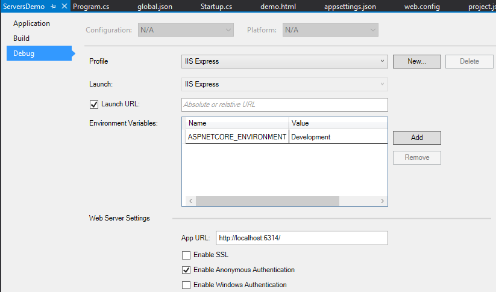

  # Servers

By [Steve Smith](http://ardalis.com) and [Stephen Halter](https://twitter.com/halter73)

ASP.NET Core is completely decoupled from the web server environment that hosts the application. ASP.NET Core supports hosting in IIS and IIS Express, and self-hosting scenarios using the Kestrel and WebListener HTTP servers. Additionally, developers and third party software vendors can create custom servers to host their ASP.NET Core apps.

[View or download sample code](https://github.com/aspnet/Docs/tree/master/aspnet/fundamentals/servers/sample)

  ## Servers and WebHostBuilderExtensions

ASP.NET Core was designed to decouple web applications from the underlying HTTP server. Traditionally, ASP.NET apps have been windows-only hosted on Internet Information Server (IIS). The recommended way to run ASP.NET Core applications on Windows is still using IIS, but as a reverse-proxy server. The ASP.NET Core Module in IIS manages and proxies requests to the Kestrel HTTP server hosted out-of-process. ASP.NET Core ships with two different HTTP servers:

* Microsoft.AspNetCore.Server.Kestrel (AKA Kestrel, cross-platform)

* Microsoft.AspNetCore.Server.WebListener (AKA WebListener, Windows-only, preview)

ASP.NET Core does not directly listen for requests, but instead relies on the HTTP server implementation to surface the request to the application as a set of [feature interfaces](request-features.md) composed into an HttpContext. While WebListener is Windows-only, Kestrel is designed to run cross-platform. You can configure your application to be hosted by any of these servers via extension methods on [WebHostBuilder](http://docs.asp.net/projects/api/en/latest/autoapi/Microsoft/AspNetCore/Hosting/WebHostBuilder/index.html.md#Microsoft.AspNetCore.Hosting.WebHostBuilder.md).

The default web host for ASP.NET apps developed using Visual Studio is IIS Express functioning as a reverse proxy server for Kestrel. The "Microsoft.AspNetCore.Server.Kestrel" and "Microsoft.AspNetCore.Server.IISIntegration" dependencies are included in *project.json* by default, even with the Empty web site template. Visual Studio provides support for multiple profiles. In addition to the default profile for running in IIS Express, the templates include a second profile that executes the app directly relying on Kestrel for self-hosting. You can manage these profiles and their settings in the **Debug** tab of your web application project's Properties menu or from the *launchSettings.json* file.



Note: The ASP.NET Core Module for IIS supports proxying requests to Kestrel but **not** WebListener.

The sample project's *project.json* file includes the dependencies and tools required to support each server:

project.json (truncated)

<!-- literal_block {"ids": [], "names": [], "highlight_args": {"hl_lines": [5, 6, 7, 16, 20], "linenostart": 1}, "backrefs": [], "dupnames": [], "linenos": true, "classes": [], "xml:space": "preserve", "language": "json", "source": "/Users/shirhatti/src/Docs/aspnet/fundamentals/servers/sample/ServersDemo/src/ServersDemo/project.json"} -->

````json

   {
     "version": "1.0.0-*",

     "dependencies": {
       "Microsoft.AspNetCore.Server.Kestrel": "1.0.0",
       "Microsoft.AspNetCore.Server.WebListener": "0.1.0",
       "Microsoft.AspNetCore.Server.IISIntegration": "1.0.0",
       "Microsoft.Extensions.Logging.Console": "1.0.0",
       "Microsoft.Extensions.Configuration.FileExtensions": "1.0.0",
       "Microsoft.Extensions.Configuration.CommandLine": "1.0.0",
       "Microsoft.Extensions.Configuration.Json": "1.0.0",
       "Microsoft.AspNetCore.StaticFiles": "1.0.0"
     },

     "tools": {
       "Microsoft.AspNetCore.Server.IISIntegration.Tools": "1.0.0-preview2-final"
     },

     "scripts": {
       "postpublish": [ "dotnet publish-iis --publish-folder %publish:OutputPath% --framework %publish:FullTargetFramework%" ]
     }
   }

   ````

[UseKestrel](http://docs.asp.net/projects/api/en/latest/autoapi/Microsoft/AspNetCore/Hosting/WebHostBuilderKestrelExtensions/index.html.md#Microsoft.AspNetCore.Hosting.WebHostBuilderKestrelExtensions.UseKestrel.md) and [UseWebListener](http://docs.asp.net/projects/api/en/latest/autoapi/Microsoft/AspNetCore/Hosting/WebHostBuilderWebListenerExtensions/index.html.md#Microsoft.AspNetCore.Hosting.WebHostBuilderWebListenerExtensions.UseWebListener.md) both have an overload taking an options configuration callback that can be used for server-specific configuration. For instance, WebListener exposes `AuthenticationManager` that can be used to configure the server's authentication. Configuration can easily be driven by JSON text files, environment variables, command line arguments and more with the help of ASP.NET Core's [Configuration](configuration.md) facilities.

Kestrel is selected by default in the sample project in the `Program.Main` method which is the entry point for the application. The sample is programmed so WebListener can be selected instead by passing `--server WebListener` as a command line argument. The sample explicitly reads the `--server` command line argument to determine whether to call [UseKestrel](http://docs.asp.net/projects/api/en/latest/autoapi/Microsoft/AspNetCore/Hosting/WebHostBuilderKestrelExtensions/index.html.md#Microsoft.AspNetCore.Hosting.WebHostBuilderKestrelExtensions.UseKestrel.md) or [UseWebListener](http://docs.asp.net/projects/api/en/latest/autoapi/Microsoft/AspNetCore/Hosting/WebHostBuilderWebListenerExtensions/index.html.md#Microsoft.AspNetCore.Hosting.WebHostBuilderWebListenerExtensions.UseWebListener.md). The `--server` command line flag is **not** interpreted by the ASP.NET Core framework to have any special meaning.

Note: `builder.UseUrls("http://localhost")` configures Kestrel and WebListener to only listen to local requests. Replace "localhost" with "*" to also listen to external requests.

Program.cs

<!-- literal_block {"ids": [], "names": [], "highlight_args": {"hl_lines": [5, 12, 18, 22, 28, 34, 35, 36, 37, 38, 39, 40, 46, 47, 48, 49, 50, 51], "linenostart": 1}, "backrefs": [], "dupnames": [], "linenos": true, "classes": [], "xml:space": "preserve", "language": "c#", "source": "/Users/shirhatti/src/Docs/aspnet/fundamentals/servers/sample/ServersDemo/src/ServersDemo/Program.cs"} -->

````c#

   public static int Main(string[] args)
   {
       // Add command line configuration source to read command line parameters.
       var config = new ConfigurationBuilder()
           .AddCommandLine(args)
           .Build();

       Server = config["server"] ?? "Kestrel";

       var builder = new WebHostBuilder()
           .UseContentRoot(Directory.GetCurrentDirectory())
           .UseConfiguration(config)
           .UseStartup<Startup>();

       // The default listening address is http://localhost:5000 if none is specified.
       // Replace "localhost" with "*" to listen to external requests.
       // You can use the --urls flag to change the listening address. Ex:
       // > dotnet run --urls http://*:8080;http://*:8081

       // Uncomment the following to configure URLs programmatically.
       // Since this is after UseConfiguraiton(config), this will clobber command line configuration.
       //builder.UseUrls("http://*:8080", "http://*:8081");

       // If this app isn't hosted by IIS, UseIISIntegration() no-ops.
       // It isn't possible to both listen to requests directly and from IIS using the same WebHost,
       // since this will clobber your UseUrls() configuration when hosted by IIS.
       // If UseIISIntegration() is called before UseUrls(), IIS hosting will fail.
       builder.UseIISIntegration();

       if (string.Equals(Server, "Kestrel", StringComparison.OrdinalIgnoreCase))
       {
           Console.WriteLine("Running demo with Kestrel.");

           builder.UseKestrel(options =>
           {
               if (config["threadCount"] != null)
               {
                   options.ThreadCount = int.Parse(config["threadCount"]);
               }
           });
       }
       else if (string.Equals(Server, "WebListener", StringComparison.OrdinalIgnoreCase))
       {
           Console.WriteLine("Running demo with WebListener.");

           builder.UseWebListener(options =>
           {
               // AllowAnonymous is the default WebListner configuration
               options.Listener.AuthenticationManager.AuthenticationSchemes =
                   AuthenticationSchemes.AllowAnonymous;
           });
       }

   ````

  ## Supported Features by Server

ASP.NET defines a number of [Request Features](request-features.md). The following table lists the WebListener and Kestrel support for request features.

<!-- Skip node --><!-- Skip node --><!-- Skip node --><!-- Skip node --><!-- Skip node --><!-- Skip node --><!-- Skip node --><!-- Skip node --><!-- Skip node --><!-- Skip node --><!-- Skip node --><!-- Skip node --><!-- Skip node --><!-- Skip node --><!-- Skip node --><!-- Skip node --><!-- Skip node --><!-- Skip node --><!-- Skip node --><!-- Skip node --><!-- Skip node --><!-- Skip node --><!-- Skip node --><!-- Skip node --><!-- Skip node --><!-- Skip node --><!-- Skip node --><!-- Skip node --><!-- Skip node --><!-- Skip node --><!-- Skip node --><!-- Skip node --><!-- Skip node --><!-- Skip node --><!-- Skip node --><!-- Skip node --><!-- Skip node --><!-- Skip node --><!-- Skip node --><!-- table -->

  ### ServerFeatures Collection

The [IApplicationBuilder](http://docs.asp.net/projects/api/en/latest/autoapi/Microsoft/AspNetCore/Builder/IApplicationBuilder/index.html.md#Microsoft.AspNetCore.Builder.IApplicationBuilder.md) available in the `Startup`'s `Configure` method exposes the `ServerFeatures` property of type [IFeatureCollection](http://docs.asp.net/projects/api/en/latest/autoapi/Microsoft/AspNetCore/Http/Features/IFeatureCollection/index.html.md#Microsoft.AspNetCore.Http.Features.IFeatureCollection.md). Kestrel and WebListener both expose only a single feature, [IServerAddressesFeature](http://docs.asp.net/projects/api/en/latest/autoapi/Microsoft/AspNetCore/Hosting/Server/Features/IServerAddressesFeature/index.html.md#Microsoft.AspNetCore.Hosting.Server.Features.IServerAddressesFeature.md), but different server implementations may expose additional functionality.

  ### Port 0 binding with Kestrel

Kestrel supports dynamically binding to an unspecified, available port by specifying port number 0 in [UseUrls](http://docs.asp.net/projects/api/en/latest/autoapi/Microsoft/AspNetCore/Hosting/HostingAbstractionsWebHostBuilderExtensions/index.html.md#Microsoft.AspNetCore.Hosting.HostingAbstractionsWebHostBuilderExtensions.UseUrls.md), e.g. `builder.UseUrls("http://127.0.0.1:0")`. The [IServerAddressesFeature](http://docs.asp.net/projects/api/en/latest/autoapi/Microsoft/AspNetCore/Hosting/Server/Features/IServerAddressesFeature/index.html.md#Microsoft.AspNetCore.Hosting.Server.Features.IServerAddressesFeature.md) can be used to determine which available port Kestrel actually bound to.

<!-- literal_block {"ids": [], "names": [], "highlight_args": {"hl_lines": [5], "linenostart": 1}, "backrefs": [], "dupnames": [], "linenos": true, "classes": [], "xml:space": "preserve", "language": "none", "source": "/Users/shirhatti/src/Docs/aspnet/fundamentals/servers/sample/ServersDemo/src/ServersDemo/Startup.cs"} -->

````none

   public void Configure(IApplicationBuilder app, ILoggerFactory loggerFactory)
   {
       loggerFactory.AddConsole(Configuration.GetSection("Logging"));

       var serverAddressesFeature = app.ServerFeatures.Get<IServerAddressesFeature>();

       app.UseStaticFiles();

       app.Run(async (context) =>
       {
           await context.Response.WriteAsync($"Hosted by {Program.Server}\r\n\r\n");

           if (serverAddressesFeature != null)
           {
               await context.Response.WriteAsync($"Listening on the following addresses: {string.Join(", ", serverAddressesFeature.Addresses)}\r\n");
           }

           await context.Response.WriteAsync($"Request URL: {context.Request.GetDisplayUrl()}");
       });
   }

   ````

Note: Binding to `http://localhost:0` is not supported. You must either bind to `http://127.0.0.1:0`, `http://[::1]:0` or both individually.

  ## IIS and IIS Express

IIS is the most feature rich server, and includes IIS management functionality and access to other IIS modules. Hosting ASP.NET Core no longer uses the `System.Web` infrastructure used by prior versions of ASP.NET.

IIS Express can be launched by Visual Studio using the default profile defined by the ASP.NET Core templates. [Publishing and Deployment](../publishing/index.md#publishing-and-deployment.md) provides guidelines for publishing to IIS.

  ### ASP.NET Core Module

In ASP.NET Core on Windows, the web application is hosted by an external process outside of IIS. The ASP.NET Core Module is an IIS 7.5+ module which is responsible for process management of HTTP listeners and used to proxy requests to the processes that it manages.

<a name=kestrel></a>

  ## Kestrel

Kestrel is a cross-platform web server based on [libuv](https://github.com/libuv/libuv), a cross-platform asynchronous I/O library. You add support for Kestrel by including `Microsoft.AspNetCore.Server.Kestrel` in your project's dependencies listed in *project.json* and calling [UseKestrel](http://docs.asp.net/projects/api/en/latest/autoapi/Microsoft/AspNetCore/Hosting/WebHostBuilderKestrelExtensions/index.html.md#Microsoft.AspNetCore.Hosting.WebHostBuilderKestrelExtensions.UseKestrel.md).

Learn more about working with Kestrel to create [Your First ASP.NET Core Application on a Mac Using Visual Studio Code](../tutorials/your-first-mac-aspnet.md).

<a name=weblistener></a>

  ## WebListener

WebListener is a Windows-only HTTP server for ASP.NET Core. It runs directly on the [Http.Sys kernel driver](http://www.iis.net/learn/get-started/introduction-to-iis/introduction-to-iis-architecture), and has very little overhead. WebListener cannot be used with the ASP.NET Core Module for IIS. It can only be used independently.

You can add support for WebListener to your ASP.NET application by adding the `Microsoft.AspNetCore.Server.WebListener` dependency in *project.json* and calling [UseWebListener](http://docs.asp.net/projects/api/en/latest/autoapi/Microsoft/AspNetCore/Hosting/WebHostBuilderWebListenerExtensions/index.html.md#Microsoft.AspNetCore.Hosting.WebHostBuilderWebListenerExtensions.UseWebListener.md)

Note: Kestrel is designed to be run behind a proxy (for example IIS or Nginx) and should not be deployed directly facing the Internet.

  ## Choosing a server

If you intend to deploy your application on a Windows server, you should run IIS as a reverse proxy server that manages and proxies requests to Kestrel. If deploying on Linux, you should run a comparable reverse proxy server such as Apache or Nginx to proxy requests to Kestrel (see [Publish to a Linux Production Environment](../publishing/linuxproduction.md)).

  ## Custom Servers

You can create your own server in which to host ASP.NET apps, or use other open source servers. When implementing your own server, you're free to implement just the feature interfaces your application needs, though at a minimum you must support [IHttpRequestFeature](http://docs.asp.net/projects/api/en/latest/autoapi/Microsoft/AspNetCore/Http/Features/IHttpRequestFeature/index.html.md#Microsoft.AspNetCore.Http.Features.IHttpRequestFeature.md) and [IHttpResponseFeature](http://docs.asp.net/projects/api/en/latest/autoapi/Microsoft/AspNetCore/Http/Features/IHttpResponseFeature/index.html.md#Microsoft.AspNetCore.Http.Features.IHttpResponseFeature.md).

Since Kestrel is open source, it makes an excellent starting point if you need to implement your own custom server. Like all of ASP.NET Core, you're welcome to [contribute](https://github.com/aspnet/KestrelHttpServer/blob/dev/CONTRIBUTING.md) any improvements you make back to the project.

Kestrel currently supports a limited number of feature interfaces, but additional features will be added in the future.

The [Using ASP.NET Hosting on an OWIN-based server](owin.md#hosting-on-owin.md) guide demonstrates how to write a [Nowin](https://github.com/Bobris/Nowin) based [IServer](http://docs.asp.net/projects/api/en/latest/autoapi/Microsoft/AspNetCore/Hosting/Server/IServer/index.html.md#Microsoft.AspNetCore.Hosting.Server.IServer.md).

  ## Additional Reading

* [Request Features](request-features.md)
