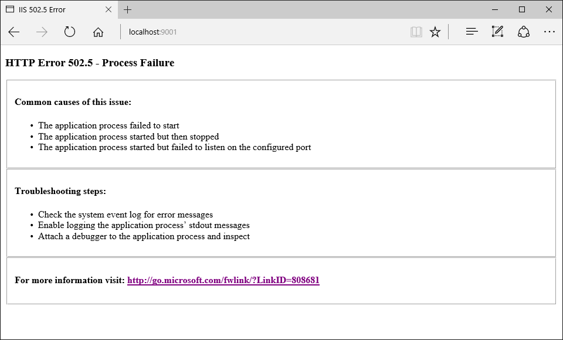

  # ASP.NET Core Module Configuration Reference

By [Luke Latham](https://github.com/GuardRex), [Rick Anderson](https://twitter.com/RickAndMSFT) and [Sourabh Shirhatti](https://twitter.com/sshirhatti)

In ASP.NET Core, the web application is hosted by an external process outside of IIS. The ASP.NET Core Module is an IIS 7.5+ module, which is responsible for process management of ASP.NET Core http listeners and to proxy requests to processes that it manages. This document provides an overview of how to configure the ASP.NET Core Module for shared hosting of ASP.NET Core.

  ## Installing the ASP.NET Core Module

Install the [.NET Core Windows Server Hosting](https://go.microsoft.com/fwlink/?LinkId=827547) bundle on the server. The bundle will install the .NET Core Runtime, .NET Core Library, and the ASP.NET Core Module.

  ## Configuring the ASP.NET Core Module

The ASP.NET Core Module is configured via a site or application *web.config* file and has its own configuration section within `system.webServer - aspNetCore`.

  ### Configuration Attributes

<!-- Skip node --><!-- Skip node --><!-- Skip node --><!-- Skip node --><!-- Skip node --><!-- Skip node --><!-- Skip node --><!-- Skip node --><!-- Skip node --><!-- Skip node --><!-- Skip node --><!-- Skip node --><!-- Skip node --><!-- Skip node --><!-- Skip node --><!-- Skip node --><!-- Skip node --><!-- Skip node --><!-- Skip node --><!-- Skip node --><!-- Skip node --><!-- Skip node --><!-- table -->

  ### Child Elements

<!-- Skip node --><!-- Skip node --><!-- Skip node --><!-- Skip node --><!-- Skip node --><!-- Skip node --><!-- table -->

  ## ASP.NET Core Module *app_offline.htm*

If you place a file with the name *app_offline.htm* at the root of a web application directory, the ASP.NET Core Module will attempt to gracefully shut-down the application and stop processing any new incoming requests. If the application is still running after `shutdownTimeLimit` number of seconds, the ASP.NET Core Module will kill the running process.

While the *app_offline.htm* file is present, the ASP.NET Core Module will respond to all requests by sending back the contents of the *app_offline.htm* file. Once the *app_offline.htm* file is removed, the next request loads the application, which then responds to requests.

  ## ASP.NET Core Module Start-up Error Page



If the ASP.NET Core Module fails to launch the backend process or the backend process starts but fails to listen on the configured port, you will see an HTTP 502.5 status code page. To supress this page and revert to the default IIS 502 status code page, use the `disableStartUpErrorPage` attribute. Look at the [HTTP Errors attribute](https://www.iis.net/configreference/system.webserver/httperrors) to override this page with a custom error page.

  ## ASP.NET Core Module configuration examples

<a name=log-redirection></a>

  ### Log creation and redirection

To save logs, you must create the *logs* directory. The ASP.NET Core Module can redirect `stdout` and `stderr` logs to disk by setting the `stdoutLogEnabled` and `stdoutLogFile` attributes of the `aspNetCore` element. Logs are not rotated (unless process recycling/restart occurs). It is the responsibilty of the hoster to limit the disk space the logs consume.

<!-- literal_block {"ids": [], "names": [], "highlight_args": {"linenostart": 1}, "backrefs": [], "dupnames": [], "linenos": false, "classes": [], "xml:space": "preserve", "language": "xml", "source": "/Users/shirhatti/src/Docs/aspnet/hosting/aspnet-core-module/sample/web.config"} -->

````xml

       <aspNetCore processPath="dotnet"
               arguments=".\MyApp.dll"
               stdoutLogEnabled="true"
               stdoutLogFile=".\logs\stdout">
       </aspNetCore>

   ````

  ### Setting environment variables

The ASP.NET Core Module allows you specify environment variables for the process specified in the `processPath` setting by specifying them in `environmentVariables` child attribute to the `aspNetCore` attribute.

<!-- literal_block {"ids": [], "names": [], "highlight_args": {"linenostart": 1}, "backrefs": [], "dupnames": [], "linenos": false, "classes": [], "xml:space": "preserve", "language": "xml", "source": "/Users/shirhatti/src/Docs/aspnet/hosting/aspnet-core-module/sample/web.config"} -->

````xml

       <aspNetCore processPath="dotnet"
               arguments=".\MyApp.dll"
               stdoutLogEnabled="true"
               stdoutLogFile=".\logs\stdout">
         <environmentVariables>
           <environmentVariable name="DEMO" value="demo_value" />
         </environmentVariables>
       </aspNetCore>

   ````

  ## ASP.NET Core Module with IIS Shared Configuration

The ASP.NET Core Module installer, which is included in the .NET Core Windows Server Hosting bundle installer, runs with the privileges of the **SYSTEM** account. Because the local system account does not have modify permission for the share path which is used by the IIS Shared Configuration, the installer will hit an access denied error when attempting to configure the module settings in *applicationHost.config* on the share.

The unsupported workaround is to disable the IIS Shared Configuration, run the installer, export the updated *applicationHost.config* file to the share, and re-enable the IIS Shared Configuration.

  ## Module, schema, and configuration file locations  ### Module

IIS (x86/amd64):
   * %windir%\System32\inetsrv\aspnetcore.dll

   * %windir%\SysWOW64\inetsrv\aspnetcore.dll

IIS Express (x86/amd64):
   * %ProgramFiles%\IIS Express\aspnetcore.dll

   * %ProgramFiles(x86)%\IIS Express\aspnetcore.dll

  ### Schema

IIS
   * %windir%\System32\inetsrv\config\schema\aspnetcore_schema.xml

IIS Express
   * %ProgramFiles%\IIS Express\config\schema\aspnetcore_schema.xml

  ### Configuration

IIS
   * %windir%\System32\inetsrv\config\applicationHost.config

IIS Express
   * .vs\config\applicationHost.config

You can search for *aspnetcore.dll* in the *applicationHost.config* file. For IIS Express, the *applicationHost.config* file won't exist by default. The file is created at *<appliation root>\.vs\config* when you start any existing web application project of the Visual Studio solution.
