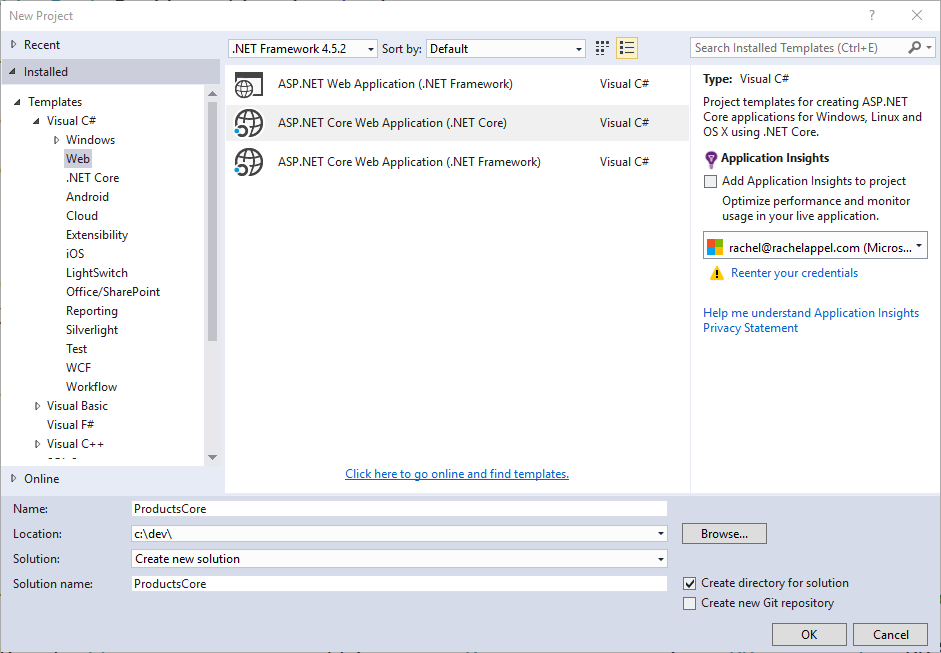
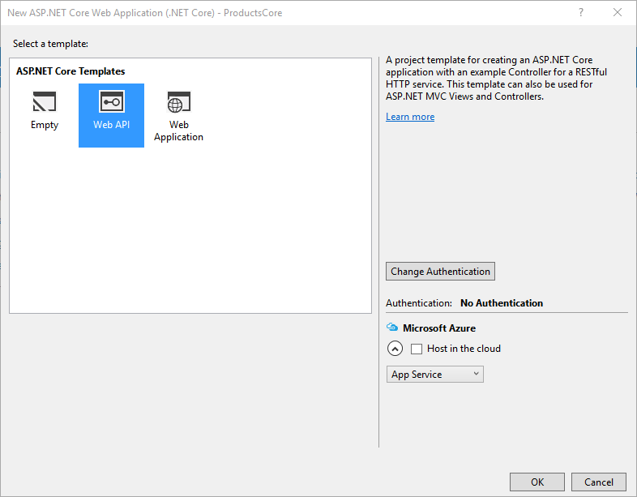

  # Migrating from ASP.NET Web API

By [Steve Smith](http://ardalis.com) and [Scott Addie](https://scottaddie.com)

Web APIs are HTTP services that reach a broad range of clients, including browsers and mobile devices. ASP.NET Core MVC includes support for building Web APIs providing a single, consistent way of building web applications. In this article, we demonstrate the steps required to migrate a Web API implementation from ASP.NET Web API to ASP.NET Core MVC.

[View or download sample code](https://github.com/aspnet/Docs/tree/master/aspnet/migration/webapi/sample)

  ## Review ASP.NET Web API Project

This article uses the sample project, *ProductsApp*, created in the article [Getting Started with ASP.NET Web API](http://www.asp.net/web-api/overview/getting-started-with-aspnet-web-api/tutorial-your-first-web-api) as its starting point. In that project, a simple ASP.NET Web API  project is configured as follows.

In *Global.asax.cs*, a call is made to `WebApiConfig.Register`:

<!-- literal_block {"ids": [], "names": [], "highlight_args": {"hl_lines": [14], "linenostart": 1}, "backrefs": [], "dupnames": [], "linenos": true, "classes": [], "xml:space": "preserve", "language": "c#", "source": "/Users/shirhatti/src/Docs/aspnet/migration/webapi/sample/ProductsApp/Global.asax.cs"} -->

````c#

   using System;
   using System.Collections.Generic;
   using System.Linq;
   using System.Web;
   using System.Web.Http;
   using System.Web.Routing;

   namespace ProductsApp
   {
       public class WebApiApplication : System.Web.HttpApplication
       {
           protected void Application_Start()
           {
               GlobalConfiguration.Configure(WebApiConfig.Register);
           }
       }
   }

   ````

`WebApiConfig` is defined in *App_Start*, and has just one static `Register` method:

<!-- literal_block {"ids": [], "names": [], "highlight_args": {"hl_lines": [15, 16, 17, 18, 19, 20], "linenostart": 1}, "backrefs": [], "dupnames": [], "linenos": true, "classes": [], "xml:space": "preserve", "language": "c#", "source": "/Users/shirhatti/src/Docs/aspnet/migration/webapi/sample/ProductsApp/App_Start/WebApiConfig.cs"} -->

````c#

   using System;
   using System.Collections.Generic;
   using System.Linq;
   using System.Web.Http;

   namespace ProductsApp
   {
       public static class WebApiConfig
       {
           public static void Register(HttpConfiguration config)
           {
               // Web API configuration and services

               // Web API routes
               config.MapHttpAttributeRoutes();

               config.Routes.MapHttpRoute(
                   name: "DefaultApi",
                   routeTemplate: "api/{controller}/{id}",
                   defaults: new { id = RouteParameter.Optional }
               );
           }
       }
   }

   ````

This class configures [attribute routing](http://www.asp.net/web-api/overview/web-api-routing-and-actions/attribute-routing-in-web-api-2), although it's not actually being used in the project. It also configures the routing table which is used by ASP.NET Web API. In this case, ASP.NET Web API will expect URLs to match the format */api/{controller}/{id}*, with *{id}* being optional.

The *ProductsApp* project includes just one simple controller, which inherits from `ApiController` and exposes two methods:

<!-- literal_block {"ids": [], "names": [], "highlight_args": {"hl_lines": [19, 24], "linenostart": 1}, "backrefs": [], "dupnames": [], "linenos": true, "classes": [], "xml:space": "preserve", "language": "c#", "source": "/Users/shirhatti/src/Docs/aspnet/migration/webapi/sample/ProductsApp/Controllers/ProductsController.cs"} -->

````c#

   using ProductsApp.Models;
   using System;
   using System.Collections.Generic;
   using System.Linq;
   using System.Net;
   using System.Web.Http;

   namespace ProductsApp.Controllers
   {
       public class ProductsController : ApiController
       {
           Product[] products = new Product[] 
           { 
               new Product { Id = 1, Name = "Tomato Soup", Category = "Groceries", Price = 1 }, 
               new Product { Id = 2, Name = "Yo-yo", Category = "Toys", Price = 3.75M }, 
               new Product { Id = 3, Name = "Hammer", Category = "Hardware", Price = 16.99M } 
           };

           public IEnumerable<Product> GetAllProducts()
           {
               return products;
           }

           public IHttpActionResult GetProduct(int id)
           {
               var product = products.FirstOrDefault((p) => p.Id == id);
               if (product == null)
               {
                   return NotFound();
               }
               return Ok(product);
           }
       }
   }

   ````

Finally, the model, *Product*, used by the *ProductsApp*, is a simple class:

<!-- literal_block {"ids": [], "names": [], "highlight_args": {"linenostart": 1}, "backrefs": [], "dupnames": [], "linenos": true, "classes": [], "xml:space": "preserve", "language": "c#", "source": "/Users/shirhatti/src/Docs/aspnet/migration/webapi/sample/ProductsApp/Models/Product.cs"} -->

````c#


   namespace ProductsApp.Models
   {
       public class Product
       {
           public int Id { get; set; }
           public string Name { get; set; }
           public string Category { get; set; }
           public decimal Price { get; set; }
       }
   }
   ````

Now that we have a simple project from which to start, we can demonstrate how to migrate this Web API project to ASP.NET Core MVC.

  ## Create the Destination Project

Using Visual Studio, create a new, empty solution, and name it *WebAPIMigration*. Add the existing *ProductsApp* project to it, then, add a new ASP.NET Core Web Application Project to the solution. Name the new project *ProductsCore*.



Next, choose the Web API project template. We will migrate the *ProductsApp* contents to this new project.



Delete the `Project_Readme.html` file from the new project. Your solution should now look like this:


  ## Migrate Configuration

ASP.NET Core no longer uses *Global.asax*, *web.config*, or *App_Start* folders. Instead, all startup tasks are done in *Startup.cs* in the root of the project (see [Application Startup](../fundamentals/startup.md)). In ASP.NET Core MVC, attribute-based routing is now included by default when `UseMvc()` is called; and, this is the recommended approach for configuring Web API routes (and is how the Web API starter project handles routing).

<!-- literal_block {"ids": [], "names": [], "highlight_args": {"hl_lines": [40], "linenostart": 1}, "backrefs": [], "dupnames": [], "linenos": true, "classes": [], "xml:space": "preserve", "language": "none", "source": "/Users/shirhatti/src/Docs/aspnet/migration/webapi/sample/ProductsCore/Startup.cs"} -->

````none

   using System;
   using System.Collections.Generic;
   using System.Linq;
   using System.Threading.Tasks;
   using Microsoft.AspNetCore.Builder;
   using Microsoft.AspNetCore.Hosting;
   using Microsoft.Extensions.Configuration;
   using Microsoft.Extensions.DependencyInjection;
   using Microsoft.Extensions.Logging;

   namespace ProductsCore
   {
       public class Startup
       {
           public Startup(IHostingEnvironment env)
           {
               var builder = new ConfigurationBuilder()
                   .SetBasePath(env.ContentRootPath)
                   .AddJsonFile("appsettings.json", optional: true, reloadOnChange: true)
                   .AddJsonFile($"appsettings.{env.EnvironmentName}.json", optional: true)
                   .AddEnvironmentVariables();
               Configuration = builder.Build();
           }

           public IConfigurationRoot Configuration { get; }

           // This method gets called by the runtime. Use this method to add services to the container.
           public void ConfigureServices(IServiceCollection services)
           {
               // Add framework services.
               services.AddMvc();
           }

           // This method gets called by the runtime. Use this method to configure the HTTP request pipeline.
           public void Configure(IApplicationBuilder app, IHostingEnvironment env, ILoggerFactory loggerFactory)
           {
               loggerFactory.AddConsole(Configuration.GetSection("Logging"));
               loggerFactory.AddDebug();

               app.UseMvc();
           }
       }
   }

   ````

Assuming you want to use attribute routing in your project going forward, no additional configuration is needed. Simply apply the attributes as needed to your controllers and actions, as is done in the sample `ValuesController` class that is included in the Web API starter project:

<!-- literal_block {"ids": [], "names": [], "highlight_args": {"hl_lines": [9, 13, 20, 27, 33, 39], "linenostart": 1}, "backrefs": [], "dupnames": [], "linenos": true, "classes": [], "xml:space": "preserve", "language": "c#", "source": "/Users/shirhatti/src/Docs/aspnet/migration/webapi/sample/ProductsCore/Controllers/ValuesController.cs"} -->

````c#

   using System;
   using System.Collections.Generic;
   using System.Linq;
   using System.Threading.Tasks;
   using Microsoft.AspNetCore.Mvc;

   namespace ProductsCore.Controllers
   {
       [Route("api/[controller]")]
       public class ValuesController : Controller
       {
           // GET api/values
           [HttpGet]
           public IEnumerable<string> Get()
           {
               return new string[] { "value1", "value2" };
           }

           // GET api/values/5
           [HttpGet("{id}")]
           public string Get(int id)
           {
               return "value";
           }

           // POST api/values
           [HttpPost]
           public void Post([FromBody]string value)
           {
           }

           // PUT api/values/5
           [HttpPut("{id}")]
           public void Put(int id, [FromBody]string value)
           {
           }

           // DELETE api/values/5
           [HttpDelete("{id}")]
           public void Delete(int id)
           {
           }
       }
   }

   ````

Note the presence of *[controller]* on line 8. Attribute-based routing now supports certain tokens, such as *[controller]* and *[action]*. These tokens are replaced at runtime with the name of the controller or action, respectively, to which the attribute has been applied. This serves to reduce the number of magic strings in the project, and it ensures the routes will be kept synchronized with their corresponding controllers and actions when automatic rename refactorings are applied.

To migrate the Products API controller, we must first copy *ProductsController* to the new project. Then simply include the route attribute on the controller:

<!-- literal_block {"ids": [], "names": [], "highlight_args": {}, "backrefs": [], "dupnames": [], "linenos": false, "classes": [], "xml:space": "preserve", "language": "c#"} -->

````c#

   [Route("api/[controller]")]
   ````

You also need to add the `[HttpGet]` attribute to the two methods, since they both should be called via HTTP Get. Include the expectation of an "id" parameter in the attribute for `GetProduct()`:

<!-- literal_block {"ids": [], "names": [], "highlight_args": {}, "backrefs": [], "dupnames": [], "linenos": false, "classes": [], "xml:space": "preserve", "language": "c#"} -->

````c#

   // /api/products
   [HttpGet]
   ...

   // /api/products/1
   [HttpGet("{id}")]
   ````

At this point, routing is configured correctly; however, we can't yet test it. Additional changes must be made before *ProductsController* will compile.

  ## Migrate Models and Controllers

The last step in the migration process for this simple Web API project is to copy over the Controllers and any Models they use. In this case, simply copy *Controllers/ProductsController.cs* from the original project to the new one. Then, copy the entire Models folder from the original project to the new one. Adjust the namespaces to match the new project name (*ProductsCore*).  At this point, you can build the application, and you will find a number of compilation errors. These should generally fall into the following categories:

* *ApiController* does not exist

* *System.Web.Http* namespace does not exist

* *IHttpActionResult* does not exist

Fortunately, these are all very easy to correct:

* Change *ApiController* to *Controller* (you may need to add *using Microsoft.AspNetCore.Mvc*)

* Delete any using statement referring to *System.Web.Http*

* Change any method returning *IHttpActionResult* to return a *IActionResult*

Once these changes have been made and unused using statements removed, the migrated *ProductsController* class looks like this:

<!-- literal_block {"ids": [], "names": [], "highlight_args": {"hl_lines": [1, 2, 6, 8, 9, 27], "linenostart": 1}, "backrefs": [], "dupnames": [], "linenos": true, "classes": [], "xml:space": "preserve", "language": "c#", "source": "/Users/shirhatti/src/Docs/aspnet/migration/webapi/sample/ProductsCore/Controllers/ProductsController.cs"} -->

````c#

   using Microsoft.AspNetCore.Mvc;
   using ProductsCore.Models;
   using System.Collections.Generic;
   using System.Linq;

   namespace ProductsCore.Controllers
   {
       [Route("api/[controller]")]
       public class ProductsController : Controller
       {
           Product[] products = new Product[]
           {
               new Product { Id = 1, Name = "Tomato Soup", Category = "Groceries", Price = 1 },
               new Product { Id = 2, Name = "Yo-yo", Category = "Toys", Price = 3.75M },
               new Product { Id = 3, Name = "Hammer", Category = "Hardware", Price = 16.99M }
           };

           // /api/products
           [HttpGet]
           public IEnumerable<Product> GetAllProducts()
           {
               return products;
           }

           // /api/products/1
           [HttpGet("{id}")]
           public IActionResult GetProduct(int id)
           {
               var product = products.FirstOrDefault((p) => p.Id == id);
               if (product == null)
               {
                   return NotFound();
               }
               return Ok(product);
           }
       }
   }

   ````

You should now be able to run the migrated project and browse to */api/products*; and, you should see the full list of 3 products. Browse to */api/products/1* and you should see the first product.

  ## Summary

Migrating a simple ASP.NET Web API project to ASP.NET Core MVC is fairly straightforward, thanks to the built-in support for Web APIs in ASP.NET Core MVC. The main pieces every ASP.NET Web API project will need to migrate are routes, controllers, and models, along with updates to the types used by  controllers and actions.
