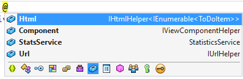

  # Dependency injection into views

By [Steve Smith](http://ardalis.com)

ASP.NET Core supports [dependency injection](../../fundamentals/dependency-injection.md) into views. This can be useful for view-specific services, such as localization or data required only for populating view elements. You should try to maintain [separation of concerns](http://deviq.com/separation-of-concerns) between your controllers and views. Most of the data your views display should be passed in from the controller.

[View or download sample code](https://github.com/aspnet/Docs/tree/master/aspnet/mvc/views/dependency-injection/sample)

  ## A Simple Example

You can inject a service into a view using the `@inject` directive. You can think of `@inject` as adding a property to your view, and populating the property using DI.

The syntax for `@inject`:
   `@inject <type> <name>`

An example of `@inject` in action:

<!-- literal_block {"ids": [], "names": [], "highlight_args": {"hl_lines": [4, 5, 15, 16, 17], "linenostart": 1}, "backrefs": [], "dupnames": [], "linenos": true, "classes": [], "xml:space": "preserve", "language": "c#", "source": "/Users/shirhatti/src/Docs/aspnet/mvc/views/dependency-injection/sample/src/ViewInjectSample/Views/ToDo/Index.cshtml"} -->

````c#

   @using System.Threading.Tasks
   @using ViewInjectSample.Model
   @using ViewInjectSample.Model.Services
   @model IEnumerable<ToDoItem>
   @inject StatisticsService StatsService
   <!DOCTYPE html>
   <html>
   <head>
       <title>To Do Items</title>
   </head>
   <body>
       <div>
           <h1>To Do Items</h1>
           <ul>
               <li>Total Items: @StatsService.GetCount()</li>
               <li>Completed: @StatsService.GetCompletedCount()</li>
               <li>Avg. Priority: @StatsService.GetAveragePriority()</li>
           </ul>
           <table>
               <tr>
                   <th>Name</th>
                   <th>Priority</th>
                   <th>Is Done?</th>
               </tr>
               @foreach (var item in Model)
               {
                   <tr>
                       <td>@item.Name</td>
                       <td>@item.Priority</td>
                       <td>@item.IsDone</td>
                   </tr>
               }
           </table>
       </div>
   </body>
   </html>
   ````

This view displays a list of `ToDoItem` instances, along with a summary showing overall statistics. The summary is populated from the injected `StatisticsService`. This service is registered for dependency injection in `ConfigureServices` in *Startup.cs*:

<!-- literal_block {"ids": [], "names": [], "highlight_args": {"hl_lines": [6, 7], "linenostart": 1}, "backrefs": [], "dupnames": [], "linenos": true, "classes": [], "xml:space": "preserve", "language": "c#", "source": "/Users/shirhatti/src/Docs/aspnet/mvc/views/dependency-injection/sample/src/ViewInjectSample/Startup.cs"} -->

````c#

   // For more information on how to configure your application, visit http://go.microsoft.com/fwlink/?LinkID=398940
   public void ConfigureServices(IServiceCollection services)
   {
       services.AddMvc();

       services.AddTransient<IToDoItemRepository, ToDoItemRepository>();
       services.AddTransient<StatisticsService>();
       services.AddTransient<ProfileOptionsService>();

   ````

The `StatisticsService` performs some calculations on the set of `ToDoItem` instances, which it accesses via a repository:

<!-- literal_block {"ids": [], "names": [], "highlight_args": {"hl_lines": [15, 20, 26], "linenostart": 1}, "backrefs": [], "dupnames": [], "linenos": true, "classes": [], "xml:space": "preserve", "language": "c#", "source": "/Users/shirhatti/src/Docs/aspnet/mvc/views/dependency-injection/sample/src/ViewInjectSample/Model/Services/StatisticsService.cs"} -->

````c#

   using System.Linq;
   using ViewInjectSample.Interfaces;

   namespace ViewInjectSample.Model.Services
   {
       public class StatisticsService
       {
           private readonly IToDoItemRepository _toDoItemRepository;

           public StatisticsService(IToDoItemRepository toDoItemRepository)
           {
               _toDoItemRepository = toDoItemRepository;
           }

           public int GetCount()
           {
               return _toDoItemRepository.List().Count();
           }

           public int GetCompletedCount()
           {
               return _toDoItemRepository.List().Count(x => x.IsDone);
           }

           public double GetAveragePriority()
           {
               if (_toDoItemRepository.List().Count() == 0)
               {
                   return 0.0;
               }

               return _toDoItemRepository.List().Average(x => x.Priority);
           }
       }
   }

   ````

The sample repository uses an in-memory collection. The implementation shown above (which operates on all of the data in memory) is not recommended for large, remotely accessed data sets.

The sample displays data from the model bound to the view and the service injected into the view:


  ## Populating Lookup Data

View injection can be useful to populate options in UI elements, such as dropdown lists. Consider a user profile form that includes options for specifying gender, state, and other preferences. Rendering such a form using a standard MVC approach would require the controller to request data access services for each of these sets of options, and then populate a model or `ViewBag` with each set of options to be bound.

An alternative approach injects services directly into the view to obtain the options. This minimizes the amount of code required by the controller, moving this view element construction logic into the view itself. The controller action to display a profile editing form only needs to pass the form the profile instance:

<!-- literal_block {"ids": [], "names": [], "highlight_args": {"hl_lines": [9, 19], "linenostart": 1}, "backrefs": [], "dupnames": [], "linenos": true, "classes": [], "xml:space": "preserve", "language": "c#", "source": "/Users/shirhatti/src/Docs/aspnet/mvc/views/dependency-injection/sample/src/ViewInjectSample/Controllers/ProfileController.cs"} -->

````c#

   using Microsoft.AspNetCore.Mvc;
   using ViewInjectSample.Model;

   namespace ViewInjectSample.Controllers
   {
       public class ProfileController : Controller
       {
           [Route("Profile")]
           public IActionResult Index()
           {
               // TODO: look up profile based on logged-in user
               var profile = new Profile()
               {
                   Name = "Steve",
                   FavColor = "Blue",
                   Gender = "Male",
                   State = new State("Ohio","OH")
               };
               return View(profile);
           }
       }
   }

   ````

The HTML form used to update these preferences includes dropdown lists for three of the properties:


These lists are populated by a service that has been injected into the view:

<!-- literal_block {"ids": [], "names": [], "highlight_args": {"hl_lines": [4, 16, 17, 21, 22, 26, 27], "linenostart": 1}, "backrefs": [], "dupnames": [], "linenos": true, "classes": [], "xml:space": "preserve", "language": "c#", "source": "/Users/shirhatti/src/Docs/aspnet/mvc/views/dependency-injection/sample/src/ViewInjectSample/Views/Profile/Index.cshtml"} -->

````c#

   @using System.Threading.Tasks
   @using ViewInjectSample.Model.Services
   @model ViewInjectSample.Model.Profile
   @inject ProfileOptionsService Options
   <!DOCTYPE html>
   <html>
   <head>
       <title>Update Profile</title>
   </head>
   <body>
   <div>
       <h1>Update Profile</h1>
       Name: @Html.TextBoxFor(m => m.Name)
       <br/>
       Gender: @Html.DropDownList("Gender",
              Options.ListGenders().Select(g => 
                   new SelectListItem() { Text = g, Value = g }))
       <br/>

       State: @Html.DropDownListFor(m => m.State.Code,
              Options.ListStates().Select(s => 
                   new SelectListItem() { Text = s.Name, Value = s.Code}))
       <br />

       Fav. Color: @Html.DropDownList("FavColor",
              Options.ListColors().Select(c => 
                   new SelectListItem() { Text = c, Value = c }))
       </div>
   </body>
   </html>
   ````

The `ProfileOptionsService` is a UI-level service designed to provide just the data needed for this form:

<!-- literal_block {"ids": [], "names": [], "highlight_args": {"hl_lines": [7, 13, 24], "linenostart": 1}, "backrefs": [], "dupnames": [], "linenos": true, "classes": [], "xml:space": "preserve", "language": "c#", "source": "/Users/shirhatti/src/Docs/aspnet/mvc/views/dependency-injection/sample/src/ViewInjectSample/Model/Services/ProfileOptionsService.cs"} -->

````c#

   using System.Collections.Generic;

   namespace ViewInjectSample.Model.Services
   {
       public class ProfileOptionsService
       {
           public List<string> ListGenders()
           {
               // keeping this simple
               return new List<string>() {"Female", "Male"};
           }

           public List<State> ListStates()
           {
               // a few states from USA
               return new List<State>()
               {
                   new State("Alabama", "AL"),
                   new State("Alaska", "AK"),
                   new State("Ohio", "OH")
               };
           }

           public List<string> ListColors()
           {
               return new List<string>() { "Blue","Green","Red","Yellow" };
           }
       }
   }

   ````

Tip: Don't forget to register types you will request through dependency injection in the  `ConfigureServices` method in *Startup.cs*.

  ## Overriding Services

In addition to injecting new services, this technique can also be used to override previously injected services on a page. The figure below shows all of the fields available on the page used in the first example:



As you can see, the default fields include `Html`, `Component`, and `Url` (as well as the `StatsService` that we injected). If for instance you wanted to replace the default HTML Helpers with your own, you could easily do so using `@inject`:

<!-- literal_block {"ids": [], "names": [], "highlight_args": {"hl_lines": [3, 11], "linenostart": 1}, "backrefs": [], "dupnames": [], "linenos": true, "classes": [], "xml:space": "preserve", "language": "html", "source": "/Users/shirhatti/src/Docs/aspnet/mvc/views/dependency-injection/sample/src/ViewInjectSample/Views/Helper/Index.cshtml"} -->

````html

   @using System.Threading.Tasks
   @using ViewInjectSample.Helpers
   @inject MyHtmlHelper Html
   <!DOCTYPE html>
   <html>
   <head>
       <title>My Helper</title>
   </head>
   <body>
       <div>
           Test: @Html.Value
       </div>
   </body>
   </html>
   ````

If you want to extend existing services, you can simply use this technique while inheriting from or wrapping the existing implementation with your own.

  ## See Also

* Simon Timms Blog: [Getting Lookup Data Into Your View](http://blog.simontimms.com/2015/06/09/getting-lookup-data-into-you-view/)
