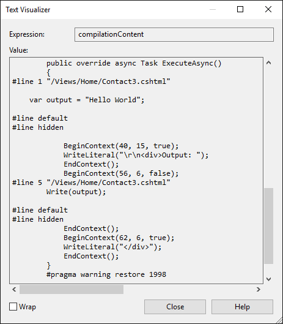

  # Razor Syntax Reference

[Taylor Mullen](https://twitter.com/ntaylormullen) and [Rick Anderson](https://twitter.com/RickAndMSFT)

  ## What is Razor?

Razor is a markup syntax for embedding server based code into web pages. The Razor syntax consists of Razor markup, C# and HTML. Files containing Razor generally have a *.cshtml* file extension.

  ## Rendering HTML

The default Razor language is HTML. Rendering HTML from Razor is no different than in an HTML file. A Razor file with the following markup:

<!-- literal_block {"ids": [], "names": [], "highlight_args": {}, "backrefs": [], "dupnames": [], "linenos": false, "classes": [], "xml:space": "preserve", "language": "html"} -->

````html

   <p>Hello World</p>
   ````

Is rendered unchanged as `<p>Hello World</p>` by the server.

  ## Razor syntax

Razor supports C# and uses the `@` symbol to transition from HTML to C#. Razor evaluates C# expressions and renders them in the HTML output. Razor can transition from HTML into C# or into Razor specific markup. When an `@` symbol is followed by a <!-- Some exception as occured. Possible loss of data --> it transitions into Razor specific markup, otherwise it transitions into plain C# .

<a name=escape-at-label></a>

HTML containing `@` symbols may need to be escaped with a second `@` symbol. For example:

<!-- literal_block {"ids": [], "names": [], "highlight_args": {}, "backrefs": [], "dupnames": [], "linenos": false, "classes": [], "xml:space": "preserve", "language": "html"} -->

````html

   <p>@@Username</p>
   ````

would render the following HTML:

<!-- literal_block {"ids": [], "names": [], "highlight_args": {}, "backrefs": [], "dupnames": [], "linenos": false, "classes": [], "xml:space": "preserve", "language": "html"} -->

````html

   <p>@Username</p>
   ````

<a name=razor-email-ref></a>

HTML attributes and content containing email addresses don’t treat the `@` symbol as a transition character.

   `<a href="mailto:Support@contoso.com">Support@contoso.com</a>`

  ## Implicit Razor expressions

Implicit Razor expressions start with `@` followed by C# code. For example:

<!-- literal_block {"ids": [], "names": [], "highlight_args": {}, "backrefs": [], "dupnames": [], "linenos": false, "classes": [], "xml:space": "preserve", "language": "html"} -->

````html

   <p>@DateTime.Now</p>
   <p>@DateTime.IsLeapYear(2016)</p>
   ````

With the exception of the C# `await` keyword implicit expressions must not contain spaces. For example, you can intermingle spaces as long as the C# statement has a clear ending:

<!-- literal_block {"ids": [], "names": [], "highlight_args": {}, "backrefs": [], "dupnames": [], "linenos": false, "classes": [], "xml:space": "preserve", "language": "html"} -->

````html

   <p>@await DoSomething("hello", "world")</p>
   ````

<a name=explicit-razor-expressions></a>

  ## Explicit Razor expressions

Explicit Razor expressions consists of an @ symbol with balanced parenthesis. For example, to render last weeks’ time:

<!-- literal_block {"ids": [], "names": [], "highlight_args": {}, "backrefs": [], "dupnames": [], "linenos": false, "classes": [], "xml:space": "preserve", "language": "html"} -->

````html

   <p>Last week this time: @(DateTime.Now - TimeSpan.FromDays(7))</p>
   ````

Any content within the @() parenthesis is evaluated and rendered to the output.

Implicit expressions generally cannot contain spaces. For example, in the code below, one week is not subtracted from the current time:

<!-- literal_block {"ids": [], "names": [], "highlight_args": {"linenostart": 1}, "backrefs": [], "dupnames": [], "linenos": false, "classes": [], "xml:space": "preserve", "language": "html", "source": "/Users/shirhatti/src/Docs/aspnet/mvc/views/razor/sample/Views/Home/Contact.cshtml"} -->

````html


   <p>Last week: @DateTime.Now - TimeSpan.FromDays(7)</p>


   ````

Which renders the following HTML:

<!-- literal_block {"ids": [], "names": [], "highlight_args": {}, "backrefs": [], "dupnames": [], "linenos": false, "classes": [], "xml:space": "preserve", "language": "html"} -->

````html

   <p>Last week: 7/7/2016 4:39:52 PM - TimeSpan.FromDays(7)</p>
   ````

You can use an explicit expression to concatenate text with an expression result:

<!-- literal_block {"ids": [], "names": [], "highlight_args": {"hl_lines": [5]}, "backrefs": [], "dupnames": [], "linenos": false, "classes": [], "xml:space": "preserve", "language": "none"} -->

````none

   @{
       var joe = new Person("Joe", 33);
    }

   <p>Age@(joe.Age)</p>
   ````

Without the explicit expression, `<p>Age@joe.Age</p>` would be treated as an email address and `<p>Age@joe.Age</p>` would be rendered. When written as an explicit expression, `<p>Age33</p>` is rendered.

<a name=expression-encoding-label></a>

  ## Expression encoding

C# expressions that evaluate to a string are HTML encoded. C# expressions that evaluate to [IHtmlContent](http://docs.asp.net/projects/api/en/latest/autoapi/Microsoft/AspNetCore/Html/IHtmlContent/index.html.md#Microsoft.AspNetCore.Html.IHtmlContent.md) are rendered directly through *IHtmlContent.WriteTo*. C# expressions that don't evaluate to *IHtmlContent* are converted to a string (by *ToString*) and encoded before they are rendered. For example, the following Razor markup:

<!-- literal_block {"ids": [], "names": [], "highlight_args": {}, "backrefs": [], "dupnames": [], "linenos": false, "classes": [], "xml:space": "preserve", "language": "html"} -->

````html

   @("<span>Hello World</span>")
   ````

Renders this HTML:

<!-- literal_block {"ids": [], "names": [], "highlight_args": {}, "backrefs": [], "dupnames": [], "linenos": false, "classes": [], "xml:space": "preserve", "language": "html"} -->

````html

   &lt;span&gt;Hello World&lt;/span&gt;
   ````

Which the browser renders as:

`<span>Hello World</span>`

[HtmlHelper](http://docs.asp.net/projects/api/en/latest/autoapi/Microsoft/AspNetCore/Mvc/ViewFeatures/HtmlHelper/index.html.md#Microsoft.AspNetCore.Mvc.ViewFeatures.HtmlHelper.md) [Raw](http://docs.asp.net/projects/api/en/latest/autoapi/Microsoft/AspNetCore/Mvc/ViewFeatures/HtmlHelper/index.html.md#Microsoft.AspNetCore.Mvc.ViewFeatures.HtmlHelper.Raw.md) output is not encoded but rendered as HTML markup.

Warning: Using `HtmlHelper.Raw` on unsanitized user input is a security risk. User input might contain malicious JavaScript or other exploits. Sanitizing user input is difficult, avoid using `HtmlHelper.Raw` on user input.

The following Razor markup:

<!-- literal_block {"ids": [], "names": [], "highlight_args": {}, "backrefs": [], "dupnames": [], "linenos": false, "classes": [], "xml:space": "preserve", "language": "html"} -->

````html

   @Html.Raw("<span>Hello World</span>")
   ````

Renders this HTML:

<!-- literal_block {"ids": [], "names": [], "highlight_args": {}, "backrefs": [], "dupnames": [], "linenos": false, "classes": [], "xml:space": "preserve", "language": "html"} -->

````html

   <span>Hello World</span>
   ````

<a name=razor-code-blocks-label></a>

  ## Razor code blocks

Razor code blocks start with `@` and are enclosed by `{}`. Unlike expressions, C# code inside code blocks is not rendered. Code blocks and expressions in a Razor page share the same scope and are defined in order (that is, declarations in a code block will be in scope for later code blocks and expressions).

<!-- literal_block {"ids": [], "names": [], "highlight_args": {}, "backrefs": [], "dupnames": [], "linenos": false, "classes": [], "xml:space": "preserve", "language": "none"} -->

````none

   @{
       var output = "Hello World";
   }

   <p>The rendered result: @output</p>
   ````

Would render:

<!-- literal_block {"ids": [], "names": [], "highlight_args": {}, "backrefs": [], "dupnames": [], "linenos": false, "classes": [], "xml:space": "preserve", "language": "html"} -->

````html

   <p>The rendered result: Hello World</p>
   ````

<a name=implicit-transitions-label></a>

  ### Implicit transitions

The default language in a code block is C#, but you can transition back to HTML. HTML within a code block will transition back into rendering HTML:

<!-- literal_block {"ids": [], "names": [], "highlight_args": {}, "backrefs": [], "dupnames": [], "linenos": false, "classes": [], "xml:space": "preserve", "language": "none"} -->

````none

   @{
       var inCSharp = true;
       <p>Now in HTML, was in C# @inCSharp</p>
   }
   ````

<a name=explicit-delimited-transition-label></a>

  ### Explicit delimited transition

To define a sub-section of a code block that should render HTML, surround the characters to be rendered with the Razor `<text>` tag:

<!-- literal_block {"ids": [], "names": [], "highlight_args": {"hl_lines": [4]}, "backrefs": [], "dupnames": [], "linenos": false, "classes": [], "xml:space": "preserve", "language": "none"} -->

````none

   @for (var i = 0; i < people.Length; i++)
   {
       var person = people[i];
       <text>Name: @person.Name</text>
   }
   ````

You generally use this approach when you want to render HTML that is not surrounded by an HTML tag. Without an HTML or Razor tag, you get a Razor runtime error.

<a name=explicit-line-transition-with-label></a>

  ### Explicit Line Transition with `@:`

To render the rest of an entire line as HTML inside a code block, use the `@:` syntax:

<!-- literal_block {"ids": [], "names": [], "highlight_args": {"hl_lines": [4]}, "backrefs": [], "dupnames": [], "linenos": false, "classes": [], "xml:space": "preserve", "language": "none"} -->

````none

   @for (var i = 0; i < people.Length; i++)
   {
       var person = people[i];
       @:Name: @person.Name
   }
   ````

Without the `@:` in the code above, you'd get a Razor run time error.

<a name=control-structures-razor-label></a>

  ## Control Structures

Control structures are an extension of code blocks. All aspects of code blocks (transitioning to markup, inline C#) also apply to the following structures.

  ### Conditionals `@if`, `else if`, `else` and `@switch`

The `@if` family controls when code runs:

<!-- literal_block {"ids": [], "names": [], "highlight_args": {}, "backrefs": [], "dupnames": [], "linenos": false, "classes": [], "xml:space": "preserve", "language": "none"} -->

````none

   @if (value % 2 == 0)
   {
       <p>The value was even</p>
   }
   ````

`else` and `else if` don't require the `@` symbol:

<!-- literal_block {"ids": [], "names": [], "highlight_args": {}, "backrefs": [], "dupnames": [], "linenos": false, "classes": [], "xml:space": "preserve", "language": "none"} -->

````none

   @if (value % 2 == 0)
   {
       <p>The value was even</p>
   }
   else if (value >= 1337)
   {
       <p>The value is large.</p>
   }
   else
   {
       <p>The value was not large and is odd.</p>
   }
   ````

You can use a switch statement like this:

<!-- literal_block {"ids": [], "names": [], "highlight_args": {}, "backrefs": [], "dupnames": [], "linenos": false, "classes": [], "xml:space": "preserve", "language": "none"} -->

````none

   @switch (value)
   {
       case 1:
           <p>The value is 1!</p>
           break;
       case 1337:
           <p>Your number is 1337!</p>
           break;
       default:
           <p>Your number was not 1 or 1337.</p>
           break;
   }
   ````

  ### Looping `@for`, `@foreach`, `@while`, and `@do while`

You can render templated HTML with looping control statements. For example, to render a list of people:

<!-- literal_block {"ids": [], "names": [], "highlight_args": {}, "backrefs": [], "dupnames": [], "linenos": false, "classes": [], "xml:space": "preserve", "language": "none"} -->

````none

   @{
       var people = new Person[]
       {
             new Person("John", 33),
             new Person("Doe", 41),
       };
   }
   ````

You can use any of the following looping statements:

`@for`

<!-- literal_block {"ids": [], "names": [], "highlight_args": {}, "backrefs": [], "dupnames": [], "linenos": false, "classes": [], "xml:space": "preserve", "language": "none"} -->

````none

   @for (var i = 0; i < people.Length; i++)
   {
       var person = people[i];
       <p>Name: @person.Name</p>
       <p>Age: @person.Age</p>
   }
   ````

`@foreach`

<!-- literal_block {"ids": [], "names": [], "highlight_args": {}, "backrefs": [], "dupnames": [], "linenos": false, "classes": [], "xml:space": "preserve", "language": "none"} -->

````none

   @foreach (var person in people)
   {
       <p>Name: @person.Name</p>
       <p>Age: @person.Age</p>
   }
   ````

`@while`

<!-- literal_block {"ids": [], "names": [], "highlight_args": {}, "backrefs": [], "dupnames": [], "linenos": false, "classes": [], "xml:space": "preserve", "language": "none"} -->

````none

   @{ var i = 0; }
   @while (i < people.Length)
   {
       var person = people[i];
       <p>Name: @person.Name</p>
       <p>Age: @person.Age</p>

       i++;
   }
   ````

`@do while`

<!-- literal_block {"ids": [], "names": [], "highlight_args": {}, "backrefs": [], "dupnames": [], "linenos": false, "classes": [], "xml:space": "preserve", "language": "none"} -->

````none

   @{ var i = 0; }
   @do
   {
       var person = people[i];
       <p>Name: @person.Name</p>
       <p>Age: @person.Age</p>

       i++;
   } while (i < people.Length);
   ````

  ### Compound `@using`

In C# a using statement is used to ensure an object is disposed. In Razor this same mechanism can be used to create [HTML helpers](html-helpers.md) that contain additional content. For instance, we can utilize [🔧 HTML Helpers](html-helpers.md) to render a form tag with the `@using` statement:

<!-- literal_block {"ids": [], "names": [], "highlight_args": {}, "backrefs": [], "dupnames": [], "linenos": false, "classes": [], "xml:space": "preserve", "language": "none"} -->

````none

   @using (Html.BeginForm())
   {
       <div>
           email:
           <input type="email" id="Email" name="Email" value="" />
           <button type="submit"> Register </button>
       </div>
   }
   ````

You can also perform scope level actions like the above with [Tag Helpers](tag-helpers/index.md).

  ### `@try`, `catch`, `finally`

Exception handling is similar to  C#:

<!-- literal_block {"ids": [], "names": [], "highlight_args": {"linenostart": 1}, "backrefs": [], "dupnames": [], "linenos": false, "classes": [], "xml:space": "preserve", "language": "html", "source": "/Users/shirhatti/src/Docs/aspnet/mvc/views/razor/sample/Views/Home/Contact7.cshtml"} -->

````html

   @try
   {
       throw new InvalidOperationException("You did something invalid.");
   }
   catch (Exception ex)
   {
       <p>The exception message: @ex.Message</p>
   }
   finally
   {
       <p>The finally statement.</p>
   }
   ````

  ### `@lock`

Razor has the capability to protect critical sections with lock statements:

<!-- literal_block {"ids": [], "names": [], "highlight_args": {}, "backrefs": [], "dupnames": [], "linenos": false, "classes": [], "xml:space": "preserve", "language": "none"} -->

````none

   @lock (SomeLock)
   {
       // Do critical section work
   }
   ````

  ### Comments

Razor supports C# and HTML comments. The following markup:

<!-- literal_block {"ids": [], "names": [], "highlight_args": {}, "backrefs": [], "dupnames": [], "linenos": false, "classes": [], "xml:space": "preserve", "language": "none"} -->

````none

   @{
       /* C# comment. */
       // Another C# comment.
   }
   <!-- HTML comment -->
   ````

Is rendered by the server as:

<!-- literal_block {"ids": [], "names": [], "highlight_args": {}, "backrefs": [], "dupnames": [], "linenos": false, "classes": [], "xml:space": "preserve", "language": "none"} -->

````none

   <!-- HTML comment -->
   ````

Razor comments are removed by the server before the page is rendered. Razor uses `@*  *@` to delimit comments. The following code is commented out, so the server will not render any markup:

<!-- literal_block {"ids": [], "names": [], "highlight_args": {}, "backrefs": [], "dupnames": [], "linenos": false, "classes": [], "xml:space": "preserve", "language": "none"} -->

````none

    @*
    @{
        /* C# comment. */
        // Another C# comment.
    }
    <!-- HTML comment -->
   *@
   ````

<a name=razor-directives-label></a>

  ## Directives

Razor directives are represented by implicit expressions with reserved keywords following the `@` symbol. A directive will typically change the way a page is parsed or enable different functionality within your Razor page.

Understanding how Razor generates code for a view will make it easier to understand how directives work. A Razor page is used to generate a C# file. For example, this Razor page:

<!-- literal_block {"ids": [], "names": [], "highlight_args": {"linenostart": 1}, "backrefs": [], "dupnames": [], "linenos": false, "classes": [], "xml:space": "preserve", "language": "html", "source": "/Users/shirhatti/src/Docs/aspnet/mvc/views/razor/sample/Views/Home/Contact8.cshtml"} -->

````html

   @{
       var output = "Hello World";
   }

   <div>Output: @output</div>

   ````

Generates a class similar to the following:

<!-- literal_block {"ids": [], "names": [], "highlight_args": {}, "backrefs": [], "dupnames": [], "linenos": false, "classes": [], "xml:space": "preserve", "language": "c#"} -->

````c#

   public class _Views_Something_cshtml : RazorPage<dynamic>
   {
       public override async Task ExecuteAsync()
       {
           var output = "Hello World";

           WriteLiteral("/r/n<div>Output: ");
           Write(output);
           WriteLiteral("</div>");
       }
   }
   ````

<!-- Some exception as occured. Possible loss of data --> explains how to view this generated class.

  ### `@using`

The `@using` directive will add the c# `using` directive to the generated razor page:

<!-- literal_block {"ids": [], "names": [], "highlight_args": {"linenostart": 1}, "backrefs": [], "dupnames": [], "linenos": false, "classes": [], "xml:space": "preserve", "language": "html", "source": "/Users/shirhatti/src/Docs/aspnet/mvc/views/razor/sample/Views/Home/Contact9.cshtml"} -->

````html

   @using System.IO
   @{
       var dir = Directory.GetCurrentDirectory();
   }
   <p>@dir</p>
   ````

  ### `@model`

The `@model` directive allows you to specify the type of the model passed to your Razor page. It uses the following syntax:

<!-- literal_block {"ids": [], "names": [], "highlight_args": {}, "backrefs": [], "dupnames": [], "linenos": false, "classes": [], "xml:space": "preserve", "language": "none"} -->

````none

   @model TypeNameOfModel
   ````

For example, if you create an ASP.NET Core MVC app with individual user accounts, the *Views/Account/Login.cshtml* Razor view contains the following model declaration:

<!-- literal_block {"ids": [], "names": [], "highlight_args": {}, "backrefs": [], "dupnames": [], "linenos": false, "classes": [], "xml:space": "preserve", "language": "c#"} -->

````c#

   @model LoginViewModel
   ````

In the class example in <!-- Some exception as occured. Possible loss of data -->, the class generated inherits from `RazorPage<dynamic>`. By adding an `@model` you control what’s inherited. For example

<!-- literal_block {"ids": [], "names": [], "highlight_args": {}, "backrefs": [], "dupnames": [], "linenos": false, "classes": [], "xml:space": "preserve", "language": "c#"} -->

````c#

   @model LoginViewModel
   ````

Generates the following class

<!-- literal_block {"ids": [], "names": [], "highlight_args": {}, "backrefs": [], "dupnames": [], "linenos": false, "classes": [], "xml:space": "preserve", "language": "c#"} -->

````c#

   public class _Views_Account_Login_cshtml : RazorPage<LoginViewModel>
   ````

Razor pages expose a `Model` property for accessing the model passed to the page.

<!-- literal_block {"ids": [], "names": [], "highlight_args": {}, "backrefs": [], "dupnames": [], "linenos": false, "classes": [], "xml:space": "preserve", "language": "html"} -->

````html

   <div>The Login Email: @Model.Email</div>
   ````

The `@model` directive specified the type of this property (by specifying the `T` in `RazorPage<T>` that the generated class for your page derives from). If you don't specify the `@model` directive the `Model` property will be of type `dynamic`. The value of the model is passed from the controller to the view. See [Strongly typed models and the @model keyword](../../tutorials/first-mvc-app/adding-model.md#strongly-typed-models-keyword-label.md) for more information.

  ### `@inherits`

The `@inherits` directive gives you full control of the class your Razor page inherits:

<!-- literal_block {"ids": [], "names": [], "highlight_args": {}, "backrefs": [], "dupnames": [], "linenos": false, "classes": [], "xml:space": "preserve", "language": "none"} -->

````none

   @inherits TypeNameOfClassToInheritFrom
   ````

For instance, let’s say we had the following custom Razor page type:

<!-- literal_block {"ids": [], "names": [], "highlight_args": {"linenostart": 1}, "backrefs": [], "dupnames": [], "linenos": false, "classes": [], "xml:space": "preserve", "language": "c#", "source": "/Users/shirhatti/src/Docs/aspnet/mvc/views/razor/sample/Classes/CustomRazorPage.cs"} -->

````c#

   using Microsoft.AspNetCore.Mvc.Razor;

   public abstract class CustomRazorPage<TModel> : RazorPage<TModel>
   {
       public string CustomText { get; } = "Hello World.";
   }

   ````

The following Razor would generate `<div>Custom text: Hello World</div>`.

<!-- literal_block {"ids": [], "names": [], "highlight_args": {"linenostart": 1}, "backrefs": [], "dupnames": [], "linenos": false, "classes": [], "xml:space": "preserve", "language": "html", "source": "/Users/shirhatti/src/Docs/aspnet/mvc/views/razor/sample/Views/Home/Contact10.cshtml"} -->

````html

   @inherits CustomRazorPage<TModel>

   <div>Custom text: @CustomText</div>
   ````

You can't use `@model` and `@inherits` on the same page. You can have `@inherits` in a *_ViewImports.cshtml* file that the Razor page imports. For example, if your Razor view imported the following *_ViewImports.cshtml* file:

<!-- literal_block {"ids": [], "names": [], "highlight_args": {"linenostart": 1}, "backrefs": [], "dupnames": [], "linenos": false, "classes": [], "xml:space": "preserve", "language": "html", "source": "/Users/shirhatti/src/Docs/aspnet/mvc/views/razor/sample/Views/_ViewImportsModel.cshtml"} -->

````html

   @inherits CustomRazorPage<TModel>
   ````

The following strongly typed Razor page

<!-- literal_block {"ids": [], "names": [], "highlight_args": {"linenostart": 1}, "backrefs": [], "dupnames": [], "linenos": false, "classes": [], "xml:space": "preserve", "language": "html", "source": "/Users/shirhatti/src/Docs/aspnet/mvc/views/razor/sample/Views/Home/Login1.cshtml"} -->

````html

   @inherits CustomRazorPage<TModel>

   <div>The Login Email: @Model.Email</div>
   <div>Custom text: @CustomText</div>
   ````

Generates this HTML markup:

<!-- literal_block {"ids": [], "names": [], "highlight_args": {}, "backrefs": [], "dupnames": [], "linenos": false, "classes": [], "xml:space": "preserve", "language": "none"} -->

````none

   <div>The Login Email: Rick@contoso.com</div>
   <div>Custom text: Hello World</div>
   ````

When passed "[Rick@contoso.com](mailto:Rick@contoso.com)" in the model:

   See [Layout](layout.md) for more information.

  ### `@inject`

The `@inject` directive enables you to inject a service from your [service container](../../fundamentals/dependency-injection.md)  into your Razor page for use. See [Dependency injection into views](dependency-injection.md).

  ### `@functions`

The `@functions` directive enables you to add function level content to your Razor page. The syntax is:

<!-- literal_block {"ids": [], "names": [], "highlight_args": {}, "backrefs": [], "dupnames": [], "linenos": false, "classes": [], "xml:space": "preserve", "language": "none"} -->

````none

   @functions { // C# Code }
   ````

For example:

<!-- literal_block {"ids": [], "names": [], "highlight_args": {"linenostart": 1}, "backrefs": [], "dupnames": [], "linenos": false, "classes": [], "xml:space": "preserve", "language": "html", "source": "/Users/shirhatti/src/Docs/aspnet/mvc/views/razor/sample/Views/Home/Contact6.cshtml"} -->

````html

   @functions {
       public string GetHello()
       {
           return "Hello";
       }
   }

   <div>From method: @GetHello()</div> 

   ````

Generates the following HTML markup:

<!-- literal_block {"ids": [], "names": [], "highlight_args": {}, "backrefs": [], "dupnames": [], "linenos": false, "classes": [], "xml:space": "preserve", "language": "none"} -->

````none

   <div>From method: Hello</div>
   ````

The generated Razor C# looks like:

<!-- literal_block {"ids": [], "names": [], "highlight_args": {"linenostart": 1}, "backrefs": [], "dupnames": [], "linenos": false, "classes": [], "xml:space": "preserve", "language": "c#", "source": "/Users/shirhatti/src/Docs/aspnet/mvc/views/razor/sample/Classes/Views_Home_Test_cshtml.cs"} -->

````c#

   using System.Threading.Tasks;
   using Microsoft.AspNetCore.Mvc.Razor;

   public class _Views_Home_Test_cshtml : RazorPage<dynamic>
   {
       // Functions placed between here 
       public string GetHello()
       {
           return "Hello";
       }
       // And here.
   #pragma warning disable 1998
       public override async Task ExecuteAsync()
       {
           WriteLiteral("\r\n<div>From method: ");
           Write(GetHello());
           WriteLiteral("</div>\r\n");
       }
   #pragma warning restore 1998

   ````

  ### `@section`

The `@section` directive is used in conjunction with the [layout page](layout.md) to enable views to render content in different parts of the rendered HTML page. See [Sections](layout.md#layout-sections-label.md) for more information.

  ## TagHelpers

The following [Tag Helpers](tag-helpers/index.md) directives are detailed in the links provided.

* [@addTagHelper](tag-helpers/intro.md#add-helper-label.md)

* [@removeTagHelper](tag-helpers/intro.md#remove-razor-directives-label.md)

* [@tagHelperPrefix](tag-helpers/intro.md#prefix-razor-directives-label.md)

<a name=razor-reserved-keywords-label></a>

  ## Razor reserved keywords  ### Razor keywords

* functions

* inherits

* model

* section

* helper   (Not supported by ASP.NET Core.)

Razor keywords can be escaped with `@(Razor Keyword)`, for example `@(functions)`. See the complete sample below.

  ### C# Razor keywords

* case

* do

* default

* for

* foreach

* if

* lock

* switch

* try

* using

* while

C# Razor keywords need to be double escaped with `@(@C# Razor Keyword)`, for example `@(@case)`. The first `@` escapes the Razor parser, the second `@` escapes the C# parser. See the complete sample below.

  ### Reserved keywords not used by Razor

* namespace

* class

<a name=razor-customcompilationservice-label></a>

  ## Viewing the Razor C# class generated for a view

Add the following class to your ASP.NET Core MVC project:

<!-- literal_block {"ids": [], "names": [], "highlight_args": {"linenostart": 1}, "backrefs": [], "dupnames": [], "linenos": false, "classes": [], "xml:space": "preserve", "source": "/Users/shirhatti/src/Docs/aspnet/mvc/views/razor/sample/Services/CustomCompilationService.cs"} -->

````

   using Microsoft.AspNetCore.Mvc.ApplicationParts;
   using Microsoft.AspNetCore.Mvc.Razor;
   using Microsoft.AspNetCore.Mvc.Razor.Compilation;
   using Microsoft.AspNetCore.Mvc.Razor.Internal;
   using Microsoft.Extensions.Logging;
   using Microsoft.Extensions.Options;

   public class CustomCompilationService : DefaultRoslynCompilationService, ICompilationService
   {
       public CustomCompilationService(ApplicationPartManager partManager, 
           IOptions<RazorViewEngineOptions> optionsAccessor, 
           IRazorViewEngineFileProviderAccessor fileProviderAccessor, 
           ILoggerFactory loggerFactory) 
           : base(partManager, optionsAccessor, fileProviderAccessor, loggerFactory)
       {
       }

       CompilationResult ICompilationService.Compile(RelativeFileInfo fileInfo, 
           string compilationContent)
       {
           return base.Compile(fileInfo, compilationContent);
       }
   }


   ````

Override the [ICompilationService](http://docs.asp.net/projects/api/en/latest/autoapi/Microsoft/AspNetCore/Mvc/Razor/Compilation/ICompilationService/index.html.md#Microsoft.AspNetCore.Mvc.Razor.Compilation.ICompilationService.md) added by MVC with the above class;

<!-- literal_block {"ids": [], "names": [], "highlight_args": {"hl_lines": [4], "linenostart": 1}, "backrefs": [], "dupnames": [], "linenos": false, "classes": [], "xml:space": "preserve", "source": "/Users/shirhatti/src/Docs/aspnet/mvc/views/razor/sample/Startup.cs"} -->

````

   public void ConfigureServices(IServiceCollection services)
   {
       services.AddMvc();
       services.AddSingleton<ICompilationService, CustomCompilationService>();
   }


   ````

Set a break point on the `Compile` method of `CustomCompilationService` and view `compilationContent`.



