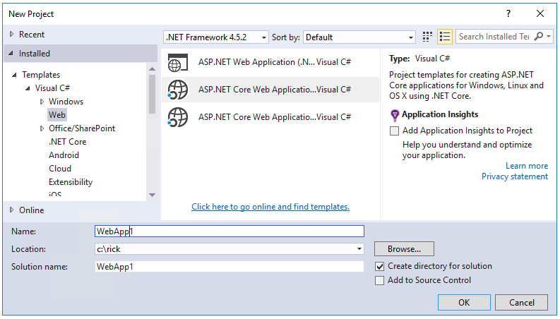
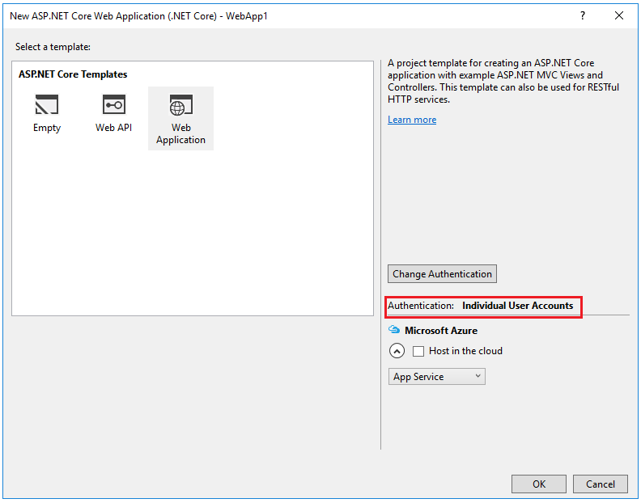
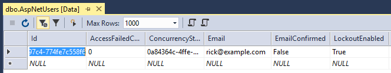
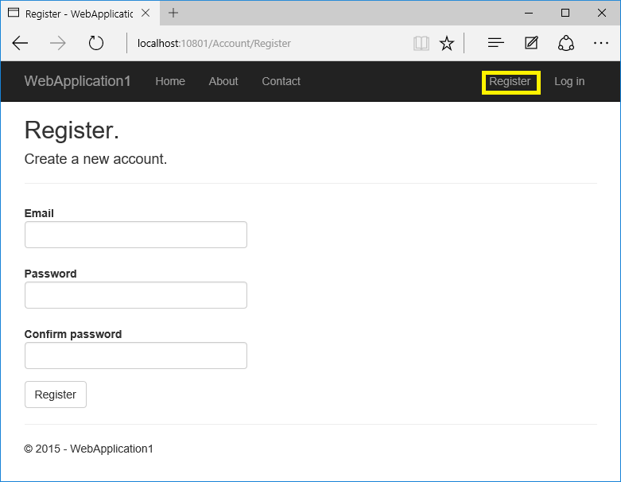

Warning: This page documents version 1.0.0-rc2 and has not yet been updated for version 1.0.0

<a name=security-authentication-account-confirmation></a>

  # Account Confirmation and Password Recovery

By [Rick Anderson](https://twitter.com/RickAndMSFT)

This tutorial shows you how to build an ASP.NET Core app with email confirmation and password reset support.

  ## Create a New ASP.NET Core Project

Note: The tutorial requires Visual Studio 2015 updated 2 and ASP.NET Core RC2 or higher.

* In Visual Studio, create a New Project (from the Start Page, or via **File > New > Project**)



* Tap **Web Application** and verify **Authentication** is set to **Individual User Accounts**



Run the app and then click on the **Register** link and register a user. At this  point, the only validation on the email is with the [[EmailAddress]](http://msdn.microsoft.com/en-us/library/system.componentmodel.dataannotations.emailaddressattribute(v=vs.110).aspx) attribute. After you submit the registration, you are logged into the app. Later in the tutorial we'll change this so new users cannot log in until their email has been validated.

In **SQL Server Object Explorer** (SSOX), navigate to **(localdb)MSSQLLocalDB(SQL Server 12)**. Right click on **dbo.AspNetUsers** > **View Data**:




Note the `EmailConfirmed` field is `False`.

Right-click on the row and from the context menu, select **Delete**. You might want to use this email again in the next step, when the app sends a confirmation email. Deleting the email alias now will make it easier in the following steps.

  ## Require SSL

In this section we'll set up our Visual Studio project to use SSL and our project to require SSL.

  ### Enable SSL in Visual Studio

   * In solution explorer, right click the project and select **Properties**

   * On the left pane, tap **Debug**

   * Check **Enable SSL**

   * Copy the SSL URL and paste it into the **App URL**


* Add the following code to `ConfigureServices` in `Startup`:

<!-- literal_block {"ids": [], "names": [], "highlight_args": {}, "backrefs": [], "dupnames": [], "linenos": false, "classes": [], "xml:space": "preserve", "language": "c#"} -->

````c#

   services.Configure<MvcOptions>(options =>
   {
       options.Filters.Add(new RequireHttpsAttribute ());
   });
   ````

Add the `[RequireHttps]` attribute to each controller. The `[RequireHttps]` attribute will redirect all HTTP GET requests to HTTPS GET and will reject all HTTP POSTs. A security best practice is to use HTTPS for all requests.

<!-- literal_block {"ids": [], "names": [], "highlight_args": {"hl_lines": [9], "linenostart": 1}, "backrefs": [], "dupnames": [], "linenos": false, "classes": [], "xml:space": "preserve", "language": "c#", "source": "/Users/shirhatti/src/Docs/aspnet/security/authentication/accconfirm/sample/WebApplication3/src/WebApplication3/Controllers/HomeController.cs"} -->

````c#

   [RequireHttps]
   public class HomeController : Controller

   ````

  ## Require email confirmation

It's a best practice to confirm the email of a new user registration to verify they are not impersonating someone else (that is, they haven't registered with someone else's email). Suppose you had a discussion forum, you would want to prevent "bob@example.com" from registering as "joe@contoso.com". Without email confirmation, "joe@contoso.com" could get unwanted email from your app. Suppose Bob accidentally registered as  "bib@example.com" and hadn't noticed it, he wouldn't be able to use password recovery because the app doesn't have his correct email. Email confirmation provides only limited protection from bots and doesn't provide protection from determined spammers who have many working email aliases they can use to register.

You generally want to prevent new users from posting any data to your web site before they have been confirmed by email, an SMS text message, or another mechanism. In the sections below, we will enable email confirmation and modify the code to prevent newly registered  users from logging in until their email has been confirmed.

  ### Configure email provider

We'll use the [Options pattern](../../fundamentals/configuration.md#options-config-objects.md) to access the user account and key settings. For more information, see [configuration](../../fundamentals/configuration.md#fundamentals-configuration.md).

   * Create a class to fetch the secure email key. For this sample, the `AuthMessageSenderOptions` class is created in the *Services/AuthMessageSenderOptions.cs* file.

      <!-- literal_block {"ids": [], "names": [], "highlight_args": {"linenostart": 1}, "backrefs": [], "dupnames": [], "linenos": false, "classes": [], "xml:space": "preserve", "language": "c#", "source": "/Users/shirhatti/src/Docs/aspnet/security/authentication/accconfirm/sample/WebApplication3/src/WebApplication3/Services/AuthMessageSenderOptions.cs"} -->

      ````c#

         public class AuthMessageSenderOptions
         {
             public string SendGridUser { get; set; }
             public string SendGridKey { get; set; }
         }

         ````

Set the `SendGridUser` and `SendGridKey` with the [secret-manager tool](../app-secrets.md). For example:

<!-- literal_block {"ids": [], "names": [], "highlight_args": {}, "backrefs": [], "dupnames": [], "linenos": false, "classes": [], "xml:space": "preserve", "language": "none"} -->

````none

   C:\WebApplication3\src\WebApplication3>dotnet user-secrets set SendGridUser RickAndMSFT
   info: Successfully saved SendGridUser = RickAndMSFT to the secret store.
   ````

On Windows, Secret Manager stores your keys/value pairs in a *secrets.json* file in the %APPDATA%/Microsoft/UserSecrets/<**userSecretsId**> directory. The **userSecretsId** directory can be found in your *project.json* file. For this example, the first few lines of the *project.json* file are shown below:

   <!-- literal_block {"ids": [], "names": [], "highlight_args": {"hl_lines": [3], "linenostart": 1}, "backrefs": [], "dupnames": [], "linenos": false, "classes": [], "xml:space": "preserve", "language": "json", "source": "/Users/shirhatti/src/Docs/aspnet/security/authentication/accconfirm/sample/WebApplication3/src/WebApplication3/project.json"} -->

   ````json

      {
        "webroot": "wwwroot",
        "userSecretsId": "aspnet-WebApplication3-f1645c1b-3962-4e7f-99b2-4fb292b6dade",
        "version": "1.0.0-*",

        "dependencies": {

      ````

At this time, the contents of the *secrets.json* file are not encrypted. The *secrets.json* file is shown below (the sensitive keys have been removed.)

<!-- literal_block {"ids": [], "names": [], "highlight_args": {}, "backrefs": [], "dupnames": [], "linenos": false, "classes": [], "xml:space": "preserve", "language": "json"} -->

````json

   {
     "SendGridUser": "RickAndMSFT",
     "SendGridKey": "",
     "Authentication:Facebook:AppId": "",
     "Authentication:Facebook:AppSecret": ""
   }
   ````

  ### Configure startup to use `AuthMessageSenderOptions`

Add the dependecy `Microsoft.Extensions.Options.ConfigurationExtensions` in the project.json file.

Add `AuthMessageSenderOptions` to the service container at the end of the `ConfigureServices` method in the *Startup.cs* file:

<!-- literal_block {"ids": [], "names": [], "highlight_args": {"hl_lines": [4], "linenostart": 1}, "backrefs": [], "dupnames": [], "linenos": false, "classes": [], "xml:space": "preserve", "language": "c#", "source": "/Users/shirhatti/src/Docs/aspnet/security/authentication/accconfirm/sample/WebApplication3/src/WebApplication3/Startup.cs"} -->

````c#

       // Add application services.
       services.AddTransient<IEmailSender, AuthMessageSender>();
       services.AddTransient<ISmsSender, AuthMessageSender>();
       services.Configure<AuthMessageSenderOptions>(Configuration);


   ````

  ### Configure the `AuthMessageSender` class

This tutorial shows how to add email notification through [SendGrid](https://sendgrid.com/), but you can send email using SMTP and other mechanisms.

* Install the SendGrid.NetCore NuGet package. From the Package Manager Console,  enter the following the following command:

   `Install-Package SendGrid.NetCore -Pre`

   Note: SendGrid.NetCore package is a prerelease version , to install it is necessary to use -Pre option on Install-Package.

* Follow the instructions [Create a SendGrid account](https://azure.microsoft.com/en-us/documentation/articles/sendgrid-dotnet-how-to-send-email/#create-a-sendgrid-account) to register for a free SendGrid account.

* Add code in *Services/MessageServices.cs* similar to the following to configure SendGrid

<!-- literal_block {"ids": [], "names": [], "highlight_args": {"linenostart": 1}, "backrefs": [], "dupnames": [], "linenos": false, "classes": [], "xml:space": "preserve", "language": "c#", "source": "/Users/shirhatti/src/Docs/aspnet/security/authentication/accconfirm/sample/WebApplication3/src/WebApplication3/Services/MessageServices.cs"} -->

````c#

   public class AuthMessageSender : IEmailSender, ISmsSender
   {
       public AuthMessageSender(IOptions<AuthMessageSenderOptions> optionsAccessor)
       {
           Options = optionsAccessor.Value;
       }

       public AuthMessageSenderOptions Options { get; } //set only via Secret Manager

       public Task SendEmailAsync(string email, string subject, string message)
       {
           // Plug in your email service here to send an email.
           var myMessage = new SendGrid.SendGridMessage();
           myMessage.AddTo(email);
           myMessage.From = new System.Net.Mail.MailAddress("Joe@contoso.com", "Joe Smith");
           myMessage.Subject = subject;
           myMessage.Text = message;
           myMessage.Html = message;
           var credentials = new System.Net.NetworkCredential(
               Options.SendGridUser,
               Options.SendGridKey);
           // Create a Web transport for sending email.
           var transportWeb = new SendGrid.Web(credentials);
           return transportWeb.DeliverAsync(myMessage);
       }

       public Task SendSmsAsync(string number, string message)
       {
           // Plug in your SMS service here to send a text message.
           return Task.FromResult(0);
       }
   }


   ````

  ## Enable account confirmation and password recovery

The template already has the code for account confirmation and password recovery. Follow these steps to enable it:

* Find the `[HttpPost] Register` method in the  *AccountController.cs* file.

* Uncomment the code to enable account confirmation.

<!-- literal_block {"ids": [], "names": [], "highlight_args": {"hl_lines": [17, 18, 19, 20, 21], "linenostart": 1}, "backrefs": [], "dupnames": [], "linenos": false, "classes": [], "xml:space": "preserve", "language": "none", "source": "/Users/shirhatti/src/Docs/aspnet/security/authentication/accconfirm/sample/WebApplication3/src/WebApplication3/Controllers/AccountController.cs"} -->

````none

   [HttpPost]
   [AllowAnonymous]
   [ValidateAntiForgeryToken]
   public async Task<IActionResult> Register(RegisterViewModel model, string returnUrl = null)
   {
       ViewData["ReturnUrl"] = returnUrl;
       if (ModelState.IsValid)
       {
           var user = new ApplicationUser { UserName = model.Email, Email = model.Email };
           var result = await _userManager.CreateAsync(user, model.Password);
           if (result.Succeeded)
           {
               // For more information on how to enable account confirmation and password reset please visit http://go.microsoft.com/fwlink/?LinkID=532713
               // Send an email with this link
               var code = await _userManager.GenerateEmailConfirmationTokenAsync(user);
               var callbackUrl = Url.Action("ConfirmEmail", "Account", new { userId = user.Id, code = code }, protocol: HttpContext.Request.Scheme);
               await _emailSender.SendEmailAsync(model.Email, "Confirm your account",
                   $"Please confirm your account by clicking this link: <a href='{callbackUrl}'>link</a>");
               //await _signInManager.SignInAsync(user, isPersistent: false);
               _logger.LogInformation(3, "User created a new account with password.");
               return RedirectToLocal(returnUrl);
               
           }
           AddErrors(result);
       }

       // If we got this far, something failed, redisplay form
       return View(model);
   }


   ````

**Note:** We're also preventing a newly registered user from being automatically logged on by commenting out the following line:

<!-- literal_block {"ids": [], "names": [], "highlight_args": {}, "backrefs": [], "dupnames": [], "linenos": false, "classes": [], "xml:space": "preserve", "language": "c#"} -->

````c#

   //await _signInManager.SignInAsync(user, isPersistent: false);
   ````

* Enable password recovery by uncommenting the code in the `ForgotPassword` action in the *Controllers/AccountController.cs* file.

<!-- literal_block {"ids": [], "names": [], "highlight_args": {"hl_lines": [17, 18, 19, 20, 21], "linenostart": 1}, "backrefs": [], "dupnames": [], "linenos": false, "classes": [], "xml:space": "preserve", "language": "none", "source": "/Users/shirhatti/src/Docs/aspnet/security/authentication/accconfirm/sample/WebApplication3/src/WebApplication3/Controllers/AccountController.cs"} -->

````none

   [HttpPost]
   [AllowAnonymous]
   [ValidateAntiForgeryToken]
   public async Task<IActionResult> ForgotPassword(ForgotPasswordViewModel model)
   {
       if (ModelState.IsValid)
       {
           var user = await _userManager.FindByNameAsync(model.Email);
           if (user == null || !(await _userManager.IsEmailConfirmedAsync(user)))
           {
               // Don't reveal that the user does not exist or is not confirmed
               return View("ForgotPasswordConfirmation");
           }

           // For more information on how to enable account confirmation and password reset please visit http://go.microsoft.com/fwlink/?LinkID=532713
           // Send an email with this link
           var code = await _userManager.GeneratePasswordResetTokenAsync(user);
           var callbackUrl = Url.Action("ResetPassword", "Account", new { userId = user.Id, code = code }, protocol: HttpContext.Request.Scheme);
           await _emailSender.SendEmailAsync(model.Email, "Reset Password",
              $"Please reset your password by clicking here: <a href='{callbackUrl}'>link</a>");
           return View("ForgotPasswordConfirmation");
       }

       // If we got this far, something failed, redisplay form
       return View(model);
   }

   ````

Uncomment the highlighted `ForgotPassword` from in the *Views/Account/ForgotPassword.cshtml* view file.

<!-- literal_block {"ids": [], "names": [], "highlight_args": {"hl_lines": [11, 12, 13, 14, 15, 16, 17, 18, 19, 20, 21, 22, 23, 24, 25, 26, 27], "linenostart": 1}, "backrefs": [], "dupnames": [], "linenos": false, "classes": [], "xml:space": "preserve", "language": "html", "source": "/Users/shirhatti/src/Docs/aspnet/security/authentication/accconfirm/sample/WebApplication3/src/WebApplication3/Views/Account/ForgotPassword.cshtml"} -->

````html

   @model ForgotPasswordViewModel
   @{
       ViewData["Title"] = "Forgot your password?";
   }

   <h2>@ViewData["Title"]</h2>
   <p>
       For more information on how to enable reset password please see this <a href="http://go.microsoft.com/fwlink/?LinkID=532713">article</a>.
   </p>

   <form asp-controller="Account" asp-action="ForgotPassword" method="post" class="form-horizontal">
       <h4>Enter your email.</h4>
       <hr />
       <div asp-validation-summary="All" class="text-danger"></div>
       <div class="form-group">
           <label asp-for="Email" class="col-md-2 control-label"></label>
           <div class="col-md-10">
               <input asp-for="Email" class="form-control" />
               <span asp-validation-for="Email" class="text-danger"></span>
           </div>
       </div>
       <div class="form-group">
           <div class="col-md-offset-2 col-md-10">
               <button type="submit" class="btn btn-default">Submit</button>
           </div>
       </div>
   </form>

   @section Scripts {
       @{ await Html.RenderPartialAsync("_ValidationScriptsPartial"); }
   }

   ````

  ## Register, confirm email, and reset password

In this section, run the web app and show the account confirmation and password recovery flow.

* Run the application and register a new user



* Check your email for the account confirmation link. If you don't get the email notification:

  * Check the SendGrid web site to verify your sent mail messages.

  * Check your spam folder.

  * Try another email alias on a different email provider (Microsoft, Yahoo, Gmail, etc.)

  * In SSOX, navigate to **dbo.AspNetUsers** and delete the email entry and try again.

* Click the link to confirm your email.

* Log in with your email and password.

* Log off.

  ### Test password reset

* Login and select **Forgot your password?**

* Enter the email you used to register the account.

* An email with a link to reset your password will be sent. Check your email and click the link to reset your password.  After your password has been successfully reset, you can login with your email and new password.

  ## Require email confirmation before login

With the current templates, once a user completes the registration form, they are logged in (authenticated). You generally want to confirm their email before logging them in. In the section below, we will modify the code to require new users have a confirmed email before they are logged in. Update the `[HttpPost] Login` action in the *AccountController.cs* file with the following highlighted changes.

<!-- literal_block {"ids": [], "names": [], "highlight_args": {"hl_lines": [11, 12, 13, 14, 15, 16, 17, 18, 19, 20], "linenostart": 1}, "backrefs": [], "dupnames": [], "linenos": false, "classes": [], "xml:space": "preserve", "language": "c#", "source": "/Users/shirhatti/src/Docs/aspnet/security/authentication/accconfirm/sample/WebApplication3/src/WebApplication3/Controllers/AccountController.cs"} -->

````c#


   //
   // POST: /Account/Login
   [HttpPost]
   [AllowAnonymous]
   [ValidateAntiForgeryToken]
   public async Task<IActionResult> Login(LoginViewModel model, string returnUrl = null)
   {
       ViewData["ReturnUrl"] = returnUrl;
       if (ModelState.IsValid)
       {
           // Require the user to have a confirmed email before they can log on.
           var user = await _userManager.FindByNameAsync(model.Email);
           if (user != null)
           {
               if (!await _userManager.IsEmailConfirmedAsync(user))
               {
                   ModelState.AddModelError(string.Empty, "You must have a confirmed email to log in.");
                   return View(model);
               }
           }

           // This doesn't count login failures towards account lockout
           // To enable password failures to trigger account lockout, set lockoutOnFailure: true
           var result = await _signInManager.PasswordSignInAsync(model.Email, model.Password, model.RememberMe, lockoutOnFailure: false);
           if (result.Succeeded)
           {
               _logger.LogInformation(1, "User logged in.");
               return RedirectToLocal(returnUrl);
           }
           if (result.RequiresTwoFactor)
           {
               return RedirectToAction(nameof(SendCode), new { ReturnUrl = returnUrl, RememberMe = model.RememberMe });
           }
           if (result.IsLockedOut)
           {
               _logger.LogWarning(2, "User account locked out.");
               return View("Lockout");
           }
           else
           {
               ModelState.AddModelError(string.Empty, "Invalid login attempt.");
               return View(model);
           }
       }


   ````

Note: A security best practice is to not use production secrets in test and development. If you publish the app to Azure, you can set the SendGrid secrets as application settings in the Azure Web App portal. The configuration system is setup to read keys from environment variables.

  ## Combine social and local login accounts

To complete this section, you must first enable an external authentication provider. See [Enabling authentication using Facebook, Google and other external providers](sociallogins.md).

You can combine local and social accounts by clicking on your email link. In the following sequence "RickAndMSFT@gmail.com" is first created as a local login, but you can create the account as a social login first, then add a local login.


Click on the **Manage** link. Note the 0 external (social logins) associated with this account.


Click the link to another login service and accept the app requests. In the image below, Facebook is the external authentication provider:


The two accounts have been combined. You will be able to log on with either account. You might want your users to add local accounts in case their social log in authentication service is down, or more likely they have lost access to their social account.
