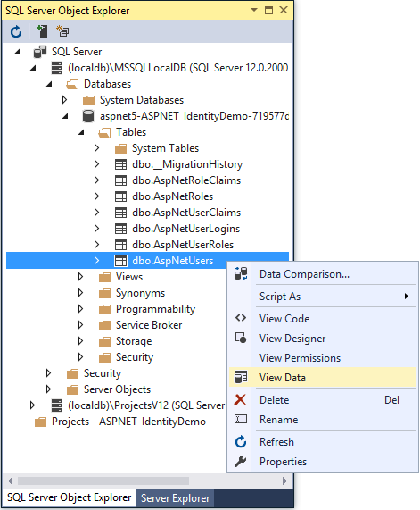
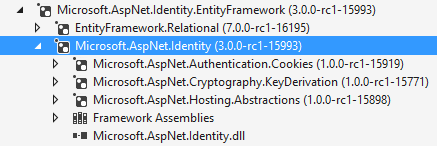

  # Introduction to Identity

By [Pranav Rastogi](https://github.com/rustd), [Rick Anderson](https://twitter.com/RickAndMSFT), Tom Dykstra, Jon Galloway and [Erik Reitan](https://github.com/Erikre)

ASP.NET Core Identity is a membership system which allows you to add login functionality to your application. Users can create an account and login with a user name and password or they can use an external login providers such as Facebook, Google, Microsoft Account, Twitter and more.

You can configure ASP.NET Core Identity to use a SQL Server database to store user names, passwords, and profile data. Alternatively, you can use your own persistent store to store data in another persistent storage, such as Azure Table Storage.

  ## Overview of Identity

In this topic, you'll learn how to use ASP.NET Core Identity to add functionality to register, log in, and log out a user. You can follow along step by step or just read the details. For more detailed instructions about creating apps using ASP.NET Core Identity, see the Next Steps section at the end of this article.

1. Create an ASP.NET Core Web Application project in Visual Studio with Individual User Accounts.

   In Visual Studio, select **File** -> **New** -> **Project**. Then, select the **ASP.NET Web Application** from the **New Project** dialog box. Continue by selecting an ASP.NET Core **Web Application** with **Individual User Accounts** as the authentication method.

   

   The created project contains the `Microsoft.AspNetCore.Identity.EntityFrameworkCore` package, which will persist the identity data and schema to SQL Server using [Entity Framework Core](https://docs.efproject.net).

   Note: In Visual Studio, you can view NuGet packages details by selecting **Tools** -> **NuGet Package Manager** -> **Manage NuGet Packages for Solution**. You also see a list of packages in the dependencies section of the *project.json* file within your project.

   The identity services are added to the application in the `ConfigureServices` method in the `Startup` class:

   <!-- literal_block {"ids": [], "names": [], "highlight_args": {"hl_lines": [10, 11, 12], "linenostart": 1}, "backrefs": [], "dupnames": [], "linenos": false, "classes": [], "xml:space": "preserve", "language": "c#", "source": "/Users/shirhatti/src/Docs/aspnet/security/authentication/identity/sample/src/ASPNET-IdentityDemo/Startup.cs"} -->

   ````c#

      // This method gets called by the runtime. Use this method to add services to the container.
      public void ConfigureServices(IServiceCollection services)
      {
          // Add framework services.
          services.AddEntityFramework()
              .AddSqlServer()
              .AddDbContext<ApplicationDbContext>(options =>
                  options.UseSqlServer(Configuration["Data:DefaultConnection:ConnectionString"]));

          services.AddIdentity<ApplicationUser, IdentityRole>()
              .AddEntityFrameworkStores<ApplicationDbContext>()
              .AddDefaultTokenProviders();

          services.AddMvc();

          // Add application services.
          services.AddTransient<IEmailSender, AuthMessageSender>();
          services.AddTransient<ISmsSender, AuthMessageSender>();
           

      ````

   These services are then made available to the application through [dependency injection](../../fundamentals/dependency-injection.md).

   Identity is enabled for the application by calling  `UseIdentity` in the `Configure` method of the `Startup` class. This adds cookie-based authentication to the request pipeline.

   <!-- literal_block {"ids": [], "names": [], "highlight_args": {"hl_lines": [22], "linenostart": 1}, "backrefs": [], "dupnames": [], "linenos": false, "classes": [], "xml:space": "preserve", "language": "c#", "source": "/Users/shirhatti/src/Docs/aspnet/security/authentication/identity/sample/src/ASPNET-IdentityDemo/Startup.cs"} -->

   ````c#

          services.Configure<IdentityOptions>(options =>
          {
              // Password settings
              options.Password.RequireDigit = true;
              options.Password.RequiredLength = 8;
              options.Password.RequireNonAlphanumeric = false;
              options.Password.RequireUppercase = true;
              options.Password.RequireLowercase = false;
              
              // Lockout settings
              options.Lockout.DefaultLockoutTimeSpan = TimeSpan.FromMinutes(30);
              options.Lockout.MaxFailedAccessAttempts = 10;
              
              // Cookie settings
              options.Cookies.ApplicationCookie.ExpireTimeSpan = TimeSpan.FromDays(150);
              options.Cookies.ApplicationCookie.LoginPath = "/Account/LogIn";
              options.Cookies.ApplicationCookie.LogoutPath = "/Account/LogOff";
              
              // User settings
              options.User.RequireUniqueEmail = true;
          });
      }

      // This method gets called by the runtime. Use this method to configure the HTTP request pipeline.
      public void Configure(IApplicationBuilder app, IHostingEnvironment env, ILoggerFactory loggerFactory)
      {
          loggerFactory.AddConsole(Configuration.GetSection("Logging"));
          loggerFactory.AddDebug();

          if (env.IsDevelopment())
          {
              app.UseBrowserLink();

      ````

   For more information about the application start up process, see [Application Startup](../../fundamentals/startup.md).

2. Creating a user.

   Launch the application from Visual Studio (**Debug** -> **Start Debugging**) and then click on the **Register** link in the browser to create a user. The following image shows the Register page which collects the user name and password.

   

   When the user clicks the **Register** link, the `UserManager` and `SignInManager` services are injected into the Controller:

   <!-- literal_block {"ids": [], "names": [], "highlight_args": {"hl_lines": [3, 4, 11, 12, 17, 18], "linenostart": 1}, "backrefs": [], "dupnames": [], "linenos": false, "classes": [], "xml:space": "preserve", "language": "c#", "source": "/Users/shirhatti/src/Docs/aspnet/security/authentication/identity/sample/src/ASPNET-IdentityDemo/Controllers/AccountController.cs"} -->

   ````c#

          public class AccountController : Controller
          {
              private readonly UserManager<ApplicationUser> _userManager;
              private readonly SignInManager<ApplicationUser> _signInManager;
              private readonly IEmailSender _emailSender;
              private readonly ISmsSender _smsSender;
              private static bool _databaseChecked;
              private readonly ILogger _logger;

              public AccountController(
                  UserManager<ApplicationUser> userManager,
                  SignInManager<ApplicationUser> signInManager,
                  IEmailSender emailSender,
                  ISmsSender smsSender,
                  ILoggerFactory loggerFactory)
              {
                  _userManager = userManager;
                  _signInManager = signInManager;
                  _emailSender = emailSender;
                  _smsSender = smsSender;
                  _logger = loggerFactory.CreateLogger<AccountController>();
              }

              //
              // GET: /Account/Login

      ````

   Then, the **Register** action creates the user by calling `CreateAsync` function of the `UserManager` object, as shown below:

   <!-- literal_block {"ids": [], "names": [], "highlight_args": {"hl_lines": [9], "linenostart": 1}, "backrefs": [], "dupnames": [], "linenos": false, "classes": [], "xml:space": "preserve", "language": "c#", "source": "/Users/shirhatti/src/Docs/aspnet/security/authentication/identity/sample/src/ASPNET-IdentityDemo/Controllers/AccountController.cs"} -->

   ````c#

      [HttpPost]
      [AllowAnonymous]
      [ValidateAntiForgeryToken]
      public async Task<IActionResult> Register(RegisterViewModel model)
      {
          if (ModelState.IsValid)
          {
              var user = new ApplicationUser { UserName = model.Email, Email = model.Email };
              var result = await _userManager.CreateAsync(user, model.Password);
              if (result.Succeeded)
              {
                  // For more information on how to enable account confirmation and password reset please visit http://go.microsoft.com/fwlink/?LinkID=532713
                  // Send an email with this link
                  //var code = await _userManager.GenerateEmailConfirmationTokenAsync(user);
                  //var callbackUrl = Url.Action("ConfirmEmail", "Account", new { userId = user.Id, code = code }, protocol: HttpContext.Request.Scheme);
                  //await _emailSender.SendEmailAsync(model.Email, "Confirm your account",
                  //    "Please confirm your account by clicking this link: <a href=\"" + callbackUrl + "\">link</a>");
                  await _signInManager.SignInAsync(user, isPersistent: false);
                  _logger.LogInformation(3, "User created a new account with password.");
                  return RedirectToAction(nameof(HomeController.Index), "Home");
              }
              AddErrors(result);
          }

          // If we got this far, something failed, redisplay form
          return View(model);
      }


      ````

3. Log in.

   If the user was successfully created, the user is logged in by the `SignInAsync` method, also contained in the `Register` action. By signing in, the `SignInAsync` method stores a cookie with the user's claims.

   <!-- literal_block {"ids": [], "names": [], "highlight_args": {"hl_lines": [18], "linenostart": 1}, "backrefs": [], "dupnames": [], "linenos": false, "classes": [], "xml:space": "preserve", "language": "c#", "source": "/Users/shirhatti/src/Docs/aspnet/security/authentication/identity/sample/src/ASPNET-IdentityDemo/Controllers/AccountController.cs"} -->

   ````c#

      [HttpPost]
      [AllowAnonymous]
      [ValidateAntiForgeryToken]
      public async Task<IActionResult> Register(RegisterViewModel model)
      {
          if (ModelState.IsValid)
          {
              var user = new ApplicationUser { UserName = model.Email, Email = model.Email };
              var result = await _userManager.CreateAsync(user, model.Password);
              if (result.Succeeded)
              {
                  // For more information on how to enable account confirmation and password reset please visit http://go.microsoft.com/fwlink/?LinkID=532713
                  // Send an email with this link
                  //var code = await _userManager.GenerateEmailConfirmationTokenAsync(user);
                  //var callbackUrl = Url.Action("ConfirmEmail", "Account", new { userId = user.Id, code = code }, protocol: HttpContext.Request.Scheme);
                  //await _emailSender.SendEmailAsync(model.Email, "Confirm your account",
                  //    "Please confirm your account by clicking this link: <a href=\"" + callbackUrl + "\">link</a>");
                  await _signInManager.SignInAsync(user, isPersistent: false);
                  _logger.LogInformation(3, "User created a new account with password.");
                  return RedirectToAction(nameof(HomeController.Index), "Home");
              }
              AddErrors(result);
          }

          // If we got this far, something failed, redisplay form
          return View(model);
      }


      ````

   The above `SignInAsync` method calls the below `SignInAsync` task, which is contained in the `SignInManager` class.

   If needed, you can access the user's identity details inside a controller action. For instance, by setting a breakpoint inside the `HomeController.Index` action method, you can view the `User.claims` details. By having the user signed-in, you can make authorization decisions. For more information, see [Authorization](../authorization/index.md).

   As a registered user, you can log in to the web app by clicking the **Log in** link.  When a registered user logs in, the `Login` action of the `AccountController` is called. Then, the **Login** action signs in the user using the `PasswordSignInAsync` method contained in the `Login` action.

   <!-- literal_block {"ids": [], "names": [], "highlight_args": {"hl_lines": [11], "linenostart": 1}, "backrefs": [], "dupnames": [], "linenos": false, "classes": [], "xml:space": "preserve", "language": "c#", "source": "/Users/shirhatti/src/Docs/aspnet/security/authentication/identity/sample/src/ASPNET-IdentityDemo/Controllers/AccountController.cs"} -->

   ````c#

      [HttpPost]
      [AllowAnonymous]
      [ValidateAntiForgeryToken]
      public async Task<IActionResult> Login(LoginViewModel model, string returnUrl = null)
      {
          ViewData["ReturnUrl"] = returnUrl;
          if (ModelState.IsValid)
          {
              // This doesn't count login failures towards account lockout
              // To enable password failures to trigger account lockout, set lockoutOnFailure: true
              var result = await _signInManager.PasswordSignInAsync(model.Email, model.Password, model.RememberMe, lockoutOnFailure: false);
              if (result.Succeeded)
              {
                  _logger.LogInformation(1, "User logged in.");
                  return RedirectToLocal(returnUrl);
              }
              if (result.RequiresTwoFactor)
              {
                  return RedirectToAction(nameof(SendCode), new { ReturnUrl = returnUrl, RememberMe = model.RememberMe });
              }
              if (result.IsLockedOut)
              {
                  _logger.LogWarning(2, "User account locked out.");
                  return View("Lockout");
              }
              else
              {
                  ModelState.AddModelError(string.Empty, "Invalid login attempt.");
                  return View(model);
              }
          }

          // If we got this far, something failed, redisplay form
          return View(model);
      }


      ````

4. Log off.

   Clicking the **Log off** link calls the `LogOff` action in the account controller.

   <!-- literal_block {"ids": [], "names": [], "highlight_args": {"hl_lines": [5], "linenostart": 1}, "backrefs": [], "dupnames": [], "linenos": false, "classes": [], "xml:space": "preserve", "language": "c#", "source": "/Users/shirhatti/src/Docs/aspnet/security/authentication/identity/sample/src/ASPNET-IdentityDemo/Controllers/AccountController.cs"} -->

   ````c#

      [HttpPost]
      [ValidateAntiForgeryToken]
      public async Task<IActionResult> LogOff()
      {
          await _signInManager.SignOutAsync();
          _logger.LogInformation(4, "User logged out.");
          return RedirectToAction(nameof(HomeController.Index), "Home");
      }

      ````

   The code above shows the `SignInManager.SignOutAsync` method. The `SignOutAsync` method clears the users claims stored in a cookie.

5. Configuration.

   Identity has some default behaviors that you can override in your application's startup class.

      <!-- literal_block {"ids": [], "names": [], "highlight_args": {"hl_lines": [5], "linenostart": 1}, "backrefs": [], "dupnames": [], "linenos": false, "classes": [], "xml:space": "preserve", "language": "c#", "source": "/Users/shirhatti/src/Docs/aspnet/security/authentication/identity/sample/src/ASPNET-IdentityDemo/Startup.cs"} -->

      ````c#

             // Configure Identity
             services.Configure<IdentityOptions>(options =>
             {
                 // Password settings
                 options.Password.RequireDigit = true;
                 options.Password.RequiredLength = 8;
                 options.Password.RequireNonAlphanumeric = false;
                 options.Password.RequireUppercase = true;
                 options.Password.RequireLowercase = false;
                 
                 // Lockout settings
                 options.Lockout.DefaultLockoutTimeSpan = TimeSpan.FromMinutes(30);
                 options.Lockout.MaxFailedAccessAttempts = 10;
                 
                 // Cookie settings
                 options.Cookies.ApplicationCookie.ExpireTimeSpan = TimeSpan.FromDays(150);
                 options.Cookies.ApplicationCookie.LoginPath = "/Account/LogIn";
                 options.Cookies.ApplicationCookie.LogoutPath = "/Account/LogOff";
                 
                 // User settings
                 options.User.RequireUniqueEmail = true;
             });

         ````

6. View the database.

   After stopping the application, view the user database from Visual Studio by selecting **View** -> **SQL Server Object Explorer**. Then, expand the following within the **SQL Server Object Explorer**:

   * (localdb)MSSQLLocalDB

   * Databases

   * aspnet5-<*the name of your application*>

   * Tables

   Next, right-click the **dbo.AspNetUsers** table and select **View Data** to see the properties of the user you created.

   

  ## Identity Components

The primary reference assembly for the identity system is `Microsoft.AspNetCore.Identity`. This package contains the core set of interfaces for ASP.NET Core Identity.



These dependencies are needed to use the identity system in ASP.NET Core applications:

* `EntityFramework.SqlServer` - Entity Framework is Microsoft's recommended data access technology for relational databases.

* `Microsoft.AspNetCore.Authentication.Cookies` - Middleware that enables an application to use cookie based authentication, similar to ASP.NET's Forms Authentication.

* `Microsoft.AspNetCore.Cryptography.KeyDerivation` - Utilities for key derivation.

* `Microsoft.AspNetCore.Hosting.Abstractions` - Hosting abstractions.

  ## Migrating to ASP.NET Core Identity

For additional information and guidance on migrating your existing identity store see [Migrating Authentication and Identity](../../migration/identity.md)

  ## Next Steps

* [Migrating Authentication and Identity](../../migration/identity.md#migration-identity.md)

* [Account Confirmation and Password Recovery](accconfirm.md#security-authentication-account-confirmation.md)

* [Two-factor authentication with SMS](2fa.md#security-authentication-2fa.md)

* [Enabling authentication using Facebook, Google and other external providers](sociallogins.md#security-authentication-social-logins.md)
