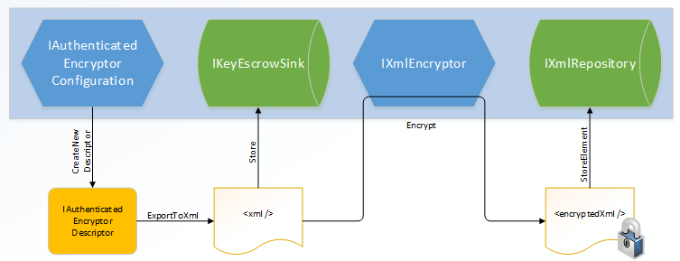

<a name=data-protection-extensibility-key-management></a>

  # Key management extensibility

Tip: Read the [key management](../implementation/key-management.md#data-protection-implementation-key-management.md) section before reading this section, as it explains some of the fundamental concepts behind these APIs.

Warning: Types that implement any of the following interfaces should be thread-safe for multiple callers.

  ## Key

The IKey interface is the basic representation of a key in cryptosystem. The term key is used here in the abstract sense, not in the literal sense of "cryptographic key material". A key has the following properties:

* Activation, creation, and expiration dates

* Revocation status

* Key identifier (a GUID)

Additionally, IKey exposes a CreateEncryptorInstance method which can be used to create an [IAuthenticatedEncryptor](core-crypto.md#data-protection-extensibility-core-crypto-iauthenticatedencryptor.md) instance tied to this key.

Note: There is no API to retrieve the raw cryptographic material from an IKey instance.

  ## IKeyManager

The IKeyManager interface represents an object responsible for general key storage, retrieval, and manipulation. It exposes three high-level operations:

* Create a new key and persist it to storage.

* Get all keys from storage.

* Revoke one or more keys and persist the revocation information to storage.

Warning: Writing an IKeyManager is a very advanced task, and the majority of developers should not attempt it. Instead, most developers should take advantage of the facilities offered by the [XmlKeyManager](xref:security/data-protection/extensibility/key-management#data-protection-extensibility-key-management-xmlkeymanager) class.

<a name=data-protection-extensibility-key-management-xmlkeymanager></a>

  ## XmlKeyManager

The XmlKeyManager type is the in-box concrete implementation of IKeyManager. It provides several useful facilities, including key escrow and encryption of keys at rest. Keys in this system are represented as XML elements (specifically, [XElement](https://msdn.microsoft.com/en-us/library/system.xml.linq.xelement(v=vs.110).aspx)).

XmlKeyManager depends on several other components in the course of fulfilling its tasks:

* IAuthenticatedEncryptorConfiguration, which dictates the algorithms used by new keys.

* IXmlRepository, which controls where keys are persisted in storage.

* IXmlEncryptor [optional], which allows encrypting keys at rest.

* IKeyEscrowSink [optional], which provides key escrow services.

Below are high-level diagrams which indicate how these components are wired together within XmlKeyManager.

   
   

   Key Creation / CreateNewKey

In the implementation of CreateNewKey, the IAuthenticatedEncryptorConfiguration component is used to create a unique IAuthenticatedEncryptorDescriptor, which is then serialized as XML. If a key escrow sink is present, the raw (unencrypted) XML is provided to the sink for long-term storage. The unencrypted XML is then run through an IXmlEncryptor (if required) to generate the encrypted XML document. This encrypted document is persisted to long-term storage via the IXmlRepository. (If no IXmlEncryptor is configured, the unencrypted document is persisted in the IXmlRepository.)

   
   

   Key Retrieval / GetAllKeys

In the implementation of GetAllKeys, the XML documents representing keys and revocations are read from the underlying IXmlRepository. If these documents are encrypted, the system will automatically decrypt them. XmlKeyManager creates the appropriate IAuthenticatedEncryptorDescriptorDeserializer instances to deserialize the documents back into IAuthenticatedEncryptorDescriptor instances, which are then wrapped in individual IKey instances. This collection of IKey instances is returned to the caller.

Further information on the particular XML elements can be found in the [key storage format document](../implementation/key-storage-format.md#data-protection-implementation-key-storage-format.md).

  ## IXmlRepository

The IXmlRepository interface represents a type that can persist XML to and retrieve XML from a backing store. It exposes two APIs:

* GetAllElements() : IReadOnlyCollection<XElement>

* StoreElement(XElement element, string friendlyName)

Implementations of IXmlRepository don't need to parse the XML passing through them. They should treat the XML documents as opaque and let higher layers worry about generating and parsing the documents.

There are two built-in concrete types which implement IXmlRepository: FileSystemXmlRepository and RegistryXmlRepository. See the [key storage providers document](../implementation/key-storage-providers.md#data-protection-implementation-key-storage-providers.md) for more information. Registering a custom IXmlRepository would be the appropriate manner to use a different backing store, e.g., Azure Blob Storage. To change the default repository application-wide, register a custom singleton IXmlRepository in the service provider.

<a name=data-protection-extensibility-key-management-ixmlencryptor></a>

  ## IXmlEncryptor

The IXmlEncryptor interface represents a type that can encrypt a plaintext XML element. It exposes a single API:

* Encrypt(XElement plaintextElement) : EncryptedXmlInfo

If a serialized IAuthenticatedEncryptorDescriptor contains any elements marked as "requires encryption", then XmlKeyManager will run those elements through the configured IXmlEncryptor's Encrypt method, and it will persist the enciphered element rather than the plaintext element to the IXmlRepository. The output of the Encrypt method is an EncryptedXmlInfo object. This object is a wrapper which contains both the resultant enciphered XElement and the Type which represents an IXmlDecryptor which can be used to decipher the corresponding element.

There are four built-in concrete types which implement IXmlEncryptor: CertificateXmlEncryptor, DpapiNGXmlEncryptor, DpapiXmlEncryptor, and NullXmlEncryptor. See the [key encryption at rest document](../implementation/key-encryption-at-rest.md#data-protection-implementation-key-encryption-at-rest.md) for more information. To change the default key-encryption-at-rest mechanism application-wide, register a custom singleton IXmlEncryptor in the service provider.

  ## IXmlDecryptor

The IXmlDecryptor interface represents a type that knows how to decrypt an XElement that was enciphered via an IXmlEncryptor. It exposes a single API:

* Decrypt(XElement encryptedElement) : XElement

The Decrypt method undoes the encryption performed by IXmlEncryptor.Encrypt. Generally each concrete IXmlEncryptor implementation will have a corresponding concrete IXmlDecryptor implementation.

Types which implement IXmlDecryptor should have one of the following two public constructors:

* .ctor(IServiceProvider)

* .ctor()

Note: The IServiceProvider passed to the constructor may be null.

  ## IKeyEscrowSink

The IKeyEscrowSink interface represents a type that can perform escrow of sensitive information. Recall that serialized descriptors might contain sensitive information (such as cryptographic material), and this is what led to the introduction of the [IXmlEncryptor](xref:security/data-protection/extensibility/key-management#data-protection-extensibility-key-management-ixmlencryptor) type in the first place. However, accidents happen, and keyrings can be deleted or become corrupted.

The escrow interface provides an emergency escape hatch, allowing access to the raw serialized XML before it is transformed by any configured [IXmlEncryptor](xref:security/data-protection/extensibility/key-management#data-protection-extensibility-key-management-ixmlencryptor). The interface exposes a single API:

* Store(Guid keyId, XElement element)

It is up to the IKeyEscrowSink implementation to handle the provided element in a secure manner consistent with business policy. One possible implementation could be for the escrow sink to encrypt the XML element using a known corporate X.509 certificate where the certificate's private key has been escrowed; the CertificateXmlEncryptor type can assist with this. The IKeyEscrowSink implementation is also responsible for persisting the provided element appropriately.

By default no escrow mechanism is enabled, though server administrators can [configure this globally](../configuration/machine-wide-policy.md#data-protection-configuration-machinewidepolicy.md). It can also be configured programmatically via the *IDataProtectionBuilder.AddKeyEscrowSink* method as shown in the sample below. The *AddKeyEscrowSink* method overloads mirror the *IServiceCollection.AddSingleton* and *IServiceCollection.AddInstance* overloads, as IKeyEscrowSink instances are intended to be singletons. If multiple IKeyEscrowSink instances are registered, each one will be called during key generation, so keys can be escrowed to multiple mechanisms simultaneously.

There is no API to read material from an IKeyEscrowSink instance. This is consistent with the design theory of the escrow mechanism: it's intended to make the key material accessible to a trusted authority, and since the application is itself not a trusted authority, it shouldn't have access to its own escrowed material.

The following sample code demonstrates creating and registering an IKeyEscrowSink where keys are escrowed such that only members of "CONTOSODomain Admins" can recover them.

Note: To run this sample, you must be on a domain-joined Windows 8 / Windows Server 2012 machine, and the domain controller must be Windows Server 2012 or later.

<!-- literal_block {"ids": [], "names": [], "highlight_args": {"linenostart": 1}, "backrefs": [], "dupnames": [], "linenos": false, "classes": [], "xml:space": "preserve", "language": "none", "source": "/Users/shirhatti/src/Docs/aspnet/security/data-protection/extensibility/key-management/samples/key-management-extensibility.cs"} -->

````none

   using System;
   using System.IO;
   using System.Xml.Linq;
   using Microsoft.AspNetCore.DataProtection;
   using Microsoft.AspNetCore.DataProtection.KeyManagement;
   using Microsoft.AspNetCore.DataProtection.XmlEncryption;
   using Microsoft.Extensions.DependencyInjection;

   public class Program
   {
       public static void Main(string[] args)
       {
           var serviceCollection = new ServiceCollection();
           serviceCollection.AddDataProtection()
               .PersistKeysToFileSystem(new DirectoryInfo(@"c:\temp-keys"))
               .ProtectKeysWithDpapi()
               .AddKeyEscrowSink(sp => new MyKeyEscrowSink(sp));
           var services = serviceCollection.BuildServiceProvider();

           // get a reference to the key manager and force a new key to be generated
           Console.WriteLine("Generating new key...");
           var keyManager = services.GetService<IKeyManager>();
           keyManager.CreateNewKey(
               activationDate: DateTimeOffset.Now,
               expirationDate: DateTimeOffset.Now.AddDays(7));
       }

       // A key escrow sink where keys are escrowed such that they
       // can be read by members of the CONTOSO\Domain Admins group.
       private class MyKeyEscrowSink : IKeyEscrowSink
       {
           private readonly IXmlEncryptor _escrowEncryptor;

           public MyKeyEscrowSink(IServiceProvider services)
           {
               // Assuming I'm on a machine that's a member of the CONTOSO
               // domain, I can use the Domain Admins SID to generate an
               // encrypted payload that only they can read. Sample SID from
               // https://technet.microsoft.com/en-us/library/cc778824(v=ws.10).aspx.
               _escrowEncryptor = new DpapiNGXmlEncryptor(
                   "SID=S-1-5-21-1004336348-1177238915-682003330-512",
                   DpapiNGProtectionDescriptorFlags.None,
                   services);
           }

           public void Store(Guid keyId, XElement element)
           {
               // Encrypt the key element to the escrow encryptor.
               var encryptedXmlInfo = _escrowEncryptor.Encrypt(element);

               // A real implementation would save the escrowed key to a
               // write-only file share or some other stable storage, but
               // in this sample we'll just write it out to the console.
               Console.WriteLine($"Escrowing key {keyId}");
               Console.WriteLine(encryptedXmlInfo.EncryptedElement);

               // Note: We cannot read the escrowed key material ourselves.
               // We need to get a member of CONTOSO\Domain Admins to read
               // it for us in the event we need to recover it.
           }
       }
   }

   /*
    * SAMPLE OUTPUT
    *
    * Generating new key...
    * Escrowing key 38e74534-c1b8-4b43-aea1-79e856a822e5
    * <encryptedKey>
    *   <!-- This key is encrypted with Windows DPAPI-NG. -->
    *   <!-- Rule: SID=S-1-5-21-1004336348-1177238915-682003330-512 -->
    *   <value>MIIIfAYJKoZIhvcNAQcDoIIIbTCCCGkCAQ...T5rA4g==</value>
    * </encryptedKey>
    */

   ````
