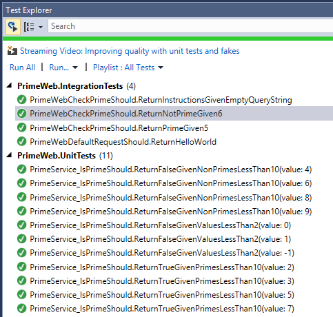

Warning: This page documents version 1.0.0-rc1 and has not yet been updated for version 1.0.0

  # Integration Testing

By [Steve Smith](http://ardalis.com)

Integration testing ensures that an application's components function correctly when assembled together. ASP.NET Core supports integration testing using unit test frameworks and a built-in test web host that can be used to handle requests without network overhead.

[View or download sample code](https://github.com/aspnet/docs/tree/master/aspnet/testing/integration-testing/sample)

  ## Introduction to Integration Testing

Integration tests verify that different parts of an application work correctly together. Unlike [Unit testing](https://docs.microsoft.com/en-us/dotnet/articles/core/testing/unit-testing-with-dotnet-test), integration tests frequently involve application infrastructure concerns, such as a database, file system, network resources, or web requests and responses. Unit tests use fakes or mock objects in place of these concerns, but the purpose of integration tests is to confirm that the system works as expected with these systems.

Integration tests, because they exercise larger segments of code and because they rely on infrastructure elements, tend to be orders of magnitude slower than unit tests. Thus, it's a good idea to limit how many integration tests you write, especially if you can test the same behavior with a unit test.

Tip: If some behavior can be tested using either a unit test or an integration test, prefer the unit test, since it will be almost always be faster. You might have dozens or hundreds of unit tests with many different inputs, but just a handful of integration tests covering the most important scenarios.

Testing the logic within your own methods is usually the domain of unit tests. Testing how your application works within its framework (e.g. ASP.NET Core) or with a database is where integration tests come into play. It doesn't take too many integration tests to confirm that you're able to write a row to and then read a row from the database. You don't need to test every possible permutation of your data access code - you only need to test enough to give you confidence that your application is working properly.

  ## Integration Testing ASP.NET Core

To get set up to run integration tests, you'll need to create a test project, refer to your ASP.NET Core web project, and install a test runner. This process is described in the [Unit testing](https://docs.microsoft.com/en-us/dotnet/articles/core/testing/unit-testing-with-dotnet-test) documentation, along with more detailed instructions on running tests and recommendations for naming your tests and test classes.

Tip: Separate your unit tests and your integration tests using different projects. This helps ensure you don't accidentally introduce infrastructure concerns into your unit tests, and lets you easily choose to run all tests, or just one set or the other.

  ### The Test Host

ASP.NET Core includes a test host that can be added to integration test projects and used to host ASP.NET Core applications, serving test requests without the need for a real web host. The provided sample includes an integration test project which has been configured to use [xUnit](https://xunit.github.io) and the Test Host, as you can see from this excerpt from its *project.json* file:

<!-- literal_block {"ids": [], "names": [], "highlight_args": {"hl_lines": [5], "linenostart": 1}, "backrefs": [], "dupnames": [], "linenos": false, "classes": [], "xml:space": "preserve", "language": "javascript", "source": "/Users/shirhatti/src/Docs/aspnet/testing/integration-testing/sample/test/PrimeWeb.IntegrationTests/project.json"} -->

````javascript

   "dependencies": {
     "PrimeWeb": "1.0.0",
     "xunit": "2.1.0",
     "dotnet-test-xunit": "1.0.0-rc2-build10025",
     "Microsoft.AspNetCore.TestHost": "1.0.0"
   },

   ````

Once the Microsoft.AspNetCore.TestHost package is included in the project, you will be able to create and configure a TestServer in your tests. The following test shows how to verify that a request made to the root of a site returns "Hello World!" and should run successfully against the default ASP.NET Core Empty Web template created by Visual Studio.

<!-- literal_block {"ids": [], "names": [], "highlight_args": {"hl_lines": [6, 7], "linenostart": 1}, "backrefs": [], "dupnames": [], "linenos": false, "classes": [], "xml:space": "preserve", "language": "c#", "source": "/Users/shirhatti/src/Docs/aspnet/testing/integration-testing/sample/test/PrimeWeb.IntegrationTests/PrimeWebDefaultRequestShould.cs"} -->

````c#

   private readonly TestServer _server;
   private readonly HttpClient _client;
   public PrimeWebDefaultRequestShould()
   {
       // Arrange
       _server = new TestServer(new WebHostBuilder()
           .UseStartup<Startup>());
       _client = _server.CreateClient();
   }

   [Fact]
   public async Task ReturnHelloWorld()
   {
       // Act
       var response = await _client.GetAsync("/");
       response.EnsureSuccessStatusCode();

       var responseString = await response.Content.ReadAsStringAsync();

       // Assert
       Assert.Equal("Hello World!",
           responseString);
   }

   ````

These tests are using the Arrange-Act-Assert pattern, but in this case all of the Arrange step is done in the constructor, which creates an instance of `TestServer`. A configured `WebHostBuilder` will be used to create a `TestHost`; in this example we are passing in the `Configure` method from our system under test (SUT)'s `Startup` class. This method will be used to configure the request pipeline of the `TestServer` identically to how the SUT server would be configured.

In the Act portion of the test, a request is made to the `TestServer` instance for the "/" path, and the response is read back into a string. This string is then compared with the expected string of "Hello World!". If they match, the test passes, otherwise it fails.

Now we can add a few additional integration tests to confirm that the prime checking functionality works via the web application:

<!-- literal_block {"ids": [], "names": [], "highlight_args": {"hl_lines": [8, 9], "linenostart": 1}, "backrefs": [], "dupnames": [], "linenos": false, "classes": [], "xml:space": "preserve", "language": "c#", "source": "/Users/shirhatti/src/Docs/aspnet/testing/integration-testing/sample/test/PrimeWeb.IntegrationTests/PrimeWebCheckPrimeShould.cs"} -->

````c#

   public class PrimeWebCheckPrimeShould
   {
       private readonly TestServer _server;
       private readonly HttpClient _client;
       public PrimeWebCheckPrimeShould()
       {
           // Arrange
           _server = new TestServer(new WebHostBuilder()
               .UseStartup<Startup>());
           _client = _server.CreateClient();
       }

       private async Task<string> GetCheckPrimeResponseString(
           string querystring = "")
       {
           var request = "/checkprime";
           if(!string.IsNullOrEmpty(querystring))
           {
               request += "?" + querystring;
           }
           var response = await _client.GetAsync(request);
           response.EnsureSuccessStatusCode();

           return await response.Content.ReadAsStringAsync();
       }

       [Fact]
       public async Task ReturnInstructionsGivenEmptyQueryString()
       {
           // Act
           var responseString = await GetCheckPrimeResponseString();

           // Assert
           Assert.Equal("Pass in a number to check in the form /checkprime?5",
               responseString);
       }
       [Fact]
       public async Task ReturnPrimeGiven5()
       {
           // Act
           var responseString = await GetCheckPrimeResponseString("5");

           // Assert
           Assert.Equal("5 is prime!",
               responseString);
       }

       [Fact]
       public async Task ReturnNotPrimeGiven6()
       {
           // Act
           var responseString = await GetCheckPrimeResponseString("6");

           // Assert
           Assert.Equal("6 is NOT prime!",
               responseString);
       }
   }

   ````

Note that we're not really trying to test the correctness of our prime number checker with these tests, but rather that the web application is doing what we expect. We already have unit test coverage that gives us confidence in `PrimeService`, as you can see here:



Note: You can learn more about the unit tests in the [Unit testing](https://docs.microsoft.com/en-us/dotnet/articles/core/testing/unit-testing-with-dotnet-test) article.

Now that we have a set of passing tests, it's a good time to think about whether we're happy with the current way in which we've designed our application. If we see any [code smells](http://deviq.com/code-smells/), now may be a good time to refactor the application to improve its design.

  ## Refactoring to use Middleware

Refactoring is the process of changing an application's code to improve its design without changing its behavior. It should ideally be done when there is a suite of passing tests, since these help ensure the system's behavior remains the same before and after the changes. Looking at the way in which the prime checking logic is implemented in our web application, we see:

<!-- literal_block {"ids": [], "names": [], "highlight_args": {"hl_lines": [11, 12, 13, 14, 15, 16, 17, 18, 19, 20, 21, 22, 23, 24, 25, 26, 27, 28, 29, 30, 31]}, "backrefs": [], "dupnames": [], "linenos": false, "classes": [], "xml:space": "preserve", "language": "c#"} -->

````c#

     public void Configure(IApplicationBuilder app,
         IHostingEnvironment env)
     {
         if (env.IsDevelopment())
         {
             app.UseDeveloperExceptionPage();
         }

         app.Run(async (context) =>
         {
             if (context.Request.Path.Value.Contains("checkprime"))
             {
                 int numberToCheck;
                 try
                 {
                     numberToCheck = int.Parse(context.Request.QueryString.Value.Replace("?",""));
                     var primeService = new PrimeService();
                     if (primeService.IsPrime(numberToCheck))
                     {
                         await context.Response.WriteAsync(numberToCheck + " is prime!");
                     }
                     else
                     {
                         await context.Response.WriteAsync(numberToCheck + " is NOT prime!");
                     }
                 }
                 catch
                 {
                     await context.Response.WriteAsync("Pass in a number to check in the form /checkprime?5");
                 }
             }
             else
             {
                 await context.Response.WriteAsync("Hello World!");
             }
         });
     }
   ````

This code works, but it's far from how we would like to implement this kind of functionality in an ASP.NET Core application, even as simple a one as this is. Imagine what the `Configure` method would look like if we needed to add this much code to it every time we added another URL endpoint!

One option we can consider is adding [MVC](../mvc/index.md) to the application, and creating a controller to handle the prime checking. However, assuming we don't currently need any other MVC functionality, that's a bit overkill.

We can, however, take advantage of ASP.NET Core [middleware](../fundamentals/middleware.md), which will help us encapsulate the prime checking logic in its own class and achieve better [separation of concerns](http://deviq.com/separation-of-concerns/) within the `Configure` method.

We want to allow the path the middleware uses to be specified as a parameter, so the middleware class expects a `RequestDelegate` and a `PrimeCheckerOptions` instance in its constructor. If the path of the request doesn't match what this middleware is configured to expect, we simply call the next middleware in the chain and do nothing further. The rest of the implementation code that was in `Configure` is now in the `Invoke` method.

Note: Since our middleware depends on the `PrimeService` service, we are also requesting an instance of this service via the constructor. The framework will provide this service via [Dependency Injection](../fundamentals/dependency-injection.md), assuming it has been configured (e.g. in `ConfigureServices`).

<!-- literal_block {"ids": [], "names": [], "highlight_args": {"hl_lines": [39, 40, 41, 42, 43, 44, 45, 46, 47, 48, 49, 50, 51, 52, 53, 54, 55, 56, 57, 58, 59, 60, 61, 62, 63], "linenostart": 1}, "backrefs": [], "dupnames": [], "linenos": false, "classes": [], "xml:space": "preserve", "language": "none", "source": "/Users/shirhatti/src/Docs/aspnet/testing/integration-testing/sample/src/PrimeWeb/Middleware/PrimeCheckerMiddleware.cs"} -->

````none

   using Microsoft.AspNetCore.Builder;
   using Microsoft.AspNetCore.Http;
   using PrimeWeb.Services;
   using System;
   using System.Threading.Tasks;

   namespace PrimeWeb.Middleware
   {
       public class PrimeCheckerMiddleware
       {
           private readonly RequestDelegate _next;
           private readonly PrimeCheckerOptions _options;
           private readonly PrimeService _primeService;

           public PrimeCheckerMiddleware(RequestDelegate next,
               PrimeCheckerOptions options,
               PrimeService primeService)
           {
               if (next == null)
               {
                   throw new ArgumentNullException(nameof(next));
               }
               if (options == null)
               {
                   throw new ArgumentNullException(nameof(options));
               }
               if (primeService == null)
               {
                   throw new ArgumentNullException(nameof(primeService));
               }

               _next = next;
               _options = options;
               _primeService = primeService;
           }

           public async Task Invoke(HttpContext context)
           {
               var request = context.Request;
               if (!request.Path.HasValue ||
                   request.Path != _options.Path)
               {
                   await _next.Invoke(context);
               }
               else
               {
                   int numberToCheck;
                   if (int.TryParse(request.QueryString.Value.Replace("?", ""), out numberToCheck))
                   {
                       if (_primeService.IsPrime(numberToCheck))
                       {
                           await context.Response.WriteAsync($"{numberToCheck} is prime!");
                       }
                       else
                       {
                           await context.Response.WriteAsync($"{numberToCheck} is NOT prime!");
                       }
                   }
                   else
                   {
                       await context.Response.WriteAsync($"Pass in a number to check in the form {_options.Path}?5");
                   }
               }
           }
       }
   }

   ````

Note: Since this middleware acts as an endpoint in the request delegate chain when its path matches, there is no call to `_next.Invoke` in the case where this middleware handles the request.

With this middleware in place and some helpful extension methods created to make configuring it easier, the refactored `Configure` method looks like this:

<!-- literal_block {"ids": [], "names": [], "highlight_args": {"hl_lines": [9], "linenostart": 1}, "backrefs": [], "dupnames": [], "linenos": false, "classes": [], "xml:space": "preserve", "language": "c#", "source": "/Users/shirhatti/src/Docs/aspnet/testing/integration-testing/sample/src/PrimeWeb/Startup.cs"} -->

````c#

   public void Configure(IApplicationBuilder app,
       IHostingEnvironment env)
   {
       if (env.IsDevelopment())
       {
           app.UseDeveloperExceptionPage();
       }

       app.UsePrimeChecker();

       app.Run(async (context) =>
       {
           await context.Response.WriteAsync("Hello World!");
       });
   }

   ````

Following this refactoring, we are confident that the web application still works as before, since our integration tests are all passing.

Tip: It's a good idea to commit your changes to source control after you complete a refactoring and your tests all pass. If you're practicing Test Driven Development, [consider adding Commit to your Red-Green-Refactor cycle](http://ardalis.com/rgrc-is-the-new-red-green-refactor-for-test-first-development).

  ## Summary

Integration testing provides a higher level of verification than unit testing. It tests application infrastructure and how different parts of an application work together. ASP.NET Core is very testable, and ships with a `TestServer` that makes wiring up integration tests for web server endpoints very easy.

  ## Additional Resources

* [Unit testing](https://docs.microsoft.com/en-us/dotnet/articles/core/testing/unit-testing-with-dotnet-test)

* [Middleware](../fundamentals/middleware.md)
