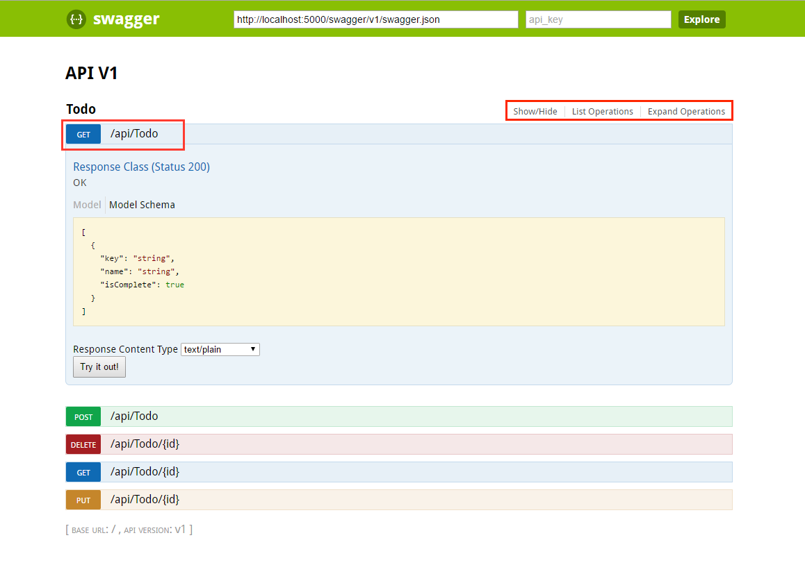
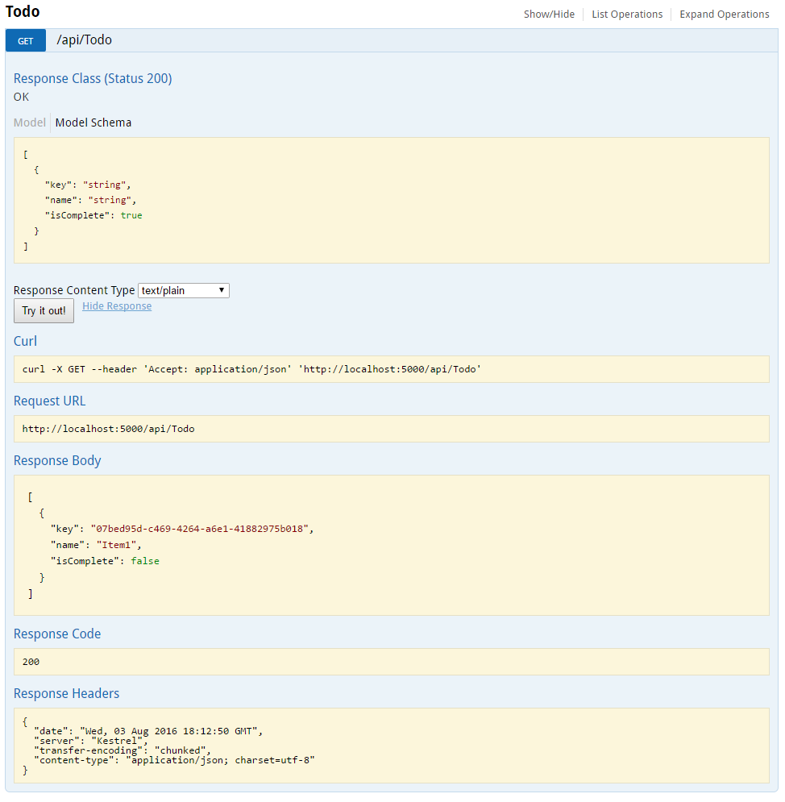
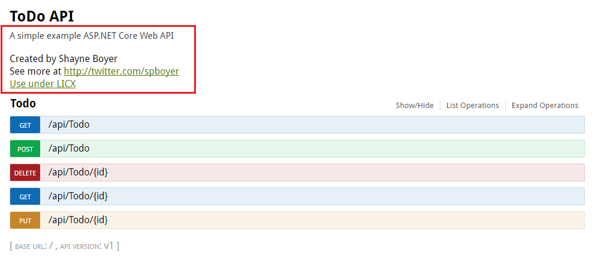
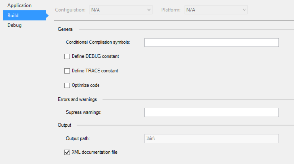
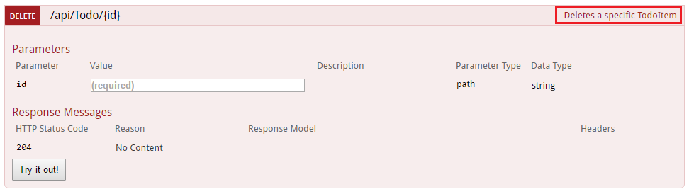
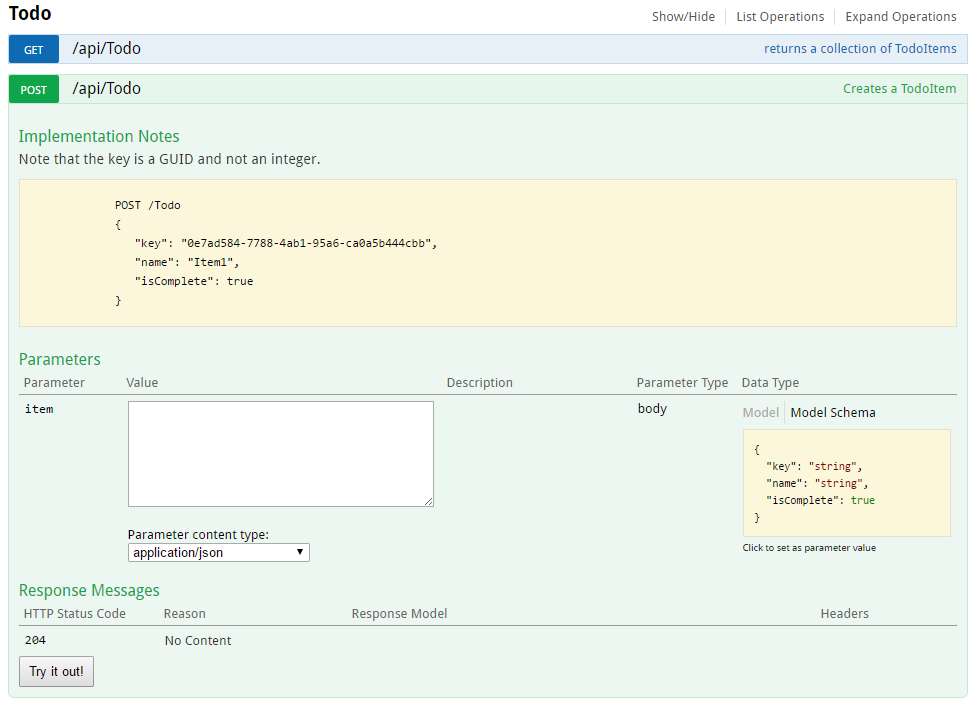
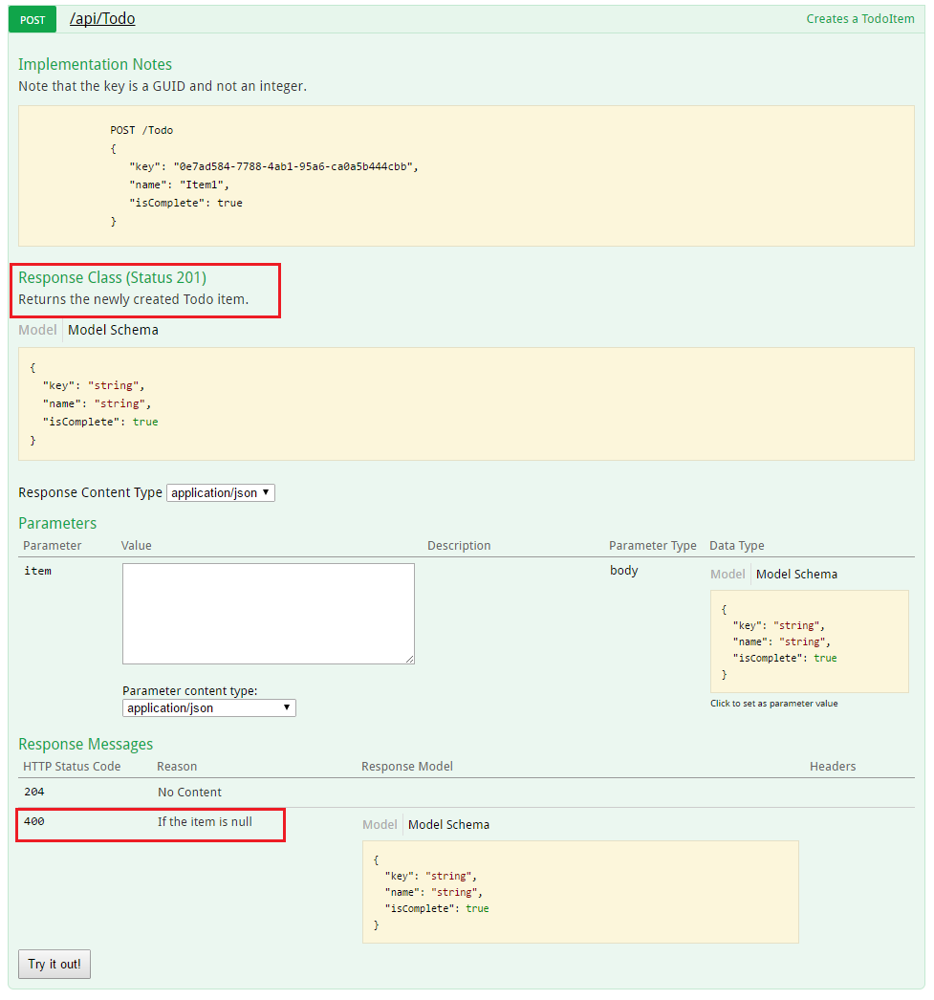
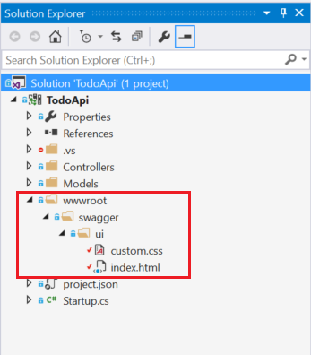
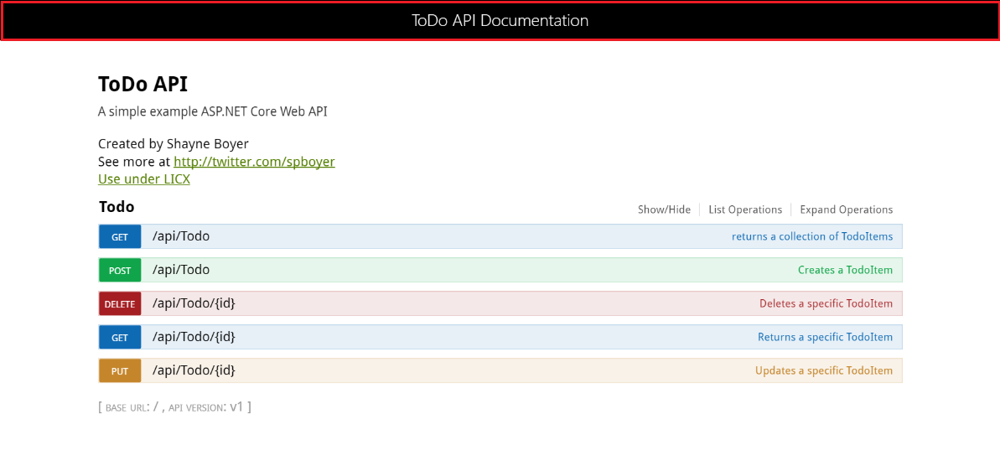

<a name=web-api-help-pages-using-swagger></a>

  # ASP.NET Web API Help Pages using Swagger

By [Shayne Boyer](https://twitter.com/spboyer)

Understanding the various methods of an API can be a challenge for a developer when building a consuming application.

Generating good documentation and help pages as a part of your Web API using [Swagger](http://swagger.io) with the .NET Core implementation [Swashbuckle](https://github.com/domaindrivendev/Ahoy) is as easy as adding a couple of NuGet packages and modifying the *Startup.cs*.

* [Swashbuckle](https://github.com/domaindrivendev/Ahoy) is an open source project for generating Swagger documents for Web APIs that are built with ASP.NET Core MVC.

* [Swagger](http://swagger.io) is a machine readable representation of a RESTful API that enables support for interactive documentation, client SDK generation and discoverability.

This tutorial builds on the sample on [Building Your First Web API with ASP.NET Core MVC and Visual Studio](first-web-api.md). If you'd like to follow along, download the sample at [https://github.com/aspnet/Docs/tree/master/aspnet/tutorials/first-web-api/sample](https://github.com/aspnet/Docs/tree/master/aspnet/tutorials/first-web-api/sample).

  ## Getting Started

There are two core components to Swashbuckle

* *Swashbuckle.SwaggerGen* : provides the functionality to generate JSON Swagger documents that describe the objects, methods, return types, etc.

* *Swashbuckle.SwaggerUI* : an embedded version of the Swagger UI tool which uses the above documents for a rich customizable experience for describing the Web API functionality and includes built in test harness capabilities for the public methods.

  ## NuGet Packages

You can add Swashbuckle with any of the following approaches:

* From the Package Manager Console:

<!-- literal_block {"ids": [], "names": [], "highlight_args": {}, "backrefs": [], "dupnames": [], "linenos": false, "classes": [], "xml:space": "preserve", "language": "bash"} -->

````bash

   Install-Package Swashbuckle -Pre
   ````

* Add Swashbuckle to *project.json*:

<!-- literal_block {"ids": [], "names": [], "highlight_args": {}, "backrefs": [], "dupnames": [], "linenos": false, "classes": [], "xml:space": "preserve", "language": "javascript"} -->

````javascript

   "Swashbuckle": "6.0.0-beta902"
   ````

* In Visual Studio:

     * Right click your project in Solution Explorer > Manage NuGet Packages

     * Enter Swashbuckle in the search box

     * Check "Include prerelease"

     * Set the Package source to nuget.org

     * Tap the Swashbuckle package and then tap Install

  ## Add and configure Swagger to the middleware

Add SwaggerGen to the services collection in the Configure method, and in the ConfigureServices method, enable the middleware for serving generated JSON document and the SwaggerUI.

<!-- literal_block {"ids": [], "names": [], "highlight_args": {"hl_lines": [12, 21, 24]}, "backrefs": [], "dupnames": [], "linenos": false, "classes": [], "xml:space": "preserve", "language": "c#"} -->

````c#

     public void ConfigureServices(IServiceCollection services)
     {
         // Add framework services.
         services.AddMvc();

         services.AddLogging();

         // Add our repository type
         services.AddSingleton<ITodoRepository, TodoRepository>();

         // Inject an implementation of ISwaggerProvider with defaulted settings applied
         services.AddSwaggerGen();
     }

     // This method gets called by the runtime. Use this method to configure the HTTP request pipeline.
     public void Configure(IApplicationBuilder app, IHostingEnvironment env, ILoggerFactory loggerFactory)
     {
         app.UseMvcWithDefaultRoute();

         // Enable middleware to serve generated Swagger as a JSON endpoint
         app.UseSwagger();

         // Enable middleware to serve swagger-ui assets (HTML, JS, CSS etc.)
         app.UseSwaggerUi();

     }
   ````

In Visual Studio, press ^F5 to launch the app and navigate to `http://localhost:<random_port>/swagger/v1/swagger.json` to see the document generated that describes the endpoints.

Note: Microsoft Edge, Google Chrome and Firefox display JSON documents natively.  There are extensions for Chrome that will format the document for easier reading. *Example below reduced for brevity.*

<!-- literal_block {"ids": [], "names": [], "highlight_args": {}, "backrefs": [], "dupnames": [], "linenos": false, "classes": [], "xml:space": "preserve", "language": "javascript"} -->

````javascript

   {
   "swagger": "2.0",
   "info": {
       "version": "v1",
       "title": "API V1"
   },
   "basePath": "/",
   "paths": {
       "/api/Todo": {
       "get": {
           "tags": [
           "Todo"
           ],
           "operationId": "ApiTodoGet",
           "consumes": [],
           "produces": [
           "text/plain",
           "application/json",
           "text/json"
           ],
           "responses": {
           "200": {
               "description": "OK",
               "schema": {
               "type": "array",
               "items": {
                   "$ref": "#/definitions/TodoItem"
               }
               }
           }
           },
           "deprecated": false
       },
       "post": {
           ...
       }
       },
       "/api/Todo/{id}": {
       "get": {
           ...
       },
       "put": {
           ...
       },
       "delete": {
           ...
   },
   "definitions": {
       "TodoItem": {
       "type": "object",
       "properties": {
           "key": {
           "type": "string"
           },
           "name": {
           "type": "string"
           },
           "isComplete": {
           "type": "boolean"
           }
       }
       }
   },
   "securityDefinitions": {}
   }
   ````

This document is used to drive the Swagger UI which can be viewed by navigating to `http://localhost:<random_port>/swagger/ui`



Each of the methods in the ToDo controller can be tested from the UI. Tap a method to expand the section, add any necessary parameters and tap "Try it out!".



  ## Customization & Extensibility

Swagger is not only a simple way to represent the API, but has options for documenting the object model, as well as customizing the interactive UI to match your look and feel or design language.

  ### API Info and Description

The `ConfigureSwaggerGen` method can be used to add information such as the author, license, description.

<!-- literal_block {"ids": [], "names": [], "highlight_args": {}, "backrefs": [], "dupnames": [], "linenos": false, "classes": [], "xml:space": "preserve", "language": "c#"} -->

````c#

   services.ConfigureSwaggerGen(options =>
   {
       options.SingleApiVersion(new Info
       {
           Version = "v1",
           Title = "ToDo API",
           Description = "A simple example ASP.NET Core Web API",
           TermsOfService = "None",
           Contact = new Contact { Name = "Shayne Boyer", Email = "", Url = "http://twitter.com/spboyer"},
           License = new License { Name = "Use under LICX", Url = "http://url.com" }
       });
   });
   ````

The following image shows the Swagger UI displaying the version information added.



  ### XML Comments

To enable XML comments, right click the project in Visual Studio and select **Properties** and then check the **XML Documentation file** box under the **Output Settings** section.



Alternatively, you can enable XML comments by setting *"xmlDoc": true* in *project.json*.

<!-- literal_block {"ids": [], "names": [], "highlight_args": {"hl_lines": [4]}, "backrefs": [], "dupnames": [], "linenos": false, "classes": [], "xml:space": "preserve", "language": "javascript"} -->

````javascript

   "buildOptions": {
       "emitEntryPoint": true,
       "preserveCompilationContext": true,
       "xmlDoc": true
   },
   ````

Configure Swagger to use the generated XML file.

Note: For Linux or non-Windows operating systems, file names and paths can be case sensitive. So `ToDoApi.XML` would be found on Windows but not CentOS for example.

<!-- literal_block {"ids": [], "names": [], "highlight_args": {"hl_lines": [29, 32], "linenostart": 1}, "backrefs": [], "dupnames": [], "linenos": false, "classes": [], "xml:space": "preserve", "language": "c#", "source": "/Users/shirhatti/src/Docs/aspnet/tutorials/web-api-help-pages-using-swagger/sample/src/TodoApi/Startup.cs"} -->

````c#

   // This method gets called by the runtime. Use this method to add services to the container.
   public void ConfigureServices(IServiceCollection services)
   {
       // Add framework services.
       services.AddMvc();

       services.AddLogging();

       // Add our repository type.
       services.AddSingleton<ITodoRepository, TodoRepository>();

       // Inject an implementation of ISwaggerProvider with defaulted settings applied.
       services.AddSwaggerGen();

       // Add the detail information for the API.
       services.ConfigureSwaggerGen(options =>
       {
           options.SingleApiVersion(new Info
           {
               Version = "v1",
               Title = "ToDo API",
               Description = "A simple example ASP.NET Core Web API",
               TermsOfService = "None",
               Contact = new Contact { Name = "Shayne Boyer", Email = "", Url = "http://twitter.com/spboyer"},
               License = new License { Name = "Use under LICX", Url = "http://url.com" }
           });

           //Determine base path for the application.
           var basePath = PlatformServices.Default.Application.ApplicationBasePath;

           //Set the comments path for the swagger json and ui.
           options.IncludeXmlComments(basePath + "\\TodoApi.xml");
       });
   }

   // This method gets called by the runtime. Use this method to configure the HTTP request pipeline.
   public void Configure(IApplicationBuilder app, IHostingEnvironment env, ILoggerFactory loggerFactory)
   {
       app.UseStaticFiles();

       app.UseMvcWithDefaultRoute();

       // Enable middleware to serve generated Swagger as a JSON endpoint.
       app.UseSwagger();

       // Enable middleware to serve swagger-ui assets (HTML, JS, CSS etc.)
       app.UseSwaggerUi();
       
   }

   ````

In the code above, ApplicationBasePath gets the base path of the app, which is needed to set the full path to the XML comments. `TodoApi.xml` only works for this example, the name of the generated XML comments file is based on the name of your application.

Adding the triple slash comments to the method enhances the Swagger UI by adding the description to the header of the section.

<!-- literal_block {"ids": [], "names": [], "highlight_args": {"hl_lines": [2], "linenostart": 1}, "backrefs": [], "dupnames": [], "linenos": false, "classes": [], "xml:space": "preserve", "language": "c#", "source": "/Users/shirhatti/src/Docs/aspnet/tutorials/web-api-help-pages-using-swagger/sample/src/TodoApi/Controllers/TodoController.cs"} -->

````c#

   /// <summary>
   /// Deletes a specific TodoItem.
   /// </summary>
   /// <param name="id"></param>
   [HttpDelete("{id}")]
   public void Delete(string id)
   {
       TodoItems.Remove(id);
   }

   ````



Note that the UI is driven by the generated JSON file, and these comments are also in that file as well.

<!-- literal_block {"ids": [], "names": [], "highlight_args": {"hl_lines": [5]}, "backrefs": [], "dupnames": [], "linenos": false, "classes": [], "xml:space": "preserve", "language": "javascript"} -->

````javascript

     "delete": {
       "tags": [
         "Todo"
       ],
       "summary": "Deletes a specific TodoItem",
       "operationId": "ApiTodoByIdDelete",
       "consumes": [],
       "produces": [],
       "parameters": [
         {
           "name": "id",
           "in": "path",
           "description": "",
           "required": true,
           "type": "string"
         }
       ],
       "responses": {
         "204": {
           "description": "No Content"
         }
       },
       "deprecated": false
     }
   ````

Here is a more robust example, adding `<remarks />` where the content can be just text or adding the JSON or XML object for further documentation of the method.

<!-- literal_block {"ids": [], "names": [], "highlight_args": {"hl_lines": [4, 5, 6, 7, 8, 9, 10, 11, 12, 13, 14], "linenostart": 1}, "backrefs": [], "dupnames": [], "linenos": false, "classes": [], "xml:space": "preserve", "language": "c#", "source": "/Users/shirhatti/src/Docs/aspnet/tutorials/web-api-help-pages-using-swagger/sample/src/TodoApi/Controllers/TodoController.cs"} -->

````c#

   /// <summary>
   /// Creates a TodoItem.
   /// </summary>
   /// <remarks>
   /// Note that the key is a GUID and not an integer.
   ///  
   ///     POST /Todo
   ///     {
   ///        "key": "0e7ad584-7788-4ab1-95a6-ca0a5b444cbb",
   ///        "name": "Item1",
   ///        "isComplete": true
   ///     }
   /// 
   /// </remarks>
   /// <param name="item"></param>
   /// <returns>New Created Todo Item</returns>
   /// <response code="201">Returns the newly created item</response>
   /// <response code="400">If the item is null</response>
   [HttpPost]
   [ProducesResponseType(typeof(TodoItem), 201)]
   [ProducesResponseType(typeof(TodoItem), 400)]
   public IActionResult Create([FromBody, Required] TodoItem item)
   {
       if (item == null)
       {
           return BadRequest();
       }
       TodoItems.Add(item);
       return CreatedAtRoute("GetTodo", new { id = item.Key }, item);
   }

   ````

Notice the enhancement of the UI with these additional comments.



  ### DataAnnotations

You can decorate the API controller with `System.ComponentModel.DataAnnotations` to help drive the Swagger UI components.

Adding the `[Required]` annotation to the `Name` property of the TodoItem class will change the ModelSchema information in the UI. `[Produces("application/json")]`, RegularExpression validators and more will further detail the information delivered in the generated page.  The more metadata that is in the code produces a more desciptive UI or API help page.

<!-- literal_block {"ids": [], "names": [], "highlight_args": {"hl_lines": [10], "linenostart": 1}, "backrefs": [], "dupnames": [], "linenos": false, "classes": [], "xml:space": "preserve", "language": "c#", "source": "/Users/shirhatti/src/Docs/aspnet/tutorials/web-api-help-pages-using-swagger/sample/src/TodoApi/Models/TodoItem.cs"} -->

````c#

   using System;
   using System.ComponentModel;
   using System.ComponentModel.DataAnnotations;

   namespace TodoApi.Models
   {
       public class TodoItem
       {
           public string Key { get; set; }
           [Required]
           public string Name { get; set; }
           [DefaultValue(false)]
           public bool IsComplete { get; set; }
       }
   }
   ````

  ### Describing Response Types

Consuming developers are probably most concerned with what is returned; specifically response types, error codes (if not standard). These are handled in the XML comments and DataAnnotations.

Take the `Create()` method for example, currently it returns only "201 Created" response by default. That is of course if the item is in fact created, or a "204 No Content" if no data is passed in the POST Body.  However, there is no documentation to know that or any other response. That can be fixed by adding the following piece of code.

<!-- literal_block {"ids": [], "names": [], "highlight_args": {"hl_lines": [17, 18, 20, 21], "linenostart": 1}, "backrefs": [], "dupnames": [], "linenos": false, "classes": [], "xml:space": "preserve", "language": "c#", "source": "/Users/shirhatti/src/Docs/aspnet/tutorials/web-api-help-pages-using-swagger/sample/src/TodoApi/Controllers/TodoController.cs"} -->

````c#

   /// <summary>
   /// Creates a TodoItem.
   /// </summary>
   /// <remarks>
   /// Note that the key is a GUID and not an integer.
   ///  
   ///     POST /Todo
   ///     {
   ///        "key": "0e7ad584-7788-4ab1-95a6-ca0a5b444cbb",
   ///        "name": "Item1",
   ///        "isComplete": true
   ///     }
   /// 
   /// </remarks>
   /// <param name="item"></param>
   /// <returns>New Created Todo Item</returns>
   /// <response code="201">Returns the newly created item</response>
   /// <response code="400">If the item is null</response>
   [HttpPost]
   [ProducesResponseType(typeof(TodoItem), 201)]
   [ProducesResponseType(typeof(TodoItem), 400)]
   public IActionResult Create([FromBody, Required] TodoItem item)
   {
       if (item == null)
       {
           return BadRequest();
       }
       TodoItems.Add(item);
       return CreatedAtRoute("GetTodo", new { id = item.Key }, item);
   }

   ````



  ### Customizing the UI

The stock UI is very functional as well as presentable, however when building documentation pages for your API you want it to represent your brand or look and feel.

Accomplishing that task with the Swashbuckle components is simple but requires adding the resources to serve static files that would not normally be included in a Web API project and then building the folder structure to host those files.

Add the `"Microsoft.AspNetCore.StaticFiles": "1.0.0-*"` NuGet package to the project.

Enable static files middleware.

<!-- literal_block {"ids": [], "names": [], "highlight_args": {"hl_lines": [4]}, "backrefs": [], "dupnames": [], "linenos": false, "classes": [], "xml:space": "preserve", "language": "c#"} -->

````c#

   // This method gets called by the runtime. Use this method to configure the HTTP request pipeline.
   public void Configure(IApplicationBuilder app, IHostingEnvironment env, ILoggerFactory loggerFactory)
   {
       app.UseStaticFiles();

       app.UseMvcWithDefaultRoute();

       // Enable middleware to serve generated Swagger as a JSON endpoint
       app.UseSwagger();

       // Enable middleware to serve swagger-ui assets (HTML, JS, CSS etc.)
       app.UseSwaggerUi();

   }
   ````

Acquire the core *index.html* file used for the Swagger UI page from the [Github repository](https://github.com/domaindrivendev/Ahoy/tree/master/test/WebSites/CustomizedUi/wwwroot/swagger/ui) and put that in the `wwwroot/swagger/ui` folder and also create a new `custom.css` file in the same folder.



Reference *custom.css* in the *index.html* file.

<!-- literal_block {"ids": [], "names": [], "highlight_args": {}, "backrefs": [], "dupnames": [], "linenos": false, "classes": [], "xml:space": "preserve", "language": "html"} -->

````html

   <link href='custom.css' media='screen' rel='stylesheet' type='text/css' />
   ````

The following CSS provides a simple sample of a custom header title to the page.

*custom.css file*

<!-- literal_block {"ids": [], "names": [], "highlight_args": {"linenostart": 1}, "backrefs": [], "dupnames": [], "linenos": false, "classes": [], "xml:space": "preserve", "language": "css", "source": "/Users/shirhatti/src/Docs/aspnet/tutorials/web-api-help-pages-using-swagger/sample/src/TodoApi/wwwroot/swagger/ui/custom.css"} -->

````css


   .swagger-section #header
   {
       border-bottom: 1px solid #000000;
       font-style: normal;
       font-weight: 400;
       font-family: "Segoe UI Light","Segoe WP Light","Segoe UI","Segoe WP",Tahoma,Arial,sans-serif;
       background-color: black;
   }

   .swagger-section #header h1
   {
       text-align: center;
       font-size: 20px;
       color: white;
   }


   ````

*index.html body*

<!-- literal_block {"ids": [], "names": [], "highlight_args": {}, "backrefs": [], "dupnames": [], "linenos": false, "classes": [], "xml:space": "preserve", "language": "html"} -->

````html

   <body class="swagger-section">
      <div id="header">
       <h1>ToDo API Documentation</h1>
      </div>

      <div id="message-bar" class="swagger-ui-wrap" data-sw-translate>&nbsp;</div>
      <div id="swagger-ui-container" class="swagger-ui-wrap"></div>
   </body>
   ````



There is much more you can do with the page, see the full capabilities for the UI resources at the [Swagger UI Github repository](https://github.com/swagger-api/swagger-ui).
